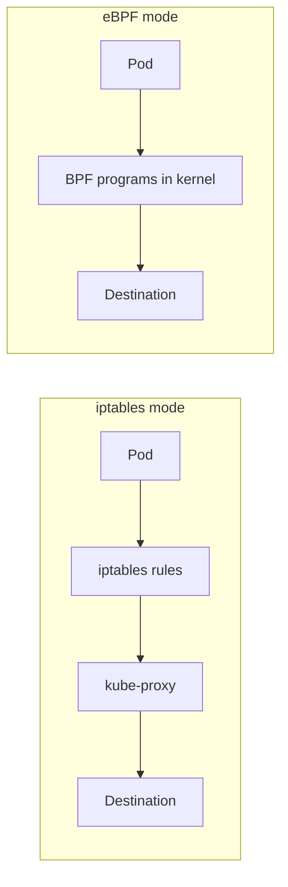

# How to Set Up Calico eBPF Mode Step by Step

Author: [nawazdhandala](https://github.com/nawazdhandala)

Tags: Calico, Kubernetes, Networking, eBPF, Performance

Description: A step-by-step guide to enabling Calico's eBPF data plane for improved network performance, replacing iptables with high-performance BPF programs on Linux kernels 5.3+.

---

## Introduction

Calico's eBPF data plane replaces the traditional iptables-based networking with BPF (Berkeley Packet Filter) programs that run directly in the Linux kernel. This delivers significant performance improvements: lower latency, higher throughput, and reduced CPU overhead, especially for services with many endpoints. The eBPF data plane also enables features like direct server return (DSR) for services, which eliminates NAT overhead for external traffic.

Enabling eBPF mode requires Linux kernel 5.3 or later, which is available in most modern Linux distributions. The migration from iptables to eBPF involves configuring kube-proxy to work in eBPF mode (or disabling it entirely) and enabling the eBPF data plane in the Calico Installation resource.

This guide walks through the complete setup process including kernel verification, kube-proxy configuration, and Calico eBPF enablement.

## Prerequisites

- Calico v3.20+ installed via the Tigera Operator
- Linux kernel 5.3+ on all nodes (5.10+ recommended for full feature set)
- Kubernetes v1.20+
- No non-standard kube-proxy configurations

## Step 1: Verify Kernel Requirements

```bash
# Check kernel version on all nodes
for node in $(kubectl get nodes -o jsonpath='{.items[*].metadata.name}'); do
  kernel=$(kubectl debug node/${node} --image=alpine -it --quiet -- uname -r 2>/dev/null | tr -d '\r')
  echo "${node}: ${kernel}"
done

# Minimum versions for eBPF features:
# - 5.3: Basic eBPF data plane
# - 5.8: TCP timestamp support
# - 5.10: LRU conntrack table, improved performance
# - 5.14+: Full feature set

# Check BPF filesystem is mounted
kubectl debug node/<node> --image=alpine -it --quiet -- \
  mount | grep bpf
# Expected: bpffs on /sys/fs/bpf type bpf
```

## Step 2: Configure kube-proxy for eBPF Compatibility

Before enabling eBPF, configure kube-proxy to not conflict:

```bash
# Option A: Disable kube-proxy entirely (Calico handles service routing)
kubectl patch ds -n kube-system kube-proxy \
  -p '{"spec":{"template":{"spec":{"nodeSelector":{"non-calico": "true"}}}}}'

# Option B: Keep kube-proxy but set iptables-backend to nftables
# (for clusters that need kube-proxy for specific features)
kubectl get configmap kube-proxy -n kube-system -o yaml | \
  grep -A5 mode
```

## Step 3: Configure Calico to Use API Server Directly

For eBPF mode, Felix needs direct access to the Kubernetes API server (not via the service):

```bash
# Get the API server's real IP (not the ClusterIP 10.96.0.1)
kubectl get endpoints kubernetes -n default
# Note: This is the real control plane node IP

API_SERVER_ADDR=$(kubectl get endpoints kubernetes -n default \
  -o jsonpath='{.subsets[0].addresses[0].ip}')
API_SERVER_PORT=$(kubectl get endpoints kubernetes -n default \
  -o jsonpath='{.subsets[0].ports[0].port}')

echo "API Server: ${API_SERVER_ADDR}:${API_SERVER_PORT}"
```

```yaml
# felix-ebpf-config.yaml - Configure Felix with direct API access
apiVersion: v1
kind: ConfigMap
metadata:
  name: kubernetes-services-endpoint
  namespace: tigera-operator
data:
  KUBERNETES_SERVICE_HOST: "192.168.1.100"  # Real control plane IP
  KUBERNETES_SERVICE_PORT: "6443"
```

## Step 4: Enable eBPF Data Plane

```yaml
# installation-ebpf.yaml
apiVersion: operator.tigera.io/v1
kind: Installation
metadata:
  name: default
spec:
  calicoNetwork:
    linuxDataplane: BPF
    hostPorts: Disabled  # hostPorts not supported with eBPF
    multiInterfaceMode: None
    ipPools:
      - cidr: 192.168.0.0/16
        encapsulation: VXLAN
```

Apply the changes:

```bash
# Apply the ConfigMap first
kubectl apply -f felix-ebpf-config.yaml

# Enable eBPF data plane
kubectl apply -f installation-ebpf.yaml

# Monitor the rollout
kubectl rollout status ds/calico-node -n calico-system
kubectl get tigerastatus -w
```

## Step 5: Verify eBPF is Active

```bash
# Check Felix logs for eBPF mode confirmation
kubectl logs -n calico-system ds/calico-node -c calico-node | \
  grep -i "bpf\|ebpf"

# Check that BPF programs are loaded
kubectl exec -n calico-system ds/calico-node -c calico-node -- \
  bpftool prog list | head -20

# Verify iptables rules are GONE (replaced by BPF)
kubectl exec -n calico-system ds/calico-node -c calico-node -- \
  iptables-legacy -L -n | grep cali | wc -l
# Should return 0 or very few lines
```

## Architecture Comparison



## Conclusion

Setting up Calico eBPF mode delivers significant performance improvements by replacing iptables with in-kernel BPF programs. The key steps are: verifying kernel version compatibility (5.3+ required), configuring kube-proxy to avoid conflicts, providing Felix with direct API server access, and enabling the BPF data plane in the Installation resource. After enabling eBPF, verify that BPF programs are loaded and iptables rules have been replaced to confirm the transition was successful.
