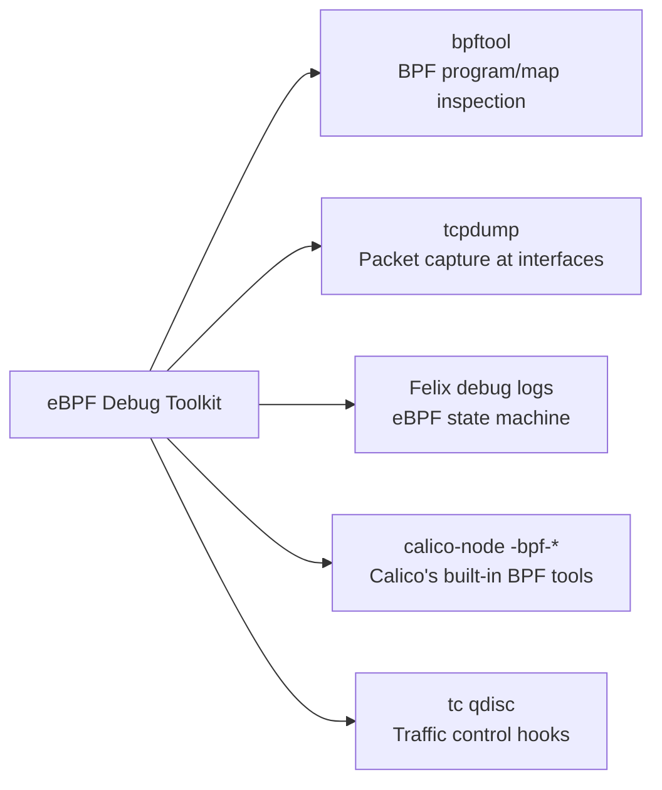

# How to Set Up Calico eBPF Troubleshooting Step by Step

Author: [nawazdhandala](https://github.com/nawazdhandala)

Tags: Calico, Kubernetes, Networking, eBPF, Troubleshooting

Description: Set up a complete eBPF troubleshooting toolkit for Calico, including bpftool, tcpdump for BPF programs, and Felix debug logging configuration.

---

## Introduction

Troubleshooting Calico eBPF issues requires a specialized toolkit that goes beyond standard Kubernetes debugging tools. The eBPF data plane is inspected differently from iptables: instead of `iptables -L`, you use `bpftool prog list` and `bpftool map dump`. Understanding how to set up and use these tools before you need them is critical for fast incident response.

This guide covers the setup of a complete eBPF troubleshooting environment including tool installation, Felix debug logging configuration, and a debug pod template that provides access to all necessary eBPF debugging utilities.

## Prerequisites

- Calico with eBPF mode active
- Node-level access (via debug pods)
- `kubectl` with cluster-admin access

## Step 1: Install eBPF Debugging Tools on Nodes

```bash
# Install bpftool on Ubuntu/Debian nodes
kubectl debug node/<node-name> -it --image=ubuntu:22.04 -- bash <<'EOF'
apt-get update -qq
apt-get install -y linux-tools-$(uname -r) linux-tools-generic tcpdump iproute2
echo "Tools installed: bpftool, tcpdump, tc"
bpftool version
EOF

# Install on RHEL/CentOS nodes
kubectl debug node/<node-name> -it --image=registry.access.redhat.com/ubi8/ubi -- bash <<'EOF'
dnf install -y bpftool tcpdump iproute
bpftool version
EOF
```

## Step 2: Create a Persistent Debug DaemonSet

```yaml
# calico-ebpf-debug-ds.yaml
apiVersion: apps/v1
kind: DaemonSet
metadata:
  name: calico-ebpf-debugger
  namespace: calico-system
spec:
  selector:
    matchLabels:
      app: calico-ebpf-debugger
  template:
    metadata:
      labels:
        app: calico-ebpf-debugger
    spec:
      hostNetwork: true
      hostPID: true
      tolerations:
        - operator: Exists
      containers:
        - name: debugger
          image: ubuntu:22.04
          command: ["sleep", "infinity"]
          securityContext:
            privileged: true
          volumeMounts:
            - name: bpf
              mountPath: /sys/fs/bpf
            - name: host-proc
              mountPath: /proc
              readOnly: true
      volumes:
        - name: bpf
          hostPath:
            path: /sys/fs/bpf
        - name: host-proc
          hostPath:
            path: /proc
```

## Step 3: Enable Felix Debug Logging for eBPF

```bash
# Enable debug logging for eBPF specifically
kubectl patch felixconfiguration default --type=merge -p '{
  "spec": {
    "logSeverityScreen": "Debug",
    "logFilePath": "/var/log/calico/felix.log"
  }
}'

# Or use environment variables on the calico-node DaemonSet
kubectl set env ds/calico-node -n calico-system \
  FELIX_LOGSEVERITYSCREEN=Debug \
  FELIX_DEBUGBPFMAP=true
```

## Step 4: Configure BPF Map Inspection

```bash
# List all Calico BPF programs
kubectl exec -n calico-system ds/calico-node -c calico-node -- \
  bpftool prog list 2>/dev/null | grep -A2 calico

# List all Calico BPF maps
kubectl exec -n calico-system ds/calico-node -c calico-node -- \
  bpftool map list 2>/dev/null | grep -A2 calico

# Dump a specific BPF map (e.g., policy map)
kubectl exec -n calico-system ds/calico-node -c calico-node -- \
  bpftool map dump name cali_v4_fwdpol 2>/dev/null | head -50
```

## Troubleshooting Toolkit Architecture



## Step 5: Built-in Calico eBPF Debug Commands

```bash
# Calico provides built-in eBPF diagnostic commands
kubectl exec -n calico-system ds/calico-node -c calico-node -- \
  calico-node -bpf-list-progs 2>/dev/null

# Dump NAT table (service routing)
kubectl exec -n calico-system ds/calico-node -c calico-node -- \
  calico-node -bpf-nat-dump 2>/dev/null | head -30

# Dump conntrack table
kubectl exec -n calico-system ds/calico-node -c calico-node -- \
  calico-node -bpf-conntrack-dump 2>/dev/null | head -30

# Dump routing table
kubectl exec -n calico-system ds/calico-node -c calico-node -- \
  calico-node -bpf-route-dump 2>/dev/null | head -30
```

## Conclusion

Setting up a Calico eBPF troubleshooting toolkit before problems occur ensures you can respond quickly when issues arise. The key components are: bpftool and tcpdump installed on nodes (via debug DaemonSet for easy access), Felix debug logging configured for eBPF-specific output, and familiarity with Calico's built-in `-bpf-*` diagnostic commands. Practice using these tools in a non-production environment so the commands are second nature when you need them during an incident.
