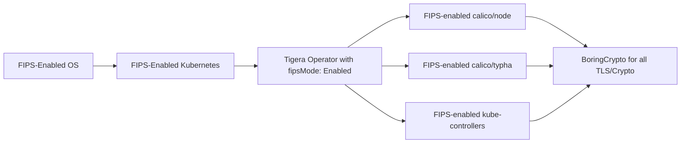

# How to Set Up Calico FIPS Mode Step by Step

Author: [nawazdhandala](https://github.com/nawazdhandala)

Tags: Calico, Kubernetes, Networking, FIPS, Compliance, Security

Description: A step-by-step guide to enabling FIPS 140-2 compliant mode for Calico on Kubernetes, covering OS configuration, operator settings, and compliance verification.

---

## Introduction

FIPS 140-2 (Federal Information Processing Standard) compliance is required for US federal government workloads and many regulated industries including healthcare and financial services. Running Calico in FIPS mode ensures that all cryptographic operations performed by Calico components use FIPS-validated algorithms and modules, satisfying these compliance requirements.

Calico Enterprise and Calico Open Source (from v3.26+) support FIPS mode through special FIPS-enabled container images and Go's built-in FIPS support. When FIPS mode is enabled, Calico components use BoringCrypto (a FIPS-validated cryptographic module) instead of the standard Go crypto libraries, and TLS configurations are restricted to FIPS-approved cipher suites.

This guide walks through the complete process of enabling FIPS mode for Calico, from OS-level FIPS enablement to operator configuration and compliance verification.

## Prerequisites

- FIPS-enabled Linux nodes (RHEL 8/9, Ubuntu 20.04+ with FIPS kernel)
- Calico v3.26+ installed via the Tigera Operator
- `kubectl` with cluster-admin permissions
- Access to FIPS-enabled Calico images (quay.io/tigera/*)

## Step 1: Enable FIPS on Linux Nodes

FIPS mode must be enabled at the OS level before Calico can operate in FIPS mode:

```bash
# RHEL 8/9
fips-mode-setup --enable
reboot

# Verify FIPS is enabled after reboot
fips-mode-setup --check
# Expected output: FIPS mode is enabled.

# Ubuntu (using Ubuntu Advantage)
ua enable fips
reboot

# Verify
cat /proc/sys/crypto/fips_enabled
# Expected output: 1
```

## Step 2: Verify FIPS-Capable Kubernetes

```bash
# Kubernetes control plane must also be FIPS-capable
# Check if kube-apiserver uses FIPS-compliant TLS
kubectl get configmap kube-apiserver-config -n kube-system -o yaml | grep tls-cipher-suites

# Acceptable FIPS cipher suites for kube-apiserver:
# TLS_ECDHE_ECDSA_WITH_AES_128_GCM_SHA256
# TLS_ECDHE_RSA_WITH_AES_128_GCM_SHA256
# TLS_ECDHE_ECDSA_WITH_AES_256_GCM_SHA384
# TLS_ECDHE_RSA_WITH_AES_256_GCM_SHA384
```

## Step 3: Use FIPS-Enabled Calico Images

FIPS mode requires special Calico images built with BoringCrypto:

```yaml
# calico-fips-imageset.yaml
apiVersion: operator.tigera.io/v1
kind: ImageSet
metadata:
  name: calico-v3.27.0
spec:
  images:
    - image: "calico/cni"
      digest: "sha256:fips-enabled-digest..."
    - image: "calico/node"
      digest: "sha256:fips-enabled-digest..."
    - image: "calico/kube-controllers"
      digest: "sha256:fips-enabled-digest..."
    - image: "calico/typha"
      digest: "sha256:fips-enabled-digest..."
```

FIPS-enabled images are published with the `-fips` suffix or via a separate FIPS tag. Check the Calico release notes for the exact image references.

## Step 4: Configure the Installation Resource

```yaml
# installation-fips.yaml
apiVersion: operator.tigera.io/v1
kind: Installation
metadata:
  name: default
spec:
  # Enable FIPS mode
  fipsMode: Enabled
  calicoNetwork:
    ipPools:
      - cidr: 192.168.0.0/16
        encapsulation: VXLAN
  # Use FIPS-validated TLS cipher suites
  componentResources: []
```

Apply the configuration:

```bash
kubectl apply -f calico-fips-imageset.yaml
kubectl apply -f installation-fips.yaml

# Monitor operator reconciliation
kubectl get tigerastatus -w
```

## Step 5: Configure Felix for FIPS

```yaml
# felix-config-fips.yaml
apiVersion: projectcalico.org/v3
kind: FelixConfiguration
metadata:
  name: default
spec:
  # Restrict to FIPS-approved cipher suites for Felix's health endpoint
  # Felix inherits FIPS mode from the OS-level FIPS enablement
  logSeverityScreen: Info
```

## Step 6: Verify FIPS Mode

```bash
# Check that Calico pods are running with FIPS images
kubectl get pods -n calico-system -o jsonpath='{range .items[*]}{.metadata.name}{"\t"}{range .spec.containers[*]}{.image}{"\n"}{end}{end}'

# Verify Installation FIPS setting
kubectl get installation default -o jsonpath='{.spec.fipsMode}'

# Check operator logs for FIPS enablement confirmation
kubectl logs -n tigera-operator deploy/tigera-operator | grep -i fips
```

## Architecture



## Conclusion

Setting up Calico in FIPS mode requires alignment at every layer: FIPS-enabled OS kernel, FIPS-compliant Kubernetes, FIPS-enabled Calico images, and the operator's `fipsMode: Enabled` setting. Each layer must be properly configured for the system to be genuinely FIPS compliant — partial enablement creates a false sense of compliance. After setup, always verify using cryptographic audit tools that all inter-component communications use only FIPS-approved algorithms.
