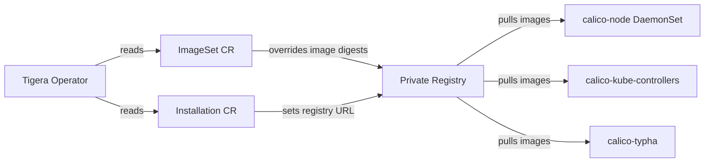

# How to Set Up Calico ImageSet Management Step by Step

Author: [nawazdhandala](https://github.com/nawazdhandala)

Tags: Calico, Kubernetes, Networking, ImageSet, Container Registry

Description: A step-by-step guide to setting up Calico ImageSet management for controlling which container images are used by Calico components in air-gapped and enterprise environments.

---

## Introduction

Calico ImageSet management allows cluster administrators to specify exact container image references for all Calico components, enabling air-gapped deployments, private registry mirroring, and strict image governance. This is particularly valuable in regulated environments where all container images must be vetted and sourced from approved registries.

The `ImageSet` custom resource works alongside the Calico Operator to override default image references. Instead of pulling images from `quay.io` or `docker.io`, you can redirect pulls to an internal Harbor, Artifactory, or ECR registry. This approach ensures your cluster never reaches out to public registries after initial setup.

This guide walks you through the complete process of creating and applying a Calico ImageSet, from mirroring images to configuring the operator to use your custom registry, ensuring a reproducible and auditable deployment pipeline.

## Prerequisites

- Calico installed via the Tigera Operator (v3.25+)
- Access to a private container registry (Harbor, Artifactory, ECR, etc.)
- `kubectl` configured with cluster-admin permissions
- `docker` or `crane` CLI for image mirroring
- Calico version pinned (e.g., v3.27.0)

## Step 1: Identify Required Images

List all images needed for the target Calico version:

```bash
# Download the operator manifest to inspect image references
CALICO_VERSION=v3.27.0
curl -o tigera-operator.yaml https://raw.githubusercontent.com/projectcalico/calico/${CALICO_VERSION}/manifests/tigera-operator.yaml

# Extract image references
grep "image:" tigera-operator.yaml | sort -u
```

For a full Calico deployment, you typically need:
- `calico/cni`
- `calico/node`
- `calico/kube-controllers`
- `calico/typha`
- `calico/pod2daemon-flexvol`
- `calico/apiserver`
- `tigera/operator`

## Step 2: Mirror Images to Private Registry

```bash
REGISTRY=registry.internal.example.com/calico
CALICO_VERSION=v3.27.0

IMAGES=(
  "quay.io/tigera/operator:${CALICO_VERSION}"
  "calico/cni:${CALICO_VERSION}"
  "calico/node:${CALICO_VERSION}"
  "calico/kube-controllers:${CALICO_VERSION}"
  "calico/typha:${CALICO_VERSION}"
  "calico/pod2daemon-flexvol:${CALICO_VERSION}"
  "calico/apiserver:${CALICO_VERSION}"
)

for img in "${IMAGES[@]}"; do
  src="docker.io/${img}"
  dest="${REGISTRY}/$(basename ${img%:*}):${CALICO_VERSION}"
  crane copy "${src}" "${dest}"
  echo "Mirrored: ${dest}"
done
```

## Step 3: Create the ImageSet Resource

```yaml
# calico-imageset.yaml
apiVersion: operator.tigera.io/v1
kind: ImageSet
metadata:
  name: calico-v3.27.0
spec:
  images:
    - image: "calico/cni"
      digest: "sha256:abc123..."
    - image: "calico/node"
      digest: "sha256:def456..."
    - image: "calico/kube-controllers"
      digest: "sha256:ghi789..."
    - image: "calico/typha"
      digest: "sha256:jkl012..."
    - image: "calico/pod2daemon-flexvol"
      digest: "sha256:mno345..."
    - image: "calico/apiserver"
      digest: "sha256:pqr678..."
    - image: "tigera/operator"
      digest: "sha256:stu901..."
```

Get image digests before applying:

```bash
for img in calico/cni calico/node calico/kube-controllers calico/typha; do
  digest=$(crane digest docker.io/${img}:${CALICO_VERSION})
  echo "  - image: \"${img}\""
  echo "    digest: \"${digest}\""
done
```

## Step 4: Configure the Installation Resource

Update the `Installation` resource to reference your private registry:

```yaml
# installation.yaml
apiVersion: operator.tigera.io/v1
kind: Installation
metadata:
  name: default
spec:
  registry: registry.internal.example.com/calico
  imagePath: ""
  imagePrefix: ""
  calicoNetwork:
    ipPools:
      - cidr: 192.168.0.0/16
        encapsulation: VXLANCrossSubnet
```

## Step 5: Apply the Configuration

```bash
# Apply the ImageSet first
kubectl apply -f calico-imageset.yaml

# Verify it was created
kubectl get imageset

# Apply the updated Installation
kubectl apply -f installation.yaml

# Watch operator reconcile
kubectl rollout status ds/calico-node -n calico-system
kubectl rollout status deploy/calico-kube-controllers -n calico-system
```

## Step 6: Verify Image Sources

```bash
# Confirm pods are using your private registry
kubectl get pods -n calico-system -o jsonpath='{range .items[*]}{.metadata.name}{"\t"}{range .spec.containers[*]}{.image}{"\n"}{end}{end}'

# Check for any ImagePullBackOff errors
kubectl get events -n calico-system --field-selector reason=Failed
```

## Architecture Overview



## Conclusion

Setting up Calico ImageSet management provides deterministic, auditable control over the exact container images running in your cluster. By pinning images to specific digests and sourcing them from a private registry, you eliminate dependency on public registries, satisfy compliance requirements, and ensure reproducible deployments. The combination of ImageSet, private registry mirroring, and the Installation resource registry field gives you full control over Calico's image supply chain.
