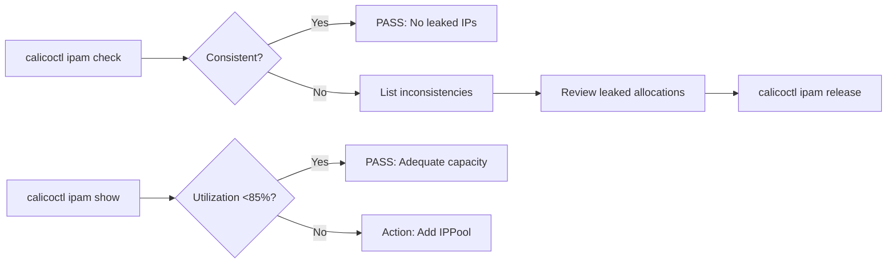

# How to Set Up Calico IPAM Checks Step by Step

Author: [nawazdhandala](https://github.com/nawazdhandala)

Tags: Calico, Kubernetes, Networking, IPAM

Description: Set up regular Calico IPAM checks using calicoctl ipam check and ipam show to detect IP address leaks, block affinity inconsistencies, and IPAM utilization issues before they cause pod scheduling...

---

## Introduction

Calico IPAM (IP Address Management) allocates IP addresses to pods using a block-based system where each node is assigned CIDR blocks, and pods on that node receive IPs from those blocks. IPAM issues - leaked allocations, orphaned blocks, or exhausted pools - manifest as pod scheduling failures with no obvious cause. Setting up IPAM checks means running `calicoctl ipam check` and `calicoctl ipam show` on a regular schedule.

## Prerequisites

- `calicoctl` v3.x installed and configured for Kubernetes datastore
- kubectl with access to calico-system namespace
- Sufficient permissions to read IPAMBlock and IPAMAllocation CRDs

## Step 1: Run calicoctl ipam check

```bash
# Run a comprehensive IPAM consistency check
calicoctl ipam check

# Expected output: "IPAM is consistent"
# If inconsistencies found, output lists specific issues:
# - Leaked allocations (IP allocated but no pod exists)
# - Orphaned blocks (block assigned to deleted node)
# - Duplicate allocations (same IP given to multiple pods)

# Run with verbose output for details
calicoctl ipam check --show-all-ips
```

## Step 2: Check IPAM Utilization

```bash
# Show IPAM block allocation summary
calicoctl ipam show

# Show per-block utilization
calicoctl ipam show --show-blocks

# Example output:
# +----------+-------------------+------------+
# | GROUPING |       CIDR        | IPS IN USE |
# +----------+-------------------+------------+
# | IP Pool  | 192.168.0.0/16    | 47 (94%)   |

# Check per-IP-pool utilization
calicoctl get ippool -o wide
```

## Step 3: Show IP Allocation Detail

```bash
# Show which pod has which IP
calicoctl ipam show --show-all-ips | head -50

# Show borrowed IPs (cross-node allocations in certain topologies)
calicoctl ipam show --show-borrowed

# Show blocks allocated to specific node
calicoctl ipam show --show-blocks | grep <node-name>
```

## IPAM Check Architecture



## Step 4: Set Up Regular IPAM Check

```bash
#!/bin/bash
# weekly-ipam-check.sh
echo "=== Calico IPAM Check $(date) ==="

calicoctl ipam check
CHECK_EXIT=$?

echo ""
echo "=== IPAM Utilization ==="
calicoctl ipam show

if [ "${CHECK_EXIT}" -ne 0 ]; then
  echo "IPAM check found issues - review above output"
  exit 1
fi
```

## Conclusion

Setting up Calico IPAM checks requires two commands: `calicoctl ipam check` (consistency verification) and `calicoctl ipam show` (utilization monitoring). Run the consistency check weekly to detect leaked allocations before they accumulate, and monitor utilization daily in large or growing clusters. IPAM issues are silent until they cause pod scheduling failures, making proactive checking the only reliable way to prevent unexpected capacity shortfalls.
