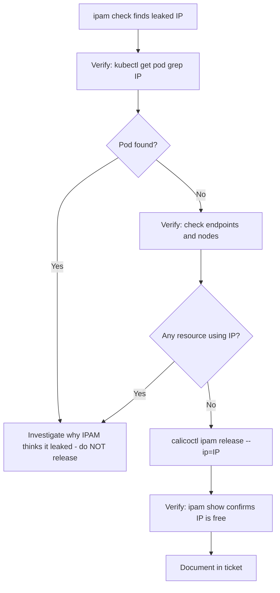

# How to Set Up Calico IPAM Release Workflows Step by Step

Author: [nawazdhandala](https://github.com/nawazdhandala)

Tags: Calico, Kubernetes, Networking, IPAM

Description: Set up safe Calico IPAM release workflows for reclaiming leaked IP addresses and orphaned blocks, with verification procedures that prevent releasing IPs still in use by running pods.

---

## Introduction

Calico IPAM release workflows reclaim IP addresses that have been allocated but are no longer associated with any running pod. This happens when pods are force-deleted, nodes fail unexpectedly, or IPAM blocks become orphaned after node removal. `calicoctl ipam release` is the command to reclaim individual IPs, and a safe workflow requires verification at each step to prevent corrupting the IPAM database.

## Prerequisites

- `calicoctl` installed and configured for Kubernetes datastore
- kubectl with read access to all namespaces (to verify pod state)
- Permission to write to IPAM CRDs (ipam release requires this)

## Step 1: Identify Leaked IPs

```bash
# Run IPAM check to identify leaked allocations
calicoctl ipam check --show-all-ips 2>&1 | grep "allocated" | head -20

# Or use the check output to find specific issues
calicoctl ipam check 2>&1 | grep -i "leak\|orphan\|inconsistency"
```

## Step 2: Verify the IP Is Not In Use

```bash
# For each suspected leaked IP:
LEAKED_IP="192.168.1.42"

# Check all namespaces for a pod using this IP
kubectl get pod --all-namespaces -o wide | grep "${LEAKED_IP}"
# Must show NO output before proceeding

# Also check endpoint resources
kubectl get endpoints --all-namespaces | grep "${LEAKED_IP}"
# Must show NO output

# Check for any node using this IP
kubectl get nodes -o wide | grep "${LEAKED_IP}"
# Must show NO output (unless it's a valid node IP - don't release node IPs)
```

## Step 3: Release the IP

```bash
# Only run after Step 2 confirms no pod/endpoint uses this IP
calicoctl ipam release --ip="${LEAKED_IP}"

# Verify the release succeeded
calicoctl ipam show --show-all-ips | grep "${LEAKED_IP}"
# Should show no output (IP is now free)
```

## IPAM Release Workflow



## Step 4: Release an Orphaned Block Affinity

```bash
# For blocks assigned to deleted nodes:
calicoctl ipam show --show-blocks | grep <deleted-node>

# Release block affinity (if node is truly deleted)
calicoctl ipam release --block=<cidr> --node=<deleted-node>
# This releases the block back to the pool for reassignment
```

## Conclusion

The IPAM release workflow's key safety step is the pre-release verification: checking that no pod, endpoint, or node is using the IP before calling `calicoctl ipam release`. Skipping this step risks creating duplicate IP assignments, which cause immediate networking corruption. Run the complete workflow for every leaked IP identified by `calicoctl ipam check`, and document each release in a ticket for audit purposes.
