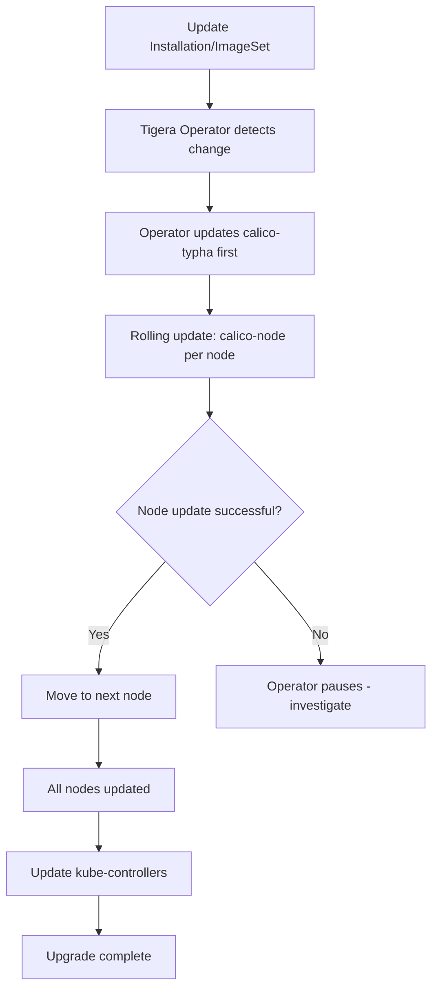

# How to Set Up Calico on Kubernetes Upgrades Step by Step

Author: [nawazdhandala](https://github.com/nawazdhandala)

Tags: Calico, Kubernetes, Networking, Upgrade, Operations

Description: A step-by-step guide to upgrading Calico on Kubernetes clusters using the Tigera Operator, ensuring zero network downtime and policy continuity during version transitions.

---

## Introduction

Upgrading Calico on Kubernetes is a controlled process that the Tigera Operator manages automatically when you update the Installation resource or ImageSet. Understanding how the operator performs rolling upgrades - updating one node at a time while maintaining network connectivity on others - allows you to plan maintenance windows, set appropriate expectations, and know when to intervene if something goes wrong.

Calico upgrades are required when a new Calico version adds important bug fixes, security patches, or new features. The upgrade process should always be tested in a non-production cluster first, with a complete validation run before proceeding to production.

## Prerequisites

- Calico installed via the Tigera Operator (v3.20+)
- Current Calico version documented
- kubectl with cluster-admin access
- Maintenance window scheduled
- Staging cluster where upgrade was pre-tested

## Pre-Upgrade Checklist

```bash
#!/bin/bash
# pre-upgrade-calico.sh
echo "=== Pre-Upgrade Calico Checklist ==="

# 1. Current version
CURRENT_VERSION=$(kubectl get installation default \
  -o jsonpath='{.status.calicoVersion}')
echo "Current Calico version: ${CURRENT_VERSION}"

# 2. Target version compatibility with Kubernetes
K8S_VERSION=$(kubectl version --short 2>/dev/null | grep "Server Version" | awk '{print $3}')
echo "Kubernetes version: ${K8S_VERSION}"
echo "Check compatibility matrix: https://docs.tigera.io/calico/latest/getting-started/kubernetes/requirements"

# 3. All Calico pods healthy before upgrade
NOT_RUNNING=$(kubectl get pods -n calico-system --no-headers | grep -v Running | wc -l)
echo "Non-running Calico pods: ${NOT_RUNNING} (should be 0)"

# 4. TigeraStatus healthy
kubectl get tigerastatus
```

## Upgrade Procedure

### Method 1: Operator-Managed Upgrade (Recommended)

```bash
CALICO_VERSION=v3.28.0

# Step 1: Update the operator image (if upgrading the operator too)
kubectl set image deploy/tigera-operator \
  tigera-operator=quay.io/tigera/operator:${CALICO_VERSION} \
  -n tigera-operator

# Step 2: Wait for operator to be ready
kubectl rollout status deploy/tigera-operator -n tigera-operator --timeout=120s

# Step 3: The operator will automatically upgrade Calico components
# Monitor progress
kubectl get tigerastatus -w

# Monitor the rolling update on calico-node
kubectl rollout status ds/calico-node -n calico-system --timeout=600s
```

### Method 2: ImageSet-Based Upgrade

```bash
# Create new ImageSet for target version
cat > calico-imageset-v3.28.0.yaml <<EOF
apiVersion: operator.tigera.io/v1
kind: ImageSet
metadata:
  name: calico-v3.28.0
spec:
  images:
    - image: "calico/cni"
      digest: "sha256:new-digest-here..."
    # ... other images
EOF

kubectl apply -f calico-imageset-v3.28.0.yaml

# Update Installation to target version
kubectl patch installation default --type=merge \
  -p '{"spec":{"version":"v3.28.0"}}'

# Monitor upgrade
kubectl get tigerastatus -w
kubectl rollout status ds/calico-node -n calico-system --timeout=600s
```

## Upgrade Process Flow



## Post-Upgrade Validation

```bash
# Verify new version is running
kubectl get installation default -o jsonpath='{.status.calicoVersion}'

# All pods should be on new version
kubectl get pods -n calico-system -o jsonpath='{range .items[*]}{.metadata.name}{"\t"}{range .spec.containers[*]}{.image}{"\n"}{end}{end}'

# Network connectivity test
kubectl run post-upgrade-test --image=busybox --restart=Never -- \
  nslookup kubernetes.default.svc.cluster.local \
  && echo "DNS working"

# TigeraStatus should be Available
kubectl get tigerastatus
```

## Conclusion

Upgrading Calico on Kubernetes via the Tigera Operator is a controlled process that handles the rolling update across nodes automatically. The key to a successful upgrade is: verifying compatibility, ensuring all pods are healthy before starting, monitoring the upgrade progress, and running post-upgrade validation. Always upgrade in staging first and have a rollback plan ready (reverting to the previous ImageSet or Installation version) in case validation fails.
