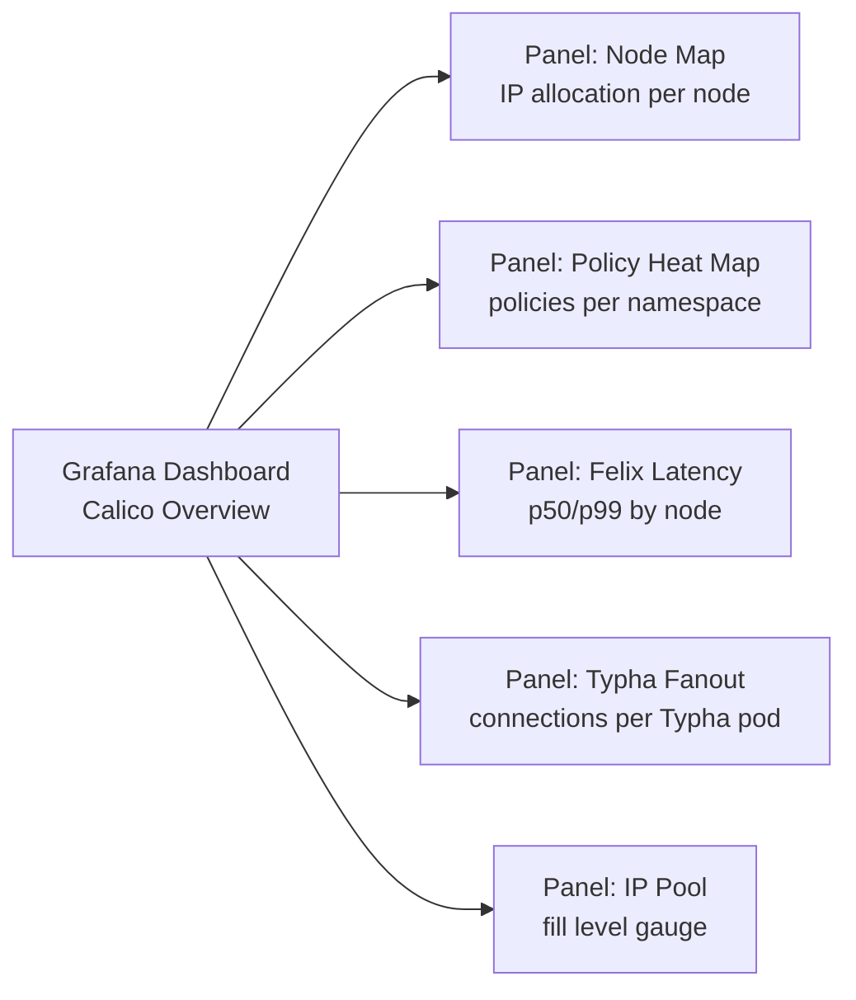

# How to Set Up Calico Metrics Visualization Step by Step

Author: [nawazdhandala](https://github.com/nawazdhandala)

Tags: Calico, Kubernetes, Networking, Metrics, Grafana, Visualization

Description: Build comprehensive Grafana dashboards for Calico networking metrics including Felix performance, IPAM utilization, policy enforcement, and network topology visualization.

---

## Introduction

Calico metrics visualization transforms raw Prometheus data into actionable insights through Grafana dashboards. A well-designed visualization suite provides platform teams with an at-a-glance view of networking health, enables quick identification of performance bottlenecks, and supports capacity planning for IP address management.

The key dashboard categories for Calico are: component health overview (Felix, Typha, kube-controllers status), policy enforcement metrics (active policies, programming latency), IPAM utilization (IP pool fill levels, per-node allocation), and performance metrics (dataplane programming time, connection counts).

## Prerequisites

- Calico Prometheus metrics enabled (see component metrics setup guide)
- Grafana v9+ with Prometheus data source configured
- `kubectl` access for initial setup

## Dashboard 1: Calico Overview

```json
{
  "title": "Calico - Network Overview",
  "uid": "calico-overview",
  "panels": [
    {
      "title": "Active Network Policies",
      "type": "stat",
      "gridPos": {"h": 4, "w": 6, "x": 0, "y": 0},
      "targets": [{
        "expr": "sum(felix_active_local_policies)",
        "legendFormat": "Total Policies"
      }]
    },
    {
      "title": "Active IP Sets",
      "type": "stat",
      "gridPos": {"h": 4, "w": 6, "x": 6, "y": 0},
      "targets": [{
        "expr": "sum(felix_ipsets_total)",
        "legendFormat": "IP Sets"
      }]
    },
    {
      "title": "IP Pool Utilization",
      "type": "gauge",
      "gridPos": {"h": 8, "w": 12, "x": 0, "y": 4},
      "targets": [{
        "expr": "sum(ipam_allocations_per_node) / sum(ipam_blocks_per_node * 64) * 100",
        "legendFormat": "IP Pool Usage %"
      }],
      "options": {
        "thresholds": {
          "steps": [
            {"color": "green", "value": 0},
            {"color": "yellow", "value": 70},
            {"color": "red", "value": 90}
          ]
        }
      }
    }
  ]
}
```

## Dashboard 2: Felix Performance

```promql
# Felix dataplane programming latency by node
histogram_quantile(0.99,
  rate(felix_int_dataplane_apply_time_seconds_bucket[5m])
)

# Felix iptables rule count over time
felix_iptables_rules

# Felix resync duration
histogram_quantile(0.99,
  rate(felix_exec_time_micros_bucket{action="add-rule"}[5m])
) / 1000000
```

## Step 1: Import the Calico Community Dashboard

```bash
# Import the official Calico Grafana dashboard (ID: 12175)
# Via Grafana UI: + > Import > ID: 12175

# Or via API
curl -X POST "http://grafana.monitoring.svc:3000/api/dashboards/import" \
  -H "Content-Type: application/json" \
  -H "Authorization: Bearer ${GRAFANA_API_KEY}" \
  -d '{
    "dashboard": {"id": 12175},
    "folderId": 0,
    "overwrite": true
  }'
```

## Step 2: Create IPAM Visualization

```yaml
# Grafana dashboard as ConfigMap for auto-provisioning
apiVersion: v1
kind: ConfigMap
metadata:
  name: calico-ipam-dashboard
  namespace: monitoring
  labels:
    grafana_dashboard: "1"
data:
  calico-ipam.json: |
    {
      "title": "Calico IPAM Dashboard",
      "panels": [
        {
          "title": "IP Allocations per Node",
          "type": "bargauge",
          "targets": [{
            "expr": "sum(ipam_allocations_per_node) by (node)",
            "legendFormat": "{{ node }}"
          }]
        },
        {
          "title": "IP Pool Block Utilization",
          "type": "timeseries",
          "targets": [{
            "expr": "ipam_blocks_per_node",
            "legendFormat": "{{ node }}"
          }]
        }
      ]
    }
```

## Step 3: Set Up Network Topology View



## Step 4: Configure Alert Annotations

```promql
# Add annotation to show when Calico upgrades happened
# Triggered by calico_node_version metric changes
changes(calico_node_version[1h]) > 0
```

## Dashboard Best Practices

- Use variables for cluster and node selection
- Set appropriate time ranges (15m for operational, 7d for trend analysis)
- Add threshold lines on performance panels
- Include drill-down links from overview to component-specific dashboards

## Conclusion

Setting up Calico metrics visualization provides platform teams with the network observability layer they need to operate production clusters confidently. Start with the community Calico Grafana dashboard (ID 12175) as a foundation, then build custom IPAM and performance dashboards tailored to your cluster's specific characteristics. The combination of overview, IPAM, and performance dashboards covers the three main use cases: health monitoring, capacity planning, and performance troubleshooting.
