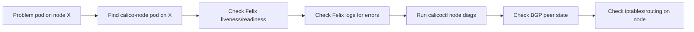

# How to Set Up Calico Node Diagnostics Step by Step

Author: [nawazdhandala](https://github.com/nawazdhandala)

Tags: Calico, Kubernetes, Networking, Diagnostics

Description: Set up a Calico node diagnostics toolkit using calicoctl node diags, Felix health checks, and per-node BGP and routing state inspection to isolate networking issues to specific cluster nodes.

---

## Introduction

Calico node diagnostics focus on the health and configuration of individual cluster nodes rather than the cluster-wide state. A networking issue affecting only pods on a specific node almost always traces back to that node's calico-node pod, its Felix process, or its BGP peering state. Setting up node diagnostics means having the tools and commands ready to inspect each node independently.

## Prerequisites

- `calicoctl` installed and configured for Kubernetes datastore
- kubectl with exec access to calico-system namespace
- Access to `calicoctl node diags` command (requires calico-node container exec)

## Step 1: Identify the Affected Node

```bash
# Find which node a problem pod is running on
kubectl get pod <pod-name> -n <namespace> -o jsonpath='{.spec.nodeName}'

# Get the calico-node pod running on that node
PROBLEM_NODE="<node-name>"
CALICO_POD=$(kubectl get pods -n calico-system -l app=calico-node \
  --field-selector=spec.nodeName="${PROBLEM_NODE}" \
  -o jsonpath='{.items[0].metadata.name}')
echo "calico-node pod on ${PROBLEM_NODE}: ${CALICO_POD}"
```

## Step 2: Check Felix Health on the Node

```bash
# Check Felix liveliness and readiness
kubectl exec -n calico-system "${CALICO_POD}" -c calico-node -- \
  calico-node -felix-live

kubectl exec -n calico-system "${CALICO_POD}" -c calico-node -- \
  calico-node -felix-ready

# Check Felix-specific logs from this node
kubectl logs -n calico-system "${CALICO_POD}" -c calico-node | \
  grep -i "error\|warning" | tail -20
```

## Step 3: Run calicoctl node diags

```bash
# Collect comprehensive node diagnostics
kubectl exec -n calico-system "${CALICO_POD}" -c calico-node -- \
  calicoctl node diags

# The output is saved inside the container; copy it out
kubectl cp calico-system/"${CALICO_POD}":/tmp/calico-diags.tar.gz \
  ./calico-node-diags-$(date +%Y%m%d).tar.gz
```

## Node Diagnostics Architecture



## Step 4: Check BGP State on the Node

```bash
# Check BGP peer state from the node's perspective
kubectl exec -n calico-system "${CALICO_POD}" -c calico-node -- \
  calicoctl node status

# Check bird routing table (BGP routes learned)
kubectl exec -n calico-system "${CALICO_POD}" -c calico-node -- \
  birdcl show route | head -30
```

## Step 5: Check iptables Rules on the Node

```bash
# View Felix-managed iptables rules (standard Calico dataplane)
kubectl debug node/"${PROBLEM_NODE}" --image=alpine -it -- \
  nsenter -t 1 -n -- iptables -L cali-FORWARD -n | head -20
```

## Conclusion

Calico node diagnostics start with identifying the affected node, finding its calico-node pod, and then checking Felix health, BGP state, and the node's iptables rules in sequence. The `calicoctl node diags` command collects a comprehensive bundle of all these signals automatically. For pod connectivity issues isolated to one node, Felix health and BGP state are the first things to check — they cover 90% of single-node Calico failures.
