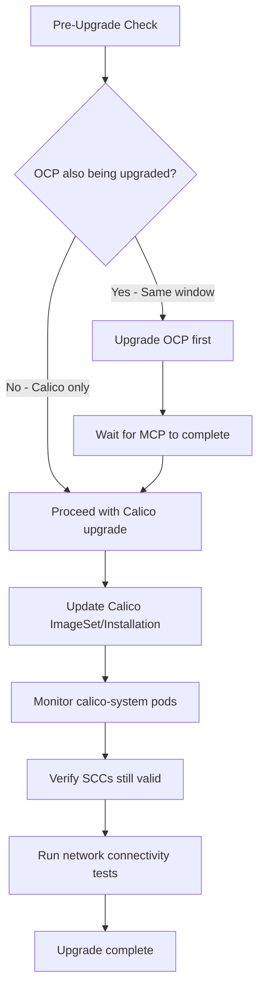

# How to Set Up Calico on OpenShift Upgrades Step by Step

Author: [nawazdhandala](https://github.com/nawazdhandala)

Tags: Calico, OpenShift, Kubernetes, Networking, Upgrade

Description: A step-by-step guide to upgrading Calico on OpenShift clusters, navigating OCP-specific operator management, SCC requirements, and upgrade coordination with OpenShift platform upgrades.

---

## Introduction

Upgrading Calico on OpenShift requires additional considerations compared to vanilla Kubernetes. OpenShift has its own operator framework (OLM), Security Context Constraints (SCCs) that affect Calico's pod execution, and a specific cluster upgrade process that may interact with Calico's rolling updates. When Red Hat releases OpenShift updates, they may also update bundled networking components, potentially creating version conflicts with independently installed Calico.

The key principles for Calico upgrades on OpenShift are: coordinate Calico upgrades with OCP upgrades, ensure SCCs remain compatible after OCP upgrades, and use the OpenShift-specific Calico installation paths to maintain compatibility.

## Prerequisites

- Calico installed on OpenShift 4.10+
- `oc` CLI and `kubectl` with cluster-admin access
- Calico Enterprise or Calico operator compatible with OCP
- OpenShift current version documented

## Pre-Upgrade Considerations

```bash
# Check current OpenShift version
oc version

# Check current Calico version
kubectl get installation default -o jsonpath='{.status.calicoVersion}'

# Check OCP-Calico compatibility
# Calico Enterprise: https://docs.tigera.io/calico-enterprise/latest/getting-started/openshift/requirements
# Calico Open Source: check release notes for OCP support

# Check existing SCCs used by Calico
oc get scc | grep -i calico
oc describe scc calico-node
```

## OpenShift-Specific Calico Upgrade Procedure

```bash
# Step 1: Before OCP upgrade - document Calico state
kubectl get installation default -o yaml > pre-upgrade-installation.yaml
kubectl get tigerastatus > pre-upgrade-tigerastatus.txt

# Step 2: If upgrading OCP first, check Calico still works
# OCP upgrades can change SCCs, kernel modules, or CNI interfaces

# Step 3: Upgrade Calico via operator
CALICO_VERSION=v3.28.0
kubectl patch installation default --type=merge \
  -p '{"spec":{"version":"'"${CALICO_VERSION}"'"}}'

# Step 4: Monitor OCP-specific components
oc get pods -n calico-system
oc get clusteroperators | grep -i calico
```

## OpenShift SCC Validation Post-Upgrade

```bash
# Verify Calico SCCs are still in place after upgrade
oc get scc | grep calico

# Check calico-node has correct SCC binding
oc get scc calico-node -o yaml | grep -A5 "users:"

# Verify calico-node pods can use privileged SCC
oc describe pod -n calico-system -l k8s-app=calico-node | \
  grep -i "scc\|security"
```

## OpenShift MachineConfigPool Interaction

```bash
# During Calico upgrades, MachineConfigPools may also be updating
# Check MCP status to avoid conflicts
oc get mcp

# Wait for all MCPs to be ready before starting Calico upgrade
watch oc get mcp
# All should show: UPDATED=True, UPDATING=False, DEGRADED=False
```

## Upgrade Architecture on OpenShift



## Post-Upgrade OpenShift-Specific Checks

```bash
# Verify OCP network operator is not fighting with Calico
oc get network.operator.openshift.io cluster -o yaml | \
  grep -A10 "defaultNetwork"

# Check for any OCP network operator warnings
oc get co network -o jsonpath='{.status.conditions[?(@.type=="Degraded")].message}'

# Verify all cluster operators are healthy
oc get co | grep -v "True.*False.*False"
```

## Conclusion

Upgrading Calico on OpenShift requires coordinating with OCP's own upgrade processes, validating SCC compatibility after upgrades, and monitoring OpenShift-specific components alongside standard Calico validation. Always upgrade OpenShift's MachineConfigPools to completion before starting Calico upgrades to avoid conflicts. The combination of standard post-upgrade validation (TigeraStatus, network connectivity) with OpenShift-specific checks (SCC validation, cluster operator status) ensures a complete and correct upgrade verification on OCP.
