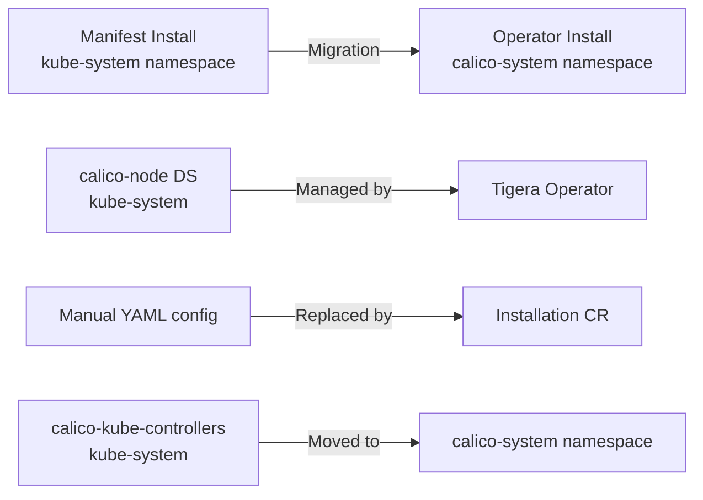

# How to Set Up Calico Operator Migration Step by Step

Author: [nawazdhandala](https://github.com/nawazdhandala)

Tags: Calico, Kubernetes, Networking, Operator, Migration

Description: A step-by-step guide to migrating Calico from manifest-based installation to the Tigera Operator, ensuring zero network downtime during the transition.

---

## Introduction

Calico can be installed via raw Kubernetes manifests or via the Tigera Operator. The operator-based installation is the recommended approach for production environments as it provides lifecycle management, automated upgrades, and a declarative configuration model. Many existing clusters run the legacy manifest-based installation and need to migrate to the operator without disrupting workload networking.

The migration from manifest to operator is a significant operation that touches every node in your cluster as the operator takes over management of the `calico-node` DaemonSet and `calico-kube-controllers` Deployment. Understanding the migration process and its risks is essential for executing it safely during a maintenance window.

This guide walks through the complete migration procedure with pre-flight checks, step-by-step execution, and verification at each stage.

## Prerequisites

- Calico installed via manifests (non-operator) — version v3.15+
- Kubernetes v1.22+
- `kubectl` with cluster-admin access
- `calicoctl` CLI installed
- Scheduled maintenance window (30-60 minutes)

## Pre-Migration Assessment

```bash
# Verify current Calico installation type
kubectl get pods -n kube-system | grep calico
kubectl get pods -n calico-system 2>/dev/null || echo "calico-system namespace not found (manifest install)"

# Check current Calico version
kubectl get ds calico-node -n kube-system \
  -o jsonpath='{.spec.template.spec.containers[0].image}'

# Check custom resources that need to be preserved
calicoctl get ippools -o yaml > pre-migration-ippools.yaml
calicoctl get felixconfiguration -o yaml > pre-migration-felixconfig.yaml
calicoctl get globalnetworkpolicies -o yaml > pre-migration-gnps.yaml

echo "Pre-migration backup complete"
```

## Migration Architecture



## Step 1: Install the Tigera Operator

```bash
CALICO_VERSION=v3.27.0

# Install the Tigera Operator CRDs
kubectl create -f https://raw.githubusercontent.com/projectcalico/calico/${CALICO_VERSION}/manifests/tigera-operator.yaml

# Verify operator is running
kubectl rollout status deploy/tigera-operator -n tigera-operator
```

## Step 2: Create the Installation Resource Matching Current Config

Inspect your current Calico configuration and create a matching Installation resource:

```bash
# Get current IP pool configuration
CURRENT_CIDR=$(kubectl get ippool default-ipv4-ippool -o jsonpath='{.spec.cidr}' 2>/dev/null || echo "192.168.0.0/16")
CURRENT_ENCAP=$(kubectl get ippool default-ipv4-ippool -o jsonpath='{.spec.ipipMode}' 2>/dev/null || echo "Never")
```

```yaml
# installation-migration.yaml
apiVersion: operator.tigera.io/v1
kind: Installation
metadata:
  name: default
spec:
  # Match your existing network configuration exactly
  calicoNetwork:
    ipPools:
      - cidr: 192.168.0.0/16   # Match existing CIDR
        encapsulation: VXLAN    # Match existing encap
        natOutgoing: Enabled
        nodeSelector: "all()"
  # Specify current version to avoid automatic upgrade
  variant: Calico
```

## Step 3: Execute the Migration

```bash
# The operator detects the existing manifest installation
# and migrates it automatically when you apply Installation

kubectl apply -f installation-migration.yaml

# Watch the migration progress
kubectl get tigerastatus -w

# Monitor namespace creation
kubectl get ns calico-system -w

# Monitor pod migration
kubectl get pods -n kube-system | grep calico
kubectl get pods -n calico-system -w
```

## Step 4: Verify Migration Success

```bash
# Old kube-system calico pods should be gone
kubectl get pods -n kube-system | grep calico

# New calico-system pods should be running
kubectl get pods -n calico-system

# Verify IP pools were preserved
calicoctl get ippools

# Verify network policies are intact
calicoctl get globalnetworkpolicies

# Test pod connectivity
kubectl run test-pod --image=busybox --restart=Never -- wget -qO- https://kubernetes.default.svc
```

## Conclusion

Migrating Calico from manifest-based to operator-based installation requires careful preparation, including backing up all custom resources and creating an Installation resource that exactly matches your existing network configuration. The Tigera Operator handles the actual migration automatically when it detects an existing manifest installation. After migration, all Calico resources should be identical, but now managed by the operator, enabling future upgrades and configuration changes through the declarative Installation API.
