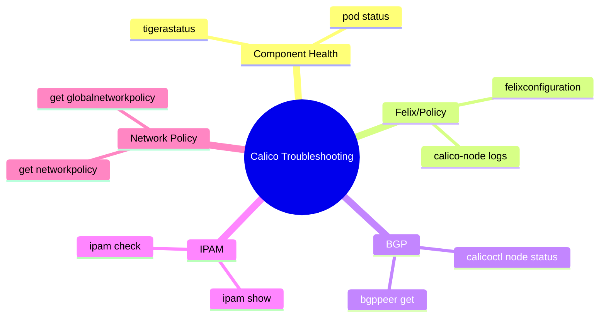

# How to Set Up Calico Troubleshooting Commands Step by Step

Author: [nawazdhandala](https://github.com/nawazdhandala)

Tags: Calico, Kubernetes, Networking, Troubleshooting

Description: Set up a complete Calico troubleshooting toolkit with calicoctl, kubectl plugins, and the standard command set for diagnosing Felix, BGP, IPAM, and policy issues in any Calico cluster.

---

## Introduction

Having the right troubleshooting commands ready before an incident is the difference between a 10-minute diagnosis and a 2-hour investigation. Calico troubleshooting spans four domains: Felix (policy enforcement), BGP (routing), IPAM (IP allocation), and the Tigera Operator (component health). Each domain has specific commands, and organizing them into a reference guide ensures any on-call engineer can diagnose issues without needing to look up syntax under pressure.

## Prerequisites

- `calicoctl` v3.x installed and configured
- `kubectl` with cluster-admin access to the Calico cluster
- Access to the `calico-system` namespace

## Step 1: Install and Configure calicoctl

```bash
# Install calicoctl matching your Calico version
CALICO_VERSION=$(kubectl get installation default \
  -o jsonpath='{.spec.variant}' 2>/dev/null || echo "v3.27.0")

curl -Lo calicoctl https://github.com/projectcalico/calico/releases/download/\
${CALICO_VERSION}/calicoctl-linux-amd64
chmod +x calicoctl
mv calicoctl /usr/local/bin/

# Configure for Kubernetes datastore (most common)
export DATASTORE_TYPE=kubernetes
export KUBECONFIG=~/.kube/config

# Verify
calicoctl version
```

## Step 2: Core Calico Troubleshooting Commands

```bash
# === COMPONENT HEALTH ===
kubectl get tigerastatus                    # Operator component health
kubectl get pods -n calico-system           # Pod status

# === FELIX / POLICY ===
kubectl logs -n calico-system -l app=calico-node -c calico-node --tail=50
calicoctl get felixconfiguration -o yaml    # Felix configuration

# === BGP ===
calicoctl node status                       # BGP peer state
calicoctl get bgppeer                       # Configured BGP peers
calicoctl get bgpconfiguration -o yaml      # BGP global config

# === IPAM ===
calicoctl ipam show                         # IPAM block allocation summary
calicoctl ipam check                        # Detect IPAM inconsistencies

# === NETWORK POLICY ===
calicoctl get networkpolicy --all-namespaces
calicoctl get globalnetworkpolicy
```

## Troubleshooting Command Map



## Step 3: Quick Diagnostic Script

```bash
#!/bin/bash
# calico-quick-check.sh
echo "=== TigeraStatus ==="
kubectl get tigerastatus

echo ""
echo "=== calico-system Pods ==="
kubectl get pods -n calico-system

echo ""
echo "=== BGP Peer Status ==="
calicoctl node status 2>/dev/null || echo "calicoctl node status requires exec to calico-node pod"

echo ""
echo "=== IPAM Allocation ==="
calicoctl ipam show --show-blocks 2>/dev/null

echo ""
echo "=== Recent Felix Errors ==="
kubectl logs -n calico-system -l app=calico-node \
  -c calico-node --tail=20 | grep -i error
```

## Conclusion

A structured troubleshooting command reference organized by domain (health, Felix, BGP, IPAM, policy) lets on-call engineers start diagnosis immediately without recalling syntax. Keep the quick diagnostic script in your incident runbook and run it as the first step in any Calico networking incident to establish baseline state before diving into specific symptoms.
