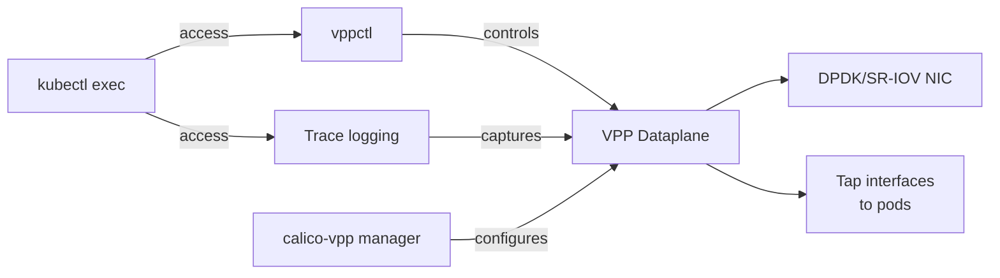

# How to Set Up Calico VPP Troubleshooting Step by Step

Author: [nawazdhandala](https://github.com/nawazdhandala)

Tags: Calico, VPP, Kubernetes, Networking, Troubleshooting

Description: Set up a complete Calico VPP troubleshooting toolkit, including VPP CLI access, trace logging configuration, and packet capture tools for diagnosing VPP dataplane issues.

---

## Introduction

Calico VPP (Vector Packet Processing) is a high-performance alternative dataplane that replaces the standard Linux networking stack with the VPP framework for significantly improved packet throughput. Troubleshooting VPP-mode Calico requires different tools than standard Linux networking — VPP has its own CLI (`vppctl`), its own packet tracing system, and its own show commands that are distinct from `ip route`, `iptables`, or `bpftool`.

Setting up a VPP troubleshooting environment means: installing the VPP CLI tools, configuring trace logging for problematic traffic, and understanding how to map VPP interfaces to Kubernetes pods.

## Prerequisites

- Calico VPP installed (projectcalico/vpp-dataplane)
- kubectl with cluster-admin access
- VPP-compatible hardware (SR-IOV NIC or DPDK-capable interface)

## Step 1: Access vppctl

```bash
# Access VPP CLI from a calico-vpp-node pod
VPP_POD=$(kubectl get pod -n calico-vpp-dataplane -l app=calico-vpp-node \
  -o jsonpath='{.items[0].metadata.name}')

# Run vppctl commands
kubectl exec -n calico-vpp-dataplane "${VPP_POD}" -c vpp -- vppctl show version

# Or open an interactive VPP CLI session
kubectl exec -n calico-vpp-dataplane "${VPP_POD}" -c vpp -- vppctl
```

## Step 2: Key VPP Show Commands

```bash
# List all VPP interfaces (analogous to 'ip link show')
kubectl exec -n calico-vpp-dataplane "${VPP_POD}" -c vpp -- \
  vppctl show interface

# Show interface addresses (analogous to 'ip addr')
kubectl exec -n calico-vpp-dataplane "${VPP_POD}" -c vpp -- \
  vppctl show interface addr

# Show VPP routing table
kubectl exec -n calico-vpp-dataplane "${VPP_POD}" -c vpp -- \
  vppctl show ip fib

# Show VPP neighbors (ARP table)
kubectl exec -n calico-vpp-dataplane "${VPP_POD}" -c vpp -- \
  vppctl show ip neighbor

# Show active connections (NAT table for services)
kubectl exec -n calico-vpp-dataplane "${VPP_POD}" -c vpp -- \
  vppctl show nat44 sessions
```

## Step 3: Configure VPP Packet Tracing

```bash
# Enable packet tracing for debugging connectivity issues
kubectl exec -n calico-vpp-dataplane "${VPP_POD}" -c vpp -- \
  vppctl trace add dpdk-input 100

# Or for tap interfaces (pod traffic):
kubectl exec -n calico-vpp-dataplane "${VPP_POD}" -c vpp -- \
  vppctl trace add virtio-input 100

# Wait for traffic, then show traces
kubectl exec -n calico-vpp-dataplane "${VPP_POD}" -c vpp -- \
  vppctl show trace

# Clear traces
kubectl exec -n calico-vpp-dataplane "${VPP_POD}" -c vpp -- \
  vppctl clear trace
```

## Step 4: Find Pod's VPP Interface

```bash
# Map a Kubernetes pod to its VPP interface
POD_IP=$(kubectl get pod <pod-name> -n <namespace> -o jsonpath='{.status.podIP}')

# Find the VPP interface for this IP
kubectl exec -n calico-vpp-dataplane "${VPP_POD}" -c vpp -- \
  vppctl show ip fib "${POD_IP}" | head -10
```

## VPP Troubleshooting Architecture



## Step 5: Set Up Persistent Debug Logging

```yaml
# Enable debug logging for calico-vpp-manager
apiVersion: v1
kind: ConfigMap
metadata:
  name: calico-vpp-config
  namespace: calico-vpp-dataplane
data:
  CALICOVPP_DEBUG_ENABLE: "true"
  CALICOVPP_LOG_LEVEL: "debug"
```

## Conclusion

Setting up Calico VPP troubleshooting requires access to `vppctl`, the VPP packet tracing system, and an understanding of how VPP interfaces map to Kubernetes pods. The most important step is getting comfortable with `vppctl show interface` and `vppctl show ip fib` before incidents occur — these commands are the VPP equivalents of `ip link show` and `ip route show`. Practice using the trace system in a non-production environment so you can configure it quickly during incidents.
