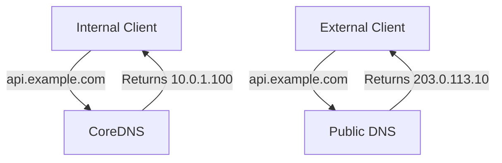

# Split-Horizon DNS with Flux CD

Author: [nawazdhandala](https://github.com/nawazdhandala)

Tags: Flux-cd, DNS, Split-Horizon, Kubernetes, Networking, GitOps

Description: Configure and manage split-horizon DNS for your Kubernetes clusters using Flux CD, allowing internal and external clients to resolve the same hostname to different endpoints.

---

## Introduction

Split-horizon DNS (also called split-brain DNS) serves different DNS answers for the same hostname depending on whether the query comes from inside or outside the network. For Kubernetes clusters, this means internal clients resolve a service to its ClusterIP or internal LoadBalancer IP, while external clients resolve it to the public IP. Managing this configuration through Flux CD ensures consistent, version-controlled DNS behavior.

## Prerequisites

- Kubernetes cluster with CoreDNS and ExternalDNS deployed
- Flux CD bootstrapped
- An internal and external DNS zone for your domain
- Understanding of Kubernetes DNS and networking

## Step 1: Understand the Split-Horizon Pattern



Internal clients use CoreDNS (cluster DNS), which is configured with stub zones or rewrite rules pointing to internal IPs. External clients use public DNS (managed by ExternalDNS) pointing to public load balancer IPs.

## Step 2: Configure CoreDNS for Internal Resolution

```yaml
# infrastructure/coredns/split-horizon-configmap.yaml
apiVersion: v1
kind: ConfigMap
metadata:
  name: coredns
  namespace: kube-system
data:
  Corefile: |
    .:53 {
        errors
        health {
          lameduck 5s
        }
        ready
        kubernetes cluster.local in-addr.arpa ip6.arpa {
          pods insecure
          fallthrough in-addr.arpa ip6.arpa
          ttl 30
        }

        # Split-horizon: Serve internal IPs for api.example.com
        # Internal clients will get the private load balancer IP
        hosts /etc/coredns/internal-hosts {
          10.0.1.100 api.example.com
          10.0.1.101 app.example.com
          10.0.1.102 admin.example.com
          fallthrough
        }

        prometheus :9153
        forward . /etc/resolv.conf {
          max_concurrent 1000
        }
        cache 30
        loop
        reload
        loadbalance
    }
  internal-hosts: |
    # Internal host overrides for split-horizon DNS
    # These IPs are only served to clients inside the cluster
    10.0.1.100  api.example.com
    10.0.1.101  app.example.com
    10.0.1.102  admin.example.com
```

## Step 3: Manage the CoreDNS Config with Flux

```yaml
# clusters/production/infrastructure/coredns-split-horizon.yaml
apiVersion: kustomize.toolkit.fluxcd.io/v1
kind: Kustomization
metadata:
  name: coredns-split-horizon
  namespace: flux-system
spec:
  interval: 10m
  path: ./infrastructure/coredns
  prune: false  # Never prune DNS config
  sourceRef:
    kind: GitRepository
    name: fleet-repo
  targetNamespace: kube-system
```

## Step 4: Configure ExternalDNS for Public Resolution

ExternalDNS manages the public DNS records:

```yaml
apiVersion: helm.toolkit.fluxcd.io/v2
kind: HelmRelease
metadata:
  name: external-dns
  namespace: external-dns
spec:
  interval: 1h
  chart:
    spec:
      chart: external-dns
      version: "1.14.x"
      sourceRef:
        kind: HelmRepository
        name: external-dns
  values:
    provider: cloudflare
    domainFilters:
      - example.com
    policy: sync
    txtOwnerId: "production-cluster"
    sources:
      - service
      - ingress
    # ExternalDNS creates public DNS records pointing to the external LoadBalancer IP
    # Internal resolution is handled by CoreDNS (above)
```

## Step 5: Service Annotations for Split-Horizon

```yaml
# Internal LoadBalancer service (private IP for CoreDNS)
apiVersion: v1
kind: Service
metadata:
  name: api-internal
  namespace: api
  annotations:
    service.beta.kubernetes.io/aws-load-balancer-internal: "true"  # AWS internal LB
    # ExternalDNS: do NOT create public record for this service
    external-dns.alpha.kubernetes.io/exclude: "true"
spec:
  type: LoadBalancer
  selector:
    app: api
  ports:
    - port: 443
      targetPort: 8443
---
# External LoadBalancer service (public IP for ExternalDNS)
apiVersion: v1
kind: Service
metadata:
  name: api-external
  namespace: api
  annotations:
    external-dns.alpha.kubernetes.io/hostname: "api.example.com"
    external-dns.alpha.kubernetes.io/ttl: "300"
spec:
  type: LoadBalancer
  selector:
    app: api
  ports:
    - port: 443
      targetPort: 8443
```

## Step 6: Verify Split-Horizon Behavior

```bash
# From inside the cluster: should return internal IP (10.0.1.100)
kubectl run dns-test --image=busybox:1.36 --rm -it --restart=Never -- \
  nslookup api.example.com

# From outside the cluster: should return public IP (203.0.113.10)
dig api.example.com +short @8.8.8.8

# Verify CoreDNS has the internal override
kubectl run coredns-test --image=busybox:1.36 --rm -it --restart=Never -- \
  nslookup api.example.com coredns.kube-system.svc.cluster.local

# Check ExternalDNS created the public record
kubectl logs -n external-dns -l app=external-dns --tail=30 | grep api.example.com
```

## Best Practices

- Keep internal host files in the CoreDNS ConfigMap synchronized with the actual internal LoadBalancer IPs; automate this via Flux if possible.
- Use Kubernetes Service annotations to clearly mark which services are internal-only versus external-facing.
- Test split-horizon behavior after every CoreDNS configuration change using pods inside the cluster and external DNS lookups.
- Use separate ExternalDNS instances for different DNS zones if you have complex split-horizon requirements.
- Monitor CoreDNS metrics for increased NXDOMAIN responses, which can indicate split-horizon misconfiguration.

## Conclusion

Split-horizon DNS with Flux CD provides a version-controlled approach to managing different DNS views for internal and external clients. CoreDNS handles internal resolution with static overrides or stub zones, while ExternalDNS manages public records. Both configurations are committed to Git and reconciled by Flux, ensuring DNS behavior is consistent, auditable, and reproducible across cluster recreations.
