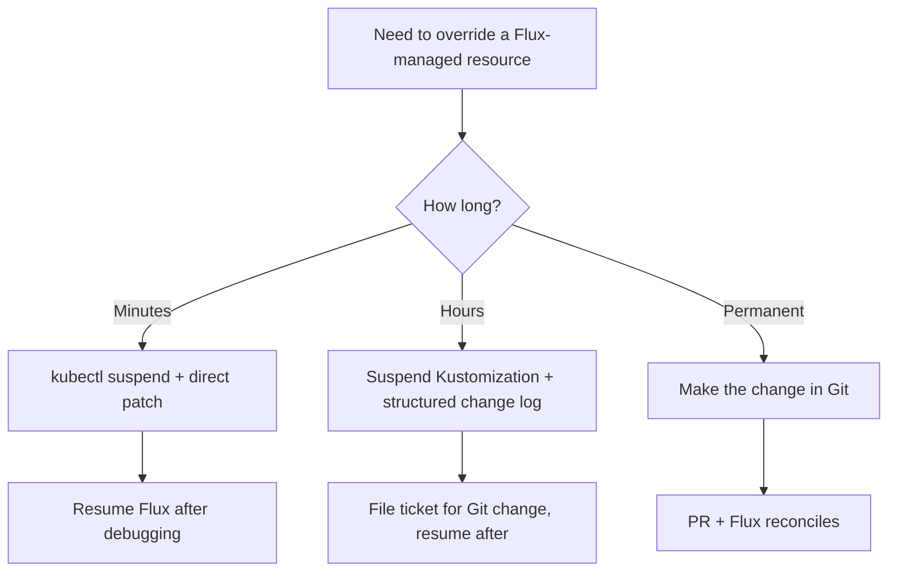

# How to Temporarily Override Flux Managed Resources for Debugging

Author: [nawazdhandala](https://github.com/nawazdhandala)

Tags: Flux CD, Kubernetes, GitOps, Day 2 Operations, Debugging, Troubleshooting

Description: Override Flux-managed resources temporarily for debugging without breaking GitOps integrity, using suspension, field managers, and structured override workflows.

---

## Introduction

Debugging production issues often requires making temporary changes to running workloads: adding a debug environment variable, increasing log verbosity, attaching a debug sidecar, or changing a resource limit to observe behavior under different constraints. In a Flux-managed cluster, these changes are immediately reverted on the next reconciliation cycle.

The correct approach is not to fight Flux but to work with it. Flux provides explicit mechanisms for controlled overrides: suspension, the `force: true` flag, field manager ownership, and annotation-based exclusions. Understanding these tools lets you make the temporary changes you need for debugging while maintaining a clear path back to the GitOps-declared state.

This guide covers the complete toolkit for temporary overrides in Flux-managed environments, from simple one-liner suspensions to complex multi-resource debugging workflows.

## Prerequisites

- Flux CD v2 managing resources in your cluster
- kubectl and Flux CLI installed
- An active incident or debugging session that requires temporary changes

## Step 1: Understand Your Override Options



## Step 2: Suspend and Override a Single Resource

For quick debugging changes that will last only minutes:

```bash
# Step 1: Suspend the Kustomization managing your deployment
flux suspend kustomization my-service -n team-alpha

# Step 2: Confirm suspension
flux get kustomization my-service -n team-alpha
# SUSPENDED: True

# Step 3: Make your debugging changes
kubectl set env deployment/my-service -n team-alpha LOG_LEVEL=debug

# Step 4: Watch your debugging session
kubectl logs -n team-alpha -l app=my-service -f

# Step 5: When done, revert your change
kubectl set env deployment/my-service -n team-alpha LOG_LEVEL=info

# Step 6: Resume Flux and let it restore declared state
flux resume kustomization my-service -n team-alpha
flux reconcile kustomization my-service -n team-alpha --with-source
```

## Step 3: Add a Debug Sidecar Temporarily

For more complex debugging, like adding a network debugging sidecar:

```bash
# Suspend Flux management
flux suspend kustomization my-service -n team-alpha

# Patch the deployment to add a debug sidecar
kubectl patch deployment my-service -n team-alpha --type=json -p='[
  {
    "op": "add",
    "path": "/spec/template/spec/containers/-",
    "value": {
      "name": "debug",
      "image": "nicolaka/netshoot:latest",
      "command": ["sleep", "3600"],
      "resources": {
        "limits": {"cpu": "100m", "memory": "128Mi"}
      }
    }
  }
]'

# Exec into the debug sidecar for investigation
kubectl exec -it deployment/my-service -n team-alpha -c debug -- /bin/bash

# After debugging, remove the sidecar by resuming Flux
# Flux will reconcile back to the Git-declared state (no debug sidecar)
flux resume kustomization my-service -n team-alpha
flux reconcile kustomization my-service -n team-alpha --with-source
```

## Step 4: Use kubectl debug for Non-Disruptive Investigation

`kubectl debug` is often better than modifying the deployment directly because it creates an ephemeral container that does not affect the running pod spec:

```bash
# Attach a debug container to a running pod without modifying the deployment
kubectl debug -it \
  $(kubectl get pod -n team-alpha -l app=my-service -o name | head -1) \
  --image=nicolaka/netshoot:latest \
  --target=my-service \
  -n team-alpha

# The ephemeral container is not managed by Flux and disappears when the pod restarts
# No suspension needed for this approach
```

## Step 5: Override Resource Limits for Performance Testing

```bash
# Suspend Flux
flux suspend kustomization my-service -n team-alpha

# Temporarily increase memory limit for profiling
kubectl patch deployment my-service -n team-alpha \
  --type=merge \
  -p '{"spec":{"template":{"spec":{"containers":[{"name":"my-service","resources":{"limits":{"memory":"2Gi"}}}]}}}}'

# Run your performance test
# ...

# Restore by resuming Flux
flux resume kustomization my-service -n team-alpha
flux reconcile kustomization my-service -n team-alpha
```

## Step 6: Create a Structured Override Workflow

For longer debugging sessions, use a structured process to ensure nothing gets forgotten.

```bash
#!/bin/bash
# scripts/start-debug-override.sh

KUSTOMIZATION=$1
NAMESPACE=$2
OPERATOR=$3
REASON=$4

if [ -z "$KUSTOMIZATION" ] || [ -z "$NAMESPACE" ] || [ -z "$REASON" ]; then
  echo "Usage: $0 <kustomization> <namespace> <operator> <reason>"
  exit 1
fi

echo "=== Starting Debug Override ==="
echo "Kustomization: $KUSTOMIZATION"
echo "Namespace:     $NAMESPACE"
echo "Operator:      $OPERATOR"
echo "Reason:        $REASON"
echo "Started at:    $(date -u +%Y-%m-%dT%H:%M:%SZ)"

# Suspend Flux
flux suspend kustomization $KUSTOMIZATION -n $NAMESPACE

# Record the override
kubectl annotate kustomization $KUSTOMIZATION -n $NAMESPACE \
  platform.io/debug-override-started="$(date -u +%Y-%m-%dT%H:%M:%SZ)" \
  platform.io/debug-override-operator="$OPERATOR" \
  platform.io/debug-override-reason="$REASON"

echo ""
echo "Flux reconciliation suspended. Make your debugging changes."
echo "When done, run: ./scripts/end-debug-override.sh $KUSTOMIZATION $NAMESPACE"
```

```bash
#!/bin/bash
# scripts/end-debug-override.sh

KUSTOMIZATION=$1
NAMESPACE=$2

echo "=== Ending Debug Override ==="
echo "Resuming Flux reconciliation..."

flux resume kustomization $KUSTOMIZATION -n $NAMESPACE
flux reconcile kustomization $KUSTOMIZATION -n $NAMESPACE --with-source

echo "Flux reconciliation resumed at: $(date -u +%Y-%m-%dT%H:%M:%SZ)"
echo "Resources are being restored to Git-declared state."
```

## Step 7: Verify Restoration After Override

```bash
# After resuming, verify Flux has reconciled successfully
flux get kustomization my-service -n team-alpha
# READY: True  MESSAGE: Applied revision: main/abc1234

# Verify key resources match Git-declared state
kubectl get deployment my-service -n team-alpha -o jsonpath='{.spec.template.spec.containers[0].env}'

# Check for any lingering differences
kubectl diff -k ./deploy/  # Run from the application repo
```

## Best Practices

- Always document why and when you suspended Flux in the Kustomization annotations before making changes
- Set a maximum suspension time - if debugging takes longer than expected, open a proper incident ticket
- Prefer `kubectl debug` with ephemeral containers over patching deployments when possible
- Never suspend multiple Kustomizations simultaneously without a clear plan to resume each one
- After resuming, verify the reconciliation completed successfully before closing your debugging session
- If the issue requires a permanent change, submit a PR to Git rather than leaving a suspended Kustomization

## Conclusion

Temporary overrides are a normal part of operating Kubernetes clusters. Flux's suspension mechanism provides a clean, auditable way to step outside the GitOps reconciliation loop for debugging, while keeping the path back to declared state clear and explicit. The key discipline is always resuming Flux when the override is no longer needed and verifying that reconciliation successfully restored the declared state.
