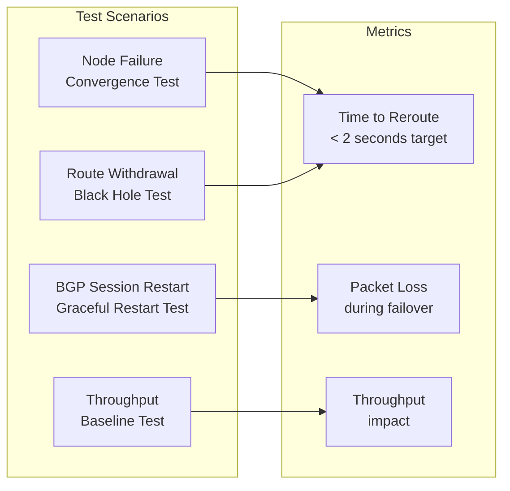

# How to Test BGP Peering in Calico with Live Workloads

Author: [nawazdhandala](https://github.com/nawazdhandala)

Tags: Calico, Kubernetes, BGP, Networking, Testing

Description: Test Calico BGP peering behavior under live workload conditions, including node failures, route flapping, and traffic disruption scenarios.

---

## Introduction

Testing BGP peering in a lab is straightforward, but validating behavior under live workload conditions requires deliberate chaos engineering. When a BGP session drops, how quickly do pods lose connectivity? When a node fails, how fast do routes converge on other nodes? These questions have real SLA implications for production workloads.

Calico's BGP implementation relies on BIRD, which is battle-tested in production environments. However, your specific topology, timer settings, and hardware influence how quickly failures are detected and traffic is rerouted. Testing before reaching production ensures you understand your actual convergence characteristics and can set realistic expectations for application teams.

This guide covers live workload testing techniques for Calico BGP peering, including connection drain testing, route withdrawal scenarios, and verifying graceful restart behavior.

## Prerequisites

- A multi-node Kubernetes cluster with Calico BGP
- Test workloads deployed across multiple nodes
- Tools: `kubectl`, `calicoctl`, `iperf3`, `ping`

## Deploy Test Workloads

Create pods distributed across nodes for connectivity testing:

```bash
kubectl apply -f - <<EOF
apiVersion: apps/v1
kind: DaemonSet
metadata:
  name: bgp-test-pods
  namespace: default
spec:
  selector:
    matchLabels:
      app: bgp-test
  template:
    metadata:
      labels:
        app: bgp-test
    spec:
      containers:
      - name: nettest
        image: busybox
        command: ["sleep", "86400"]
EOF
```

## Test Node Failure and Route Convergence

Simulate a node failure by cordoning and draining a node, then measuring pod reconnection time:

```bash
# Get pod IPs before the test
kubectl get pods -o wide -l app=bgp-test

# Start continuous ping between pods on different nodes
POD1=$(kubectl get pod -l app=bgp-test --field-selector spec.nodeName=node-1 -o name | head -1)
POD2_IP=$(kubectl get pod -l app=bgp-test --field-selector spec.nodeName=node-2 \
  -o jsonpath='{.items[0].status.podIP}')

kubectl exec ${POD1} -- ping -i 0.2 ${POD2_IP} &

# Now drain node-1 to simulate failure
kubectl drain node-1 --ignore-daemonsets --delete-emptydir-data
```

Observe how long the ping latency spikes or drops packets - this is your BGP convergence time.

## Test BGP Session Restart

Manually restart the BGP session on a node to test Graceful Restart:

```bash
NODE_POD=$(kubectl get pod -n calico-system -l k8s-app=calico-node \
  --field-selector spec.nodeName=node-1 -o name | head -1)
kubectl exec -n calico-system ${NODE_POD} -- birdcl restart BGP_<peer_ip>
```

Measure how long it takes for the session to re-establish and routes to converge:

```bash
# Monitor BGP state continuously
watch -n 1 "kubectl exec -n calico-system ${NODE_POD} -- birdcl show protocols"
```

## Test with iperf3 for Throughput Baseline

Establish a throughput baseline across BGP-routed paths:

```bash
# Start iperf3 server on pod
kubectl exec -it bgp-test-pod-server -- iperf3 -s

# Run iperf3 client from another node
SERVER_IP=$(kubectl get pod bgp-test-pod-server -o jsonpath='{.status.podIP}')
kubectl exec -it bgp-test-pod-client -- iperf3 -c ${SERVER_IP} -t 30
```

## BGP Test Scenarios



## Conclusion

Live workload testing for Calico BGP peering exposes real convergence times and packet loss characteristics under failure conditions. Use daemonset-based test pods and continuous connectivity checks to measure the actual impact of BGP session failures on your applications. These tests should be part of your cluster qualification process before promoting to production, and repeated after any significant BGP topology changes.
