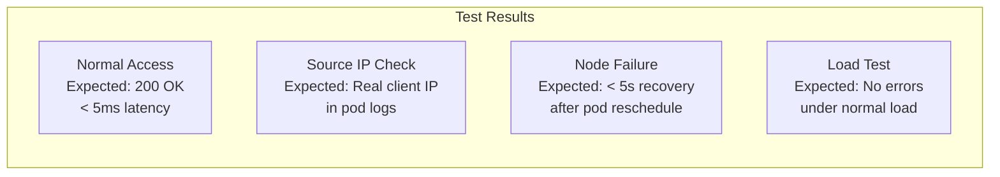

# How to Test BGP to Workload Connectivity in Calico with Live Workloads

Author: [nawazdhandala](https://github.com/nawazdhandala)

Tags: Calico, Kubernetes, BGP, Networking, Testing

Description: Test BGP-to-workload connectivity in Calico with live traffic, verifying direct pod reachability, source IP preservation, and behavior during node failures.

---

## Introduction

Testing BGP-to-workload connectivity with live workloads requires simulating real external client access patterns, verifying that source IPs are preserved end-to-end, and confirming that traffic reroutes correctly when nodes fail. Unlike testing within the cluster, you need an actual external client or router to fully validate the connectivity path.

Live testing should cover the happy path (normal connectivity), failure scenarios (node failure causing route withdrawal and re-advertisement), and edge cases such as connection persistence during pod rescheduling. These tests reveal whether your BGP convergence time meets application SLA requirements.

## Prerequisites

- External host or VM on the same network as BGP peers
- Calico BGP configured with direct pod connectivity
- Test workloads deployed on multiple nodes

## Deploy Test Application

Deploy an nginx application for connectivity testing:

```bash
kubectl create deployment bgp-test-app --image=nginx --replicas=3
kubectl expose deployment bgp-test-app --port=80 --type=ClusterIP

# Get individual pod IPs
kubectl get pods -l app=bgp-test-app -o wide
```

## Test Direct Pod Connectivity from External Host

From an external host that has BGP routes:

```bash
# Get a pod IP
POD_IP=$(kubectl get pods -l app=bgp-test-app -o jsonpath='{.items[0].status.podIP}')

# Test HTTP connectivity directly to pod
curl -sv http://${POD_IP}/

# Test with timing
time curl -s http://${POD_IP}/ -o /dev/null -w "%{time_connect} %{time_total}\n"
```

## Verify Source IP in Pod Logs

Check nginx access logs to confirm the external client IP is preserved:

```bash
POD_NAME=$(kubectl get pods -l app=bgp-test-app -o name | head -1)
kubectl logs ${POD_NAME} --follow &

# From external host, make a request
curl http://${POD_IP}/

# In pod logs, verify source IP is the external client IP, not a NAT address
```

## Test Node Failure Handling

Measure connectivity behavior during a node failure:

```bash
# From external host, run continuous requests
while true; do
  result=$(curl -s -o /dev/null -w "%{http_code}" --connect-timeout 2 http://${POD_IP}/)
  echo "$(date): $result"
  sleep 0.5
done &

# On Kubernetes: drain the node hosting the tested pod
kubectl drain <node-name> --ignore-daemonsets --delete-emptydir-data

# Observe failures and recovery time in the curl output
```

## Test Concurrent Connection Handling

Load test pod connectivity from external:

```bash
# Using wrk for load testing
wrk -t4 -c100 -d30s http://${POD_IP}/

# Using hey
hey -n 10000 -c 50 http://${POD_IP}/
```

## Test Results Diagram



## Conclusion

Live testing of BGP-to-workload connectivity validates both functional correctness and performance characteristics. Verify direct pod reachability from external hosts, confirm source IP preservation by checking application logs, and measure actual recovery time during node failures. These tests provide confidence that your BGP connectivity configuration will hold up under production conditions.
