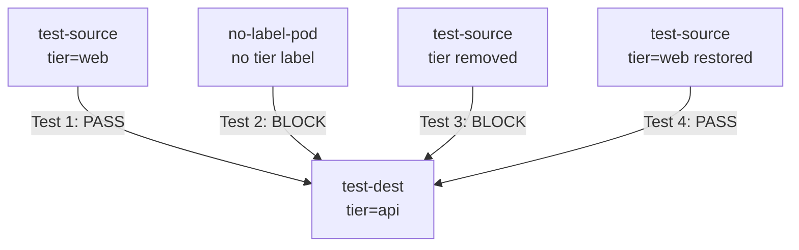

# How to Test Calico Labels for Network Policy with Real Traffic

Author: [nawazdhandala](https://github.com/nawazdhandala)

Tags: Calico, Kubernetes, Network Policy, Labels, Testing

Description: Validate that your Calico label-based network policies work correctly by testing with real traffic across labeled workloads.

---

## Introduction

Testing label-based network policies requires verifying two things: that the correct pods are selected by your policy selectors, and that traffic behaves as expected for both selected and non-selected pods. A label typo or a missing label on a deployment can render an entire security policy ineffective.

Calico's label selectors are evaluated dynamically - when you add or change a pod label, the policy takes effect immediately without requiring a policy update. This makes testing particularly important: you need to verify that both label additions and removals cause the expected policy behavior changes.

This guide provides a comprehensive test framework for Calico label-based policies, including selector verification, traffic testing, and label mutation testing to ensure your policies are robust to label changes.

## Prerequisites

- Kubernetes cluster with Calico v3.26+
- `calicoctl` and `kubectl` installed
- Test workloads with controllable labels

## Step 1: Verify Selector Matches Before Traffic Tests

```bash
# Check which pods match a selector
calicoctl get workloadendpoints --all-namespaces -o wide | grep "tier=web"

# Simulate selector evaluation
kubectl get pods --all-namespaces -l "tier=web,environment=production"
```

## Step 2: Deploy Test Pods With Specific Labels

```yaml
apiVersion: v1
kind: Pod
metadata:
  name: test-source
  namespace: test
  labels:
    app: test-source
    tier: web
    environment: production
spec:
  containers:
    - name: busybox
      image: busybox
      command: ["sleep", "3600"]
---
apiVersion: v1
kind: Pod
metadata:
  name: test-dest
  namespace: test
  labels:
    app: test-dest
    tier: api
    environment: production
spec:
  containers:
    - name: nginx
      image: nginx
      ports:
        - containerPort: 80
```

## Step 3: Apply Label-Based Policy and Test

```yaml
apiVersion: projectcalico.org/v3
kind: NetworkPolicy
metadata:
  name: test-web-to-api
  namespace: test
spec:
  order: 100
  selector: tier == 'api'
  ingress:
    - action: Allow
      source:
        selector: tier == 'web'
  types:
    - Ingress
```

```bash
DEST_IP=$(kubectl get pod test-dest -n test -o jsonpath='{.status.podIP}')

# Should succeed - both labels match
kubectl exec -n test test-source -- wget -qO- --timeout=5 http://$DEST_IP
echo "Test 1 (should pass): $?"

# Add a pod without the web label and test it's blocked
kubectl run no-label-pod -n test --image=busybox --restart=Never --labels="" -- sleep 3600
kubectl exec -n test no-label-pod -- wget -qO- --timeout=5 http://$DEST_IP
echo "Test 2 (should fail/timeout): $?"
```

## Step 4: Test Label Mutation (Dynamic Policy)

```bash
# Test that removing a label immediately blocks traffic
kubectl label pod test-source -n test tier-  # Remove tier label
kubectl exec -n test test-source -- wget -qO- --timeout=5 http://$DEST_IP
echo "Test 3 after label removal (should fail): $?"

# Restore label and verify traffic resumes
kubectl label pod test-source -n test tier=web
kubectl exec -n test test-source -- wget -qO- --timeout=5 http://$DEST_IP
echo "Test 4 after label restore (should pass): $?"
```

## Test Results Matrix



## Conclusion

Testing Calico label-based policies requires more than just checking traffic flows. You need to verify selector accuracy, test label mutations to confirm dynamic policy enforcement, and ensure that pods without the required labels are correctly blocked. Build these tests into your deployment pipeline so that every label change is automatically validated before reaching production.
