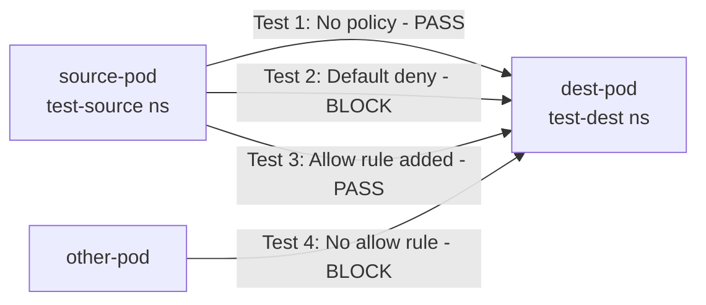

# How to Test Default Deny Policies in Calico with Real Traffic

Author: [nawazdhandala](https://github.com/nawazdhandala)

Tags: Calico, Kubernetes, Network Policy, Zero Trust, Security, Testing

Description: Learn how to validate Calico default deny network policies using real traffic scenarios to ensure your cluster is properly locked down.

---

## Introduction

Applying a default deny policy without testing it is like installing a firewall without verifying the rules work. In Kubernetes, a misconfigured Calico policy can silently block legitimate traffic or, worse, allow traffic you intended to block. Testing with real traffic gives you concrete proof that your policies behave as expected.

Calico's `GlobalNetworkPolicy` and `NetworkPolicy` resources under `projectcalico.org/v3` support granular traffic control. Testing requires both positive tests (allowed traffic passes) and negative tests (denied traffic is blocked). This guide shows you how to build a repeatable test harness using real pod-to-pod traffic.

By systematically testing your default deny policies before they reach production, you protect against misconfigurations that could cause downtime or security gaps. This is especially important in multi-tenant clusters where namespace isolation is critical.

## Prerequisites

- Kubernetes cluster with Calico v3.26+ installed
- `kubectl` with cluster-admin access
- `calicoctl` CLI configured
- A test namespace separate from production workloads

## Step 1: Set Up Test Pods

Deploy two pods in separate namespaces to test cross-namespace denial:

```bash
kubectl create namespace test-source
kubectl create namespace test-dest

kubectl run source-pod -n test-source --image=busybox --restart=Never -- sleep 3600
kubectl run dest-pod -n test-dest --image=nginx --restart=Never -- sleep 3600
```

Get the destination pod IP:

```bash
DEST_IP=$(kubectl get pod dest-pod -n test-dest -o jsonpath='{.status.podIP}')
echo "Destination IP: $DEST_IP"
```

## Step 2: Baseline Test Without Policy

Before applying deny policies, confirm traffic flows:

```bash
kubectl exec -n test-source source-pod -- wget -qO- --timeout=5 http://$DEST_IP
# Should return nginx welcome page
```

## Step 3: Apply Default Deny and Test Blocking

```yaml
apiVersion: projectcalico.org/v3
kind: GlobalNetworkPolicy
metadata:
  name: default-deny-all
spec:
  order: 1000
  selector: all()
  types:
    - Ingress
    - Egress
```

```bash
calicoctl apply -f default-deny-all.yaml
kubectl exec -n test-source source-pod -- wget -qO- --timeout=5 http://$DEST_IP
# Should timeout - policy is working
```

## Step 4: Apply Allow Rule and Test Restoration

```yaml
apiVersion: projectcalico.org/v3
kind: NetworkPolicy
metadata:
  name: allow-source-to-dest
  namespace: test-dest
spec:
  selector: app == 'dest-pod'
  ingress:
    - action: Allow
      source:
        namespaceSelector: kubernetes.io/metadata.name == 'test-source'
  types:
    - Ingress
```

```bash
calicoctl apply -f allow-source-to-dest.yaml
kubectl exec -n test-source source-pod -- wget -qO- --timeout=5 http://$DEST_IP
# Should succeed - selective allow working correctly
```

## Test Matrix Diagram



## Conclusion

Testing default deny policies with real traffic ensures your Calico security posture works as intended. Always run both positive and negative test cases, establish a baseline before applying policies, and automate your test matrix as part of your CI/CD pipeline. Real traffic tests catch edge cases that policy syntax reviews alone cannot find.
