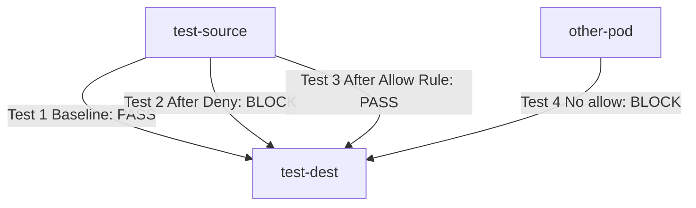

# How to Test Calico External IP Policies with Real Traffic

Author: [nawazdhandala](https://github.com/nawazdhandala)

Tags: Calico, Kubernetes, Network Policy, External IP, Testing

Description: Validate Calico external IP network policies using real traffic to confirm external access controls work correctly.

---

## Introduction

Testing External IP Policies in Calico requires systematic verification that your policy rules produce the expected traffic behavior. By sending real traffic through a test environment, you can confirm both positive scenarios (allowed traffic passes) and negative scenarios (denied traffic is blocked).

Calico's `projectcalico.org/v3` policies are evaluated dynamically — changes take effect immediately without restarting pods or services. This makes live traffic testing particularly reliable for verifying policy correctness.

## Prerequisites

- Kubernetes cluster with Calico v3.26+
- Test pods deployed in isolated test namespaces
- `calicoctl` and `kubectl` installed

## Step 1: Deploy Test Infrastructure

```bash
kubectl create namespace policy-test
kubectl run test-source -n policy-test --image=busybox --restart=Never -- sleep 3600
kubectl run test-dest -n policy-test --image=nginx --restart=Never
```

## Step 2: Baseline Test (No Policy)

```bash
DEST_IP=$(kubectl get pod test-dest -n policy-test -o jsonpath='{.status.podIP}')
kubectl exec -n policy-test test-source -- wget -qO- --timeout=5 http://$DEST_IP
echo "Baseline (should pass): $?"
```

## Step 3: Apply External IP Policy and Test Blocking

```yaml
apiVersion: projectcalico.org/v3
kind: NetworkPolicy
metadata:
  name: test-external-ip
  namespace: policy-test
spec:
  order: 100
  selector: all()
  ingress:
    - action: Deny
  types:
    - Ingress
```

```bash
calicoctl apply -f test-policy.yaml
kubectl exec -n policy-test test-source -- wget -qO- --timeout=5 http://$DEST_IP
echo "After deny (should timeout): $?"
```

## Step 4: Add Allow Rule and Verify

```yaml
apiVersion: projectcalico.org/v3
kind: NetworkPolicy
metadata:
  name: allow-test-source
  namespace: policy-test
spec:
  order: 50
  selector: all()
  ingress:
    - action: Allow
      source:
        selector: run == 'test-source'
  types:
    - Ingress
```

```bash
calicoctl apply -f allow-rule.yaml
kubectl exec -n policy-test test-source -- wget -qO- --timeout=5 http://$DEST_IP
echo "After allow rule (should pass): $?"
```

## Test Results



## Cleanup

```bash
kubectl delete namespace policy-test
```

## Conclusion

Real traffic tests for External IP Policies provide definitive proof that your Calico policies work as designed. Always run both positive and negative test cases, test policy mutations (adding and removing rules), and automate your test suite in CI/CD. Testing in a dedicated test namespace keeps your verification clean and reproducible.
