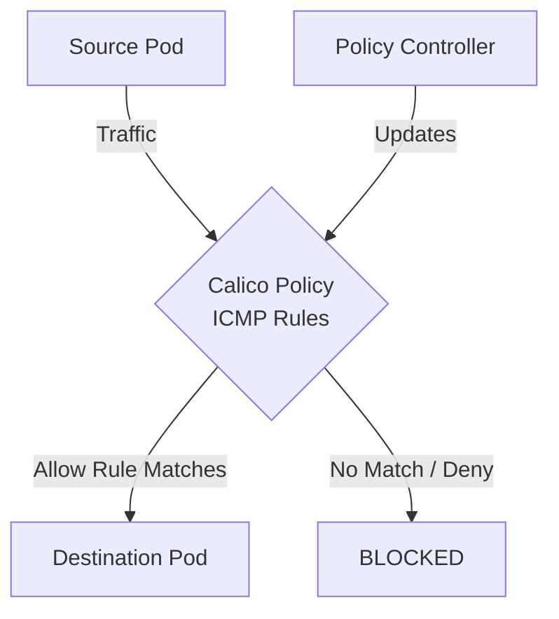

# How to Test ICMP and Ping Rules with Real Traffic in Calico

Author: [nawazdhandala](https://github.com/nawazdhandala)

Tags: Calico, Kubernetes, Network Policy, ICMP, Security, Network

Description: Validate ICMP and Ping Rules in Calico using real traffic scenarios.

---

## Introduction

ICMP and Ping Rules in Calico provides fine-grained network security controls using the `projectcalico.org/v3` API. This guide covers how to test ICMP Rules effectively.

Calico's extensible policy model supports ICMP Rules through its `GlobalNetworkPolicy` and `NetworkPolicy` resources, giving you cluster-wide and namespace-scoped control over traffic that matches your ICMP Rules criteria.

This guide provides practical techniques for test ICMP Rules in your Kubernetes cluster, following security best practices and production-tested patterns.

## Prerequisites

- Kubernetes cluster with Calico v3.26+
- `calicoctl` and `kubectl` installed
- Basic understanding of Calico network policy concepts

## Step 1: Set Up Test Environment

```bash
kubectl run test-source -n test --image=busybox --restart=Never -- sleep 3600
kubectl run test-dest -n test --image=nginx --restart=Never
```

## Step 2: Establish Baseline

Test traffic before applying the policy to confirm connectivity:

```bash
DEST_IP=$(kubectl get pod test-dest -n test -o jsonpath='{.status.podIP}')
kubectl exec -n test test-source -- wget -qO- --timeout=5 http://$DEST_IP
```

## Step 3: Apply Policy and Test Blocking

```yaml
apiVersion: projectcalico.org/v3
kind: NetworkPolicy
metadata:
  name: test-icmp-rules
  namespace: test
spec:
  order: 100
  selector: all()
  ingress:
    - action: Deny
  types:
    - Ingress
```

## Step 4: Add Allow Rule and Retest

```bash
calicoctl apply -f allow-rule.yaml
kubectl exec -n test test-source -- wget -qO- --timeout=5 http://$DEST_IP
echo "Should succeed: $?"
```

## Architecture



## Conclusion

Test ICMP Rules policies in Calico requires attention to policy ordering, selector accuracy, and bidirectional rule coverage. Follow the patterns in this guide to ensure your ICMP Rules policies are correctly configured, tested, and monitored. Always validate in staging before applying to production, and maintain comprehensive logging for visibility into policy decisions.
