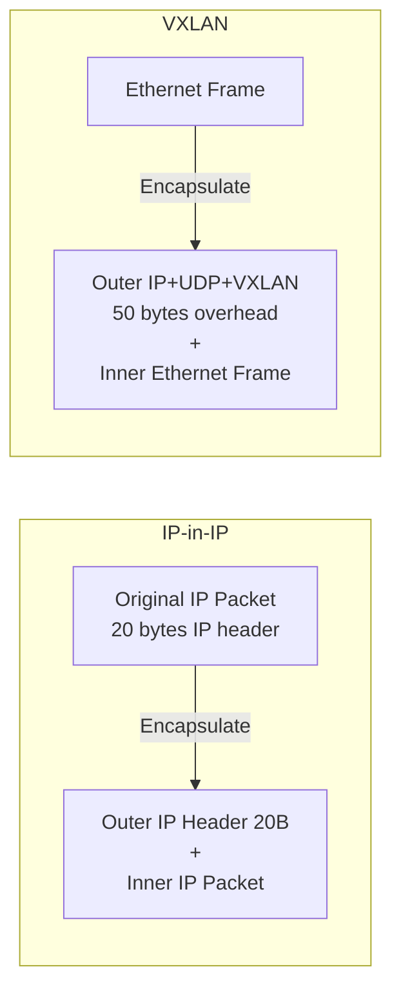

# How to Test IP-in-IP in Calico with Live Workloads

Author: [nawazdhandala](https://github.com/nawazdhandala)

Tags: Calico, Kubernetes, IP-in-IP, Networking, Encapsulation

Description: Test IP-in-IP tunnel performance and reliability in Calico with live workloads to measure encapsulation overhead.

---

## Introduction

IP-in-IP tunneling (also called IPIP) encapsulates IP packets inside other IP packets using protocol number 4. Calico uses IP-in-IP to route pod traffic across nodes when native routing is not available, with 20 bytes of overhead per packet — less than VXLAN's 50 bytes. This makes IP-in-IP the preferred lightweight encapsulation option when VXLAN's larger overhead is a concern.

Calico supports three IP-in-IP modes: `Always` (always encapsulate), `CrossSubnet` (only encapsulate when crossing subnet boundaries), and `Never` (disable IP-in-IP). The `CrossSubnet` mode is particularly useful in environments where some node pairs are on the same subnet (can use native routing) while others are on different subnets (require encapsulation).

## Prerequisites

- Kubernetes cluster with Calico
- IP protocol 4 (IPIP) permitted between nodes
- kubectl and calicoctl access

## Configure IP-in-IP Mode

```yaml
apiVersion: projectcalico.org/v3
kind: IPPool
metadata:
  name: default-ipv4-ippool
spec:
  cidr: 10.244.0.0/16
  ipipMode: CrossSubnet
  vxlanMode: Never
  natOutgoing: true
```

```bash
calicoctl apply -f ippool-ipip.yaml

# Verify IPIP tunnel interface
ip link show tunl0
ip addr show tunl0
```

## Check Tunnel Traffic

```bash
# Verify IPIP packets are being sent
tcpdump -i eth0 -n 'proto 4' -c 10

# Check tunnel statistics
ip -s link show tunl0
```

## Test Cross-Subnet Connectivity

```bash
# Deploy pods on different subnets
POD1_NODE="node-in-subnet-a"
POD2_NODE="node-in-subnet-b"

kubectl run pod-a --image=busybox --overrides="{\"spec\":{\"nodeName\":\"\"}}" -- sleep 3600
kubectl run pod-b --image=busybox --overrides="{\"spec\":{\"nodeName\":\"\"}}" -- sleep 3600

POD_B_IP=$(kubectl get pod pod-b -o jsonpath='{.status.podIP}')
kubectl exec pod-a -- ping -c 3 ${POD_B_IP}
```

## IP-in-IP vs VXLAN Comparison



## Conclusion

IP-in-IP in Calico provides efficient overlay networking with lower overhead than VXLAN, making it a good choice for environments where protocol 4 traffic is permitted. Use `CrossSubnet` mode to minimize encapsulation overhead by using native routing for within-subnet traffic. MTU consideration: subtract 20 bytes from host MTU for the IPIP overhead when configuring pod MTU.
