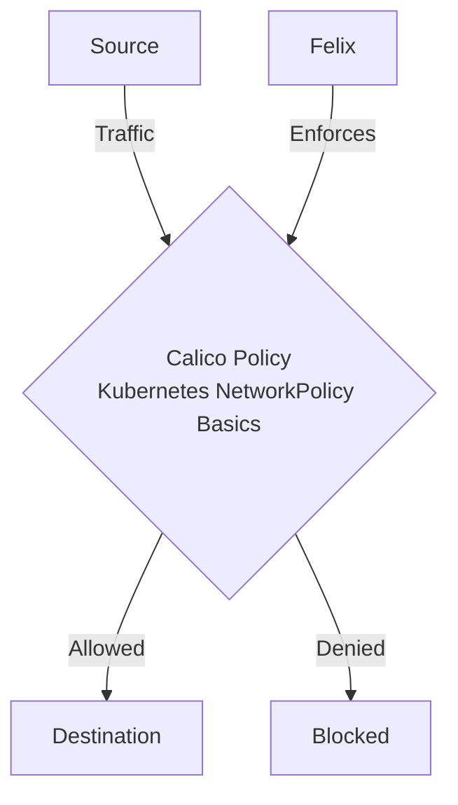

# How to Test Kubernetes NetworkPolicy Basics Enforced by Calico

Author: [nawazdhandala](https://github.com/nawazdhandala)

Tags: Calico, Kubernetes, Network Policy, Basics, Security

Description: Test Kubernetes NetworkPolicy basics using Calico as the network policy enforcement engine.

---

## Introduction

Test Kubernetes NetworkPolicy Basics Enforced by Calico requires careful policy design in Calico to balance security with performance and availability. The `projectcalico.org/v3` API provides the flexibility needed to handle kubernetes networkpolicy basics while maintaining strict access controls.

This guide covers test Kubernetes NetworkPolicy Basics in Calico with production-ready configurations.

## Prerequisites

- Kubernetes cluster with Calico v3.26+
- `calicoctl` and `kubectl` installed

## Core Configuration

```yaml
# Standard Kubernetes NetworkPolicy (enforced by Calico)
apiVersion: networking.k8s.io/v1
kind: NetworkPolicy
metadata:
  name: allow-frontend-to-backend
  namespace: production
spec:
  podSelector:
    matchLabels:
      app: backend
  policyTypes:
    - Ingress
    - Egress
  ingress:
    - from:
        - podSelector:
            matchLabels:
              app: frontend
      ports:
        - port: 8080
  egress:
    - to:
        - podSelector:
            matchLabels:
              app: database
      ports:
        - port: 5432
    - ports:
        - port: 53
          protocol: UDP
```

## Apply and Test

```bash
# Apply Kubernetes NetworkPolicy
kubectl apply -f basic-network-policy.yaml

# Verify policy is enforced by Calico
kubectl describe networkpolicy allow-frontend-to-backend -n production

# Test connectivity
kubectl exec -n production frontend-pod -- curl -s http://backend-service:8080
echo "Frontend to backend (should pass): $?"

kubectl exec -n production other-pod -- curl -s --max-time 5 http://backend-service:8080
echo "Other pod to backend (should fail): $?"
```

## Architecture



## Conclusion

Test Kubernetes NetworkPolicy Basics in Calico requires balancing security controls with operational requirements. Use the patterns in this guide as a starting point, test thoroughly in staging, and monitor policy impact after deployment. Regular review of your policies ensures they remain appropriate as your workload requirements evolve.
