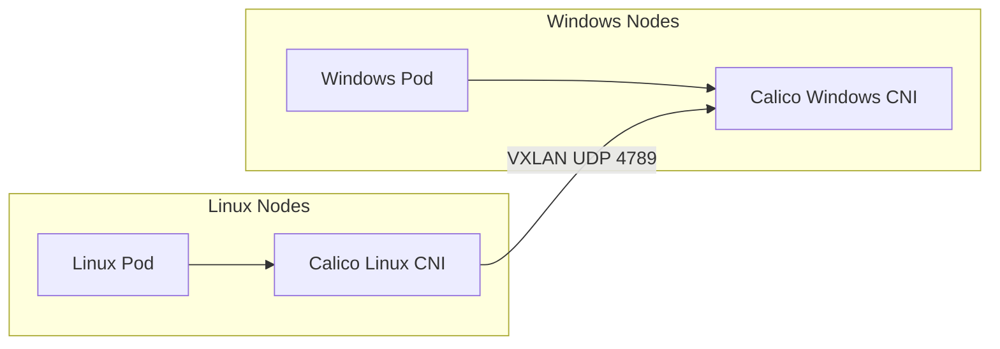

# How to Test Mixed Linux and Windows Networking with Calico with Live Workloads

Author: [nawazdhandala](https://github.com/nawazdhandala)

Tags: Calico, Kubernetes, Windows, Linux, Networking

Description: Test cross-OS pod connectivity in Calico mixed clusters with real Windows and Linux workloads.

---

## Introduction

Running Calico in mixed Linux/Windows Kubernetes clusters enables organizations to containerize Windows-specific workloads alongside Linux containers while using a unified networking and policy model. Calico for Windows supports VXLAN encapsulation (IP-in-IP is not supported on Windows) and BGP peering, providing the same network policy capabilities available for Linux pods.

Mixed OS networking requires careful attention to differences in how Windows handles network interfaces, IPAM, and policy enforcement. Windows Calico uses a different CNI binary and network driver compared to Linux, but both integrate with the same Kubernetes API and Calico datastore.

## Prerequisites

- Kubernetes cluster with Linux control plane nodes
- Windows worker nodes (Windows Server 2019+)
- Calico v3.12+ with Windows support
- VXLAN mode configured (required for Windows)

## Configure VXLAN for Windows Compatibility

```yaml
apiVersion: projectcalico.org/v3
kind: IPPool
metadata:
  name: default-ipv4-ippool
spec:
  cidr: 10.244.0.0/16
  vxlanMode: Always  # Required for Windows
  ipipMode: Never    # IP-in-IP not supported on Windows
  natOutgoing: true
```

## Install Calico on Windows Nodes

```powershell
# On Windows node
Invoke-WebRequest -Uri https://github.com/projectcalico/calico/releases/download/v3.27.0/calico-windows-v3.27.0.zip -OutFile calico-windows.zip
Expand-Archive calico-windows.zip -DestinationPath C:\CalicoWindows

# Configure and start Calico
C:\CalicoWindows\install-calico.ps1
```

## Test Cross-OS Connectivity

```bash
# Deploy Linux pod
kubectl run linux-pod --image=busybox -- sleep 3600

# Deploy Windows pod
kubectl apply -f windows-pod.yaml

LINUX_IP=$(kubectl get pod linux-pod -o jsonpath='{.status.podIP}')
WIN_IP=$(kubectl get pod windows-pod -o jsonpath='{.status.podIP}')

# Test Linux to Windows
kubectl exec linux-pod -- ping -c 3 ${WIN_IP}

# Test Windows to Linux (from Windows pod)
kubectl exec windows-pod -- ping -n 3 ${LINUX_IP}
```

## Mixed OS Architecture



## Conclusion

Mixed Linux/Windows networking with Calico requires VXLAN mode (IP-in-IP is not supported on Windows), careful MTU configuration, and thorough testing of cross-OS pod connectivity. Network policies work consistently across both OS types, giving you a unified security model for mixed workload clusters.
