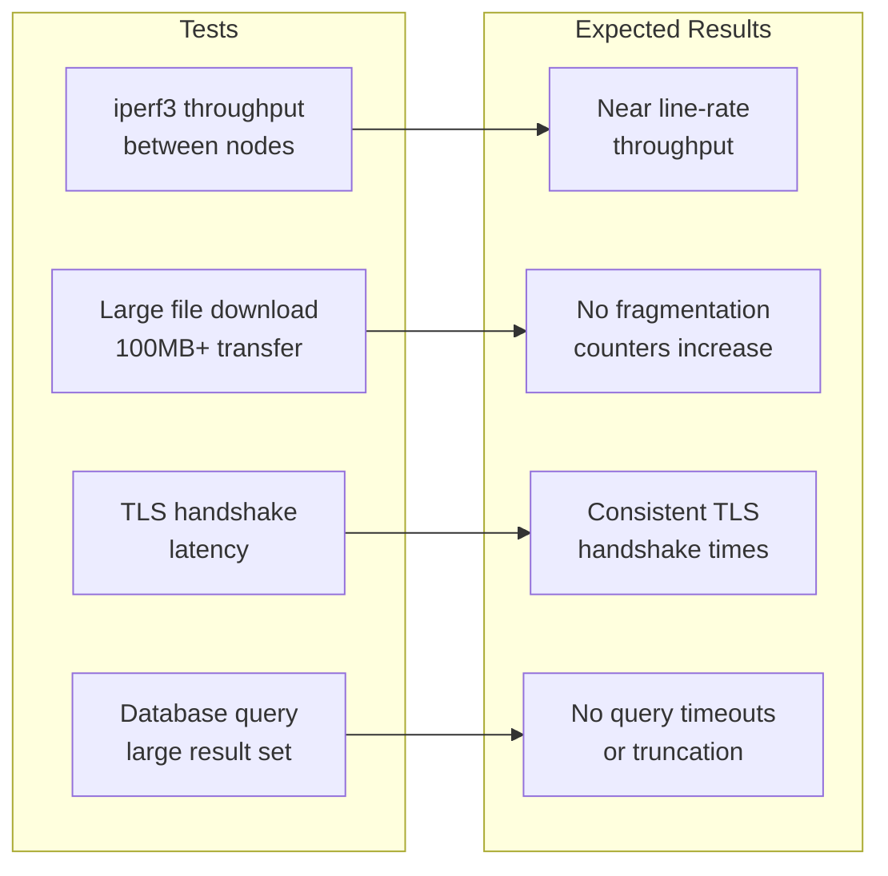

# How to Test MTU Sizing for Calico with Live Workloads

Author: [nawazdhandala](https://github.com/nawazdhandala)

Tags: Calico, Kubernetes, MTU, Networking, Testing

Description: Test Calico MTU configuration with live workloads using throughput benchmarks, large file transfers, and MTU path discovery to validate correct sizing before production.

---

## Introduction

Testing MTU sizing with live workloads validates that the configured MTU values result in optimal packet sizes throughout the network path. Abstract MTU validation with ping is useful, but real workload behavior depends on how applications set TCP MSS (Maximum Segment Size) and whether the stack correctly handles path MTU discovery.

Live workload testing should include throughput benchmarks at different data sizes, transfer of large objects that exercise the full MTU, and testing with applications that have known MTU sensitivity such as databases and message queues.

## Prerequisites

- Calico with MTU configured
- iperf3, curl, or similar tools available
- Test workloads deployed across multiple nodes

## Test Large File Transfers

Deploy a file server and test transfer with large files:

```bash
kubectl run file-server --image=nginx
kubectl exec -it file-server -- dd if=/dev/urandom of=/usr/share/nginx/html/testfile bs=1M count=100

# From another pod, download the file
SERVER_IP=$(kubectl get pod file-server -o jsonpath='{.status.podIP}')
kubectl exec client-pod -- curl -o /dev/null -w "%{speed_download}\n" http://${SERVER_IP}/testfile
```

## Throughput Benchmark

Run iperf3 between pods on different nodes:

```bash
# Start iperf3 server
kubectl run iperf3-server --image=networkstatic/iperf3 -- iperf3 -s
SERVER_IP=$(kubectl get pod iperf3-server -o jsonpath='{.status.podIP}')

# Run client
kubectl run iperf3-client --image=networkstatic/iperf3 \
  --overrides='{"spec":{"nodeName":"different-node"}}' \
  -- iperf3 -c ${SERVER_IP} -t 30 -P 4
```

## Test TLS Performance (MTU-sensitive)

TLS handshakes and large certificate chains are particularly sensitive to MTU issues:

```bash
# Deploy an HTTPS service
kubectl run https-server --image=nginx --port=443

# Test TLS handshake performance
kubectl exec client-pod -- curl -k --tlsv1.3 -w "%{time_connect} %{time_appconnect}\n" \
  -o /dev/null https://${SERVER_IP}/
```

## Test Database Large Query Performance

If running databases, test with large result sets:

```bash
# PostgreSQL example: query returning large result set
kubectl exec postgres-pod -- psql -U postgres -c \
  "SELECT count(*), sum(length(data)) FROM large_table"
```

## MTU Test Results Matrix



## Monitor During Tests

```bash
# Watch fragmentation counters during tests
watch -n 1 "netstat -s | grep -E 'fragment|reassembl'"

# Monitor interface stats
watch -n 1 "ip -s link show eth0"
```

## Conclusion

Live workload testing of MTU configuration validates that the abstract MTU settings translate to correct behavior under real application conditions. Focus on large data transfer scenarios, TLS-heavy applications, and any workloads you know are sensitive to packet size. Monitor fragmentation counters during tests — any increase indicates MTU misconfiguration that needs to be addressed before production.
