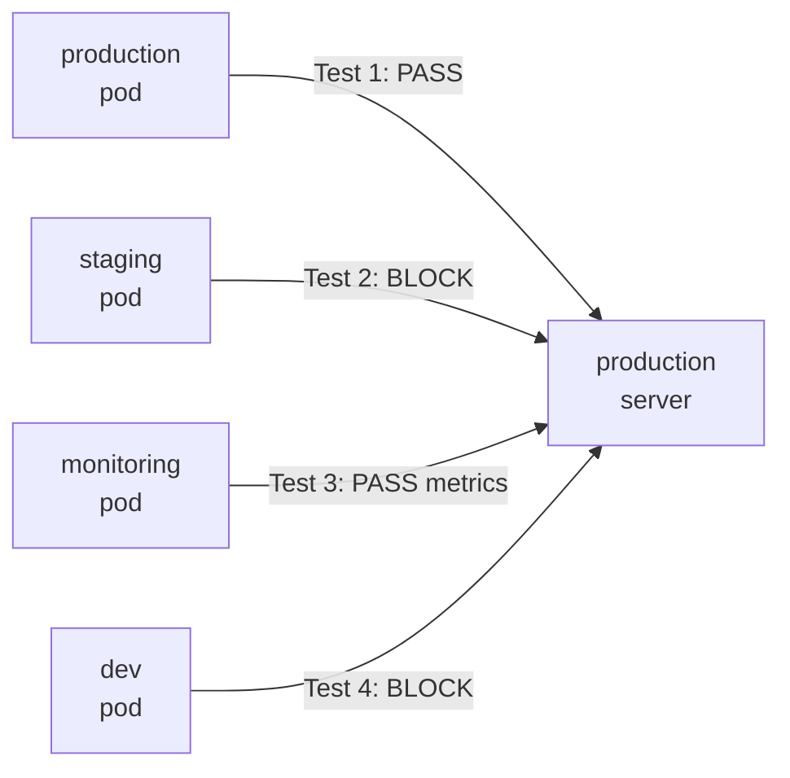

# How to Test Namespace-Based Policies in Calico with Real Traffic

Author: [nawazdhandala](https://github.com/nawazdhandala)

Tags: Calico, Kubernetes, Network Policy, Namespace, Testing

Description: Validate Calico namespace-based network policies using real cross-namespace traffic tests to confirm isolation boundaries work correctly.

---

## Introduction

Testing namespace isolation requires deliberately sending traffic across namespace boundaries and confirming that allowed paths work while blocked paths are rejected. Because namespace policies rely on namespace labels, you also need to test that label changes correctly update which namespaces can communicate.

Calico namespace-based policies use `namespaceSelector` in the `source` and `destination` fields of `projectcalico.org/v3` NetworkPolicy rules. Testing these selectors requires pods in multiple namespaces and a systematic test matrix covering every intended boundary.

This guide provides a repeatable test framework for namespace-based policies, including cross-namespace communication tests, label mutation tests, and automated test execution scripts.

## Prerequisites

- Kubernetes cluster with Calico v3.26+
- Namespace isolation policies applied
- `kubectl` with access to multiple namespaces

## Step 1: Set Up Cross-Namespace Test Pods

```bash
# Create test pods in three namespaces
for ns in production staging monitoring; do
  kubectl run test-pod -n $ns --image=busybox --restart=Never \
    --labels="app=test" -- sleep 3600
  kubectl run test-server -n $ns --image=nginx --restart=Never \
    --labels="app=test-server"
done
```

## Step 2: Get Pod IPs

```bash
PROD_IP=$(kubectl get pod test-server -n production -o jsonpath='{.status.podIP}')
STAGING_IP=$(kubectl get pod test-server -n staging -o jsonpath='{.status.podIP}')
MONITORING_IP=$(kubectl get pod test-server -n monitoring -o jsonpath='{.status.podIP}')
```

## Step 3: Run Cross-Namespace Traffic Tests

```bash
#!/bin/bash
echo "=== Namespace Isolation Tests ==="

# Test 1: Production -> Production (should pass)
kubectl exec -n production test-pod -- wget -qO- --timeout=5 http://$PROD_IP && echo "PASS: Intra-prod" || echo "FAIL: Intra-prod"

# Test 2: Staging -> Production (should fail)
kubectl exec -n staging test-pod -- wget -qO- --timeout=5 http://$PROD_IP && echo "FAIL: Staging->Prod ALLOWED" || echo "PASS: Staging->Prod blocked"

# Test 3: Monitoring -> Production (should pass for metrics port)
kubectl exec -n monitoring test-pod -- wget -qO- --timeout=5 http://$PROD_IP:9090 && echo "PASS: Monitoring->Prod" || echo "CHECK: Monitoring->Prod"
```

## Step 4: Test Label Mutation

```bash
# Remove the production environment label and verify staging can't access
kubectl label namespace staging environment-  # Remove staging label
# Re-test - behavior should remain blocked
kubectl exec -n staging test-pod -- wget -qO- --timeout=5 http://$PROD_IP && echo "FAIL: Still accessible" || echo "PASS: Still blocked"

# Re-add label
kubectl label namespace staging environment=staging
```

## Test Matrix



## Conclusion

Namespace policy testing requires a systematic matrix that covers every intended allow and deny path. Always test both directions (A->B and B->A), test label mutations to verify dynamic policy enforcement, and automate your test suite to run after every policy change. Real traffic tests are the only definitive proof that your namespace isolation boundaries are enforced correctly.
