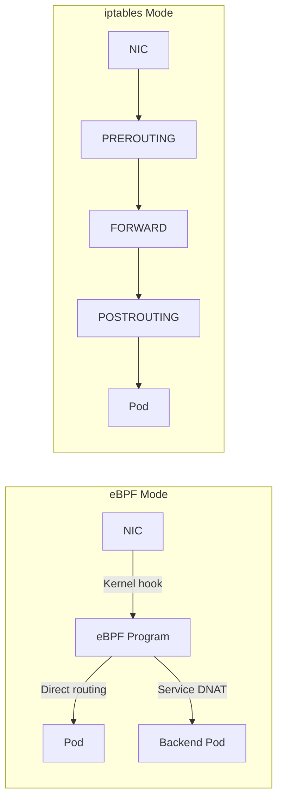

# How to Test Native Routing with Calico eBPF with Live Workloads

Author: [nawazdhandala](https://github.com/nawazdhandala)

Tags: Calico, Kubernetes, eBPF, Networking, Performance

Description: Benchmark Calico eBPF native routing performance with live workloads to quantify improvements over iptables mode.

---

## Introduction

Calico's eBPF dataplane replaces the iptables-based service and policy datapath with eBPF programs in the Linux kernel, resulting in lower latency and higher throughput in supported environments. eBPF programs are loaded into the kernel and attach to low-level networking hooks, performing service load balancing, routing decisions, and policy enforcement without traversing large iptables rule chains.

Native routing avoids VXLAN or IP-in-IP encapsulation when the underlying network can route workload IPs directly, for example with BGP peering or suitable cloud-provider routing. This makes it particularly valuable for latency-sensitive workloads and high-throughput microservices.

## Prerequisites

- Linux kernel 5.10+ for current Calico releases, or Red Hat Enterprise Linux 8.4 with kernel 4.18.0-305 or later
- A current Calico release with eBPF support
- kube-proxy disabled or replaced by Calico eBPF
- kubectl and calicoctl access

## Enable eBPF Dataplane

```bash
# Disable kube-proxy before enabling eBPF

kubectl patch ds -n kube-system kube-proxy -p   '{"spec":{"template":{"spec":{"nodeSelector":{"non-calico":"true"}}}}}'

# Enable eBPF mode
calicoctl patch felixconfiguration default --patch='{"spec": {"bpfEnabled": true}}'
```

## Verify eBPF Mode

```bash
# Check eBPF programs loaded on a node
CALICO_NODE=$(kubectl get pod -n calico-system -l k8s-app=calico-node -o jsonpath='{.items[0].metadata.name}')
kubectl exec -n calico-system ${CALICO_NODE} -- bpftool prog list | grep calico

# Verify kube-proxy replacement by inspecting the BPF NAT table
kubectl exec -n calico-system ${CALICO_NODE} -- calico-node -bpf nat dump

# Test connectivity
kubectl run test1 --image=busybox -- sleep 3600
kubectl exec test1 -- wget -O- http://kubernetes.default.svc
```

## Benchmark eBPF vs iptables

```bash
# Run throughput test
kubectl run iperf-server --image=networkstatic/iperf3 -- iperf3 -s
SRV=$(kubectl get pod iperf-server -o jsonpath='{.status.podIP}')
kubectl run iperf-client --image=networkstatic/iperf3 -- iperf3 -c ${SRV} -t 30

# Compare against previous iptables results
```

## eBPF Architecture



## Conclusion

Calico eBPF native routing delivers measurable performance improvements by bypassing traditional kernel networking overhead. Enable eBPF mode after verifying kernel compatibility, disable kube-proxy, and benchmark throughput and latency to validate the improvement. The migration is reversible - eBPF mode can be disabled and kube-proxy re-enabled if issues are encountered.
