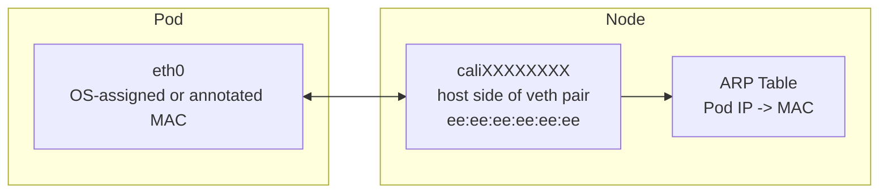

# How to Test Pod MAC Addresses with Calico with Live Workloads

Author: [nawazdhandala](https://github.com/nawazdhandala)

Tags: Calico, Kubernetes, MAC Address, Networking, CNI

Description: Test pod MAC address behavior in Calico with live workloads, verifying correct assignment, uniqueness, and behavior during pod rescheduling.

---

## Introduction

Calico uses point-to-point routed interfaces for pod networking. On the host side, Calico may assign the same MAC address, `ee:ee:ee:ee:ee:ee`, to `cali*` interfaces because the MAC address is not used for forwarding on those interfaces. If you need a specific MAC address inside a pod, Calico CNI supports setting the pod's `eth0` MAC address with an annotation at pod creation time.

Understanding Calico's MAC address assignment is important for debugging layer-2 networking issues, configuring certain network security controls, and ensuring compatibility with network monitoring tools that track device identity by MAC address.

## Prerequisites

- Calico v3.20+ installed
- kubectl access to the cluster
- Access to node networking stack

## Check Pod MAC Addresses

```bash
# View MAC address of a pod interface

kubectl exec test-pod -- ip link show eth0

# View the corresponding veth on the host
ip link | grep -A1 cali

# Verify MAC address uniqueness across pods
kubectl get pods -A --no-headers -o wide | while read ns pod rest; do
  mac=$(kubectl exec -n ${ns} ${pod} -- ip link show eth0 2>/dev/null |     grep -oP '([0-9a-f]{2}:){5}[0-9a-f]{2}' | head -1)
  echo "${ns}/${pod}: ${mac}"
done | sort -t: -k2
```

## Configure a Pod MAC Address

Calico allows configuring a specific MAC address for a pod's `eth0` interface with the `cni.projectcalico.org/hwAddr` annotation. The annotation must be present when the pod is created; adding it later has no effect:

```yaml
apiVersion: v1
kind: Pod
metadata:
  name: test-pod
  annotations:
    cni.projectcalico.org/hwAddr: "1c:0c:0a:c0:ff:ee"
spec:
  containers:
  - name: test
    image: busybox:1.36
    command: ["sleep", "3600"]
```

## Check for MAC Conflicts

```bash
# Look for duplicate MACs in the neighbor table
ip neigh show | awk '{print $5}' | grep -E '([0-9a-f]{2}:){5}[0-9a-f]{2}' | sort | uniq -d
```

## MAC Address Architecture



## Conclusion

Calico's routed workload interfaces mean the host-side `cali*` MAC address is not used for normal forwarding and may be the same across interfaces. When a workload needs a stable MAC address inside the container, use the Calico CNI `hwAddr` annotation at pod creation time. Monitoring neighbor entries and understanding the MAC behavior helps diagnose layer-2 networking issues and configure security controls appropriately in your Kubernetes environment.
