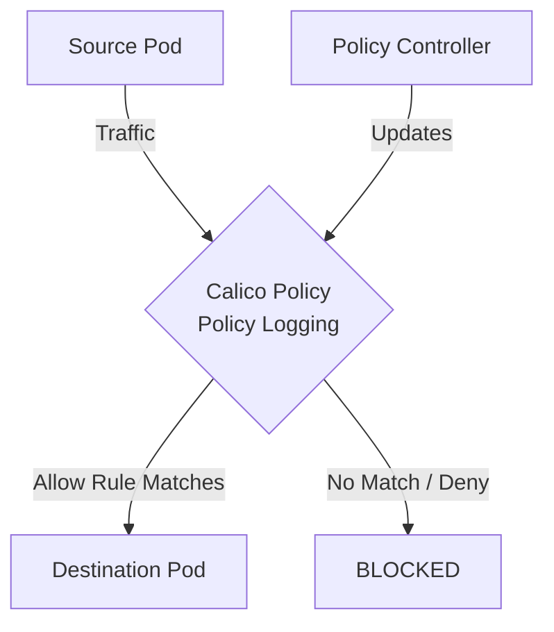

# How to Test Calico Policy Log Rules with Real Traffic in Calico

Author: [nawazdhandala](https://github.com/nawazdhandala)

Tags: Calico, Kubernetes, Network Policy, Logging, Audit, Security

Description: Validate Calico Policy Log Rules in Calico using real traffic scenarios.

---

## Introduction

Calico Policy Log Rules in Calico provides fine-grained network security controls using the `projectcalico.org/v3` API. This guide covers how to test Policy Logging effectively.

Calico's extensible policy model supports Policy Logging through its `GlobalNetworkPolicy` and `NetworkPolicy` resources, giving you cluster-wide and namespace-scoped control over traffic that matches your Policy Logging criteria.

This guide provides practical techniques for test Policy Logging in your Kubernetes cluster, following security best practices and production-tested patterns.

## Prerequisites

- Kubernetes cluster with Calico v3.26+
- `calicoctl` and `kubectl` installed
- Basic understanding of Calico network policy concepts

## Step 1: Set Up Test Environment

```bash
kubectl create namespace test
kubectl run test-source -n test --image=busybox --restart=Never --command -- sleep 3600
kubectl run test-dest -n test --image=nginx --restart=Never
kubectl wait --for=condition=Ready pod/test-source pod/test-dest -n test --timeout=60s
```

## Step 2: Establish Baseline

Test traffic before applying the policy to confirm connectivity:

```bash
DEST_IP=$(kubectl get pod test-dest -n test -o jsonpath='{.status.podIP}')
kubectl exec -n test test-source -- wget -qO- -T 5 http://$DEST_IP
```

## Step 3: Apply Policy and Test Blocking

```bash
cat > deny-with-log.yaml <<'EOF'
apiVersion: projectcalico.org/v3
kind: NetworkPolicy
metadata:
  name: test-policy-logging
  namespace: test
spec:
  order: 100
  selector: all()
  ingress:
    - action: Log
    - action: Deny
  types:
    - Ingress
EOF

calicoctl apply -f deny-with-log.yaml
kubectl exec -n test test-source -- wget -qO- -T 5 http://$DEST_IP
echo "Should fail: $?"
```

## Step 4: Add Allow Rule and Retest

```bash
cat > allow-rule.yaml <<'EOF'
apiVersion: projectcalico.org/v3
kind: NetworkPolicy
metadata:
  name: test-policy-logging
  namespace: test
spec:
  order: 100
  selector: all()
  ingress:
    - action: Log
    - action: Allow
  types:
    - Ingress
EOF

calicoctl apply -f allow-rule.yaml
kubectl exec -n test test-source -- wget -qO- -T 5 http://$DEST_IP
echo "Should succeed: $?"
```

## Architecture



## Conclusion

Test Policy Logging policies in Calico requires attention to policy ordering, selector accuracy, and bidirectional rule coverage. Follow the patterns in this guide to ensure your Policy Logging policies are correctly configured, tested, and monitored. Always validate in staging before applying to production, and maintain comprehensive logging for visibility into policy decisions.
