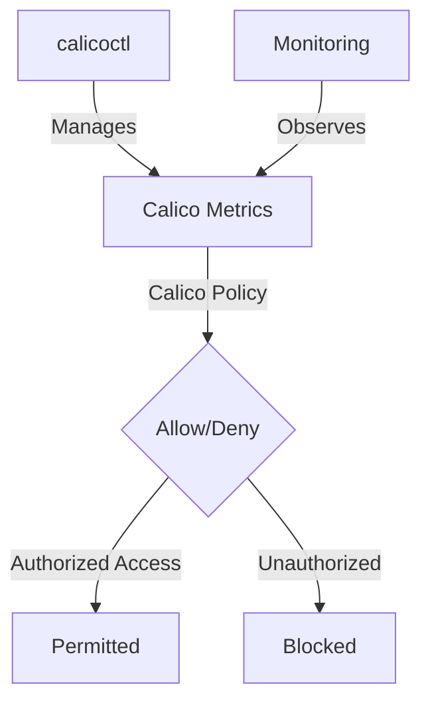

# How to Test Calico Metrics Endpoint Security with Real Traffic

Author: [nawazdhandala](https://github.com/nawazdhandala)

Tags: Calico, Kubernetes, Metric, Security, Prometheus

Description: Test security for Calico metrics endpoints to restrict access to authorized monitoring systems only.

---

## Introduction

Securing Calico Metrics Endpoints is an important security consideration for production Calico deployments. The `projectcalico.org/v3` API provides the tools needed to test Calico Metrics effectively, combining Calico's network policy with proper access controls and monitoring.

This guide covers test Calico Metrics in Calico with practical configurations and operational best practices.

## Prerequisites

- Kubernetes cluster with Calico v3.26+
- `calicoctl` and `kubectl` installed
- Calico HostEndpoint resources created for the node interfaces that expose metrics, with a label such as `role == 'calico-node'`
- Understanding of Calico's monitoring and security architecture

## Core Configuration

```yaml
# Restrict access to Calico Felix metrics (port 9091)

apiVersion: projectcalico.org/v3
kind: GlobalNetworkPolicy
metadata:
  name: secure-calico-metrics
spec:
  order: 100
  selector: role == 'calico-node'
  ingress:
    - action: Allow
      protocol: TCP
      source:
        namespaceSelector: team == 'observability'
      destination:
        ports: [9091]
    - action: Allow
      protocol: TCP
      source:
        selector: app == 'prometheus'
      destination:
        ports: [9091]
    - action: Deny
      protocol: TCP
      destination:
        ports: [9091, 9092, 9093]
  types:
    - Ingress
```

## Implementation Steps

```bash
# Apply metrics security policy
calicoctl apply -f secure-calico-metrics.yaml

# Verify only authorized access works
NODE_IP=10.0.0.10
kubectl exec -n monitoring prometheus-pod -- curl -fsS --max-time 5 "http://${NODE_IP}:9091/metrics" > /tmp/felix-metrics.out
echo "Prometheus access (should work): $?"
head -5 /tmp/felix-metrics.out

# Verify unauthorized access is blocked
kubectl exec -n default test-pod -- curl -fsS --connect-timeout 2 --max-time 5 "http://${NODE_IP}:9091/metrics"
echo "Unauthorized access (should timeout): $?"
```

## Verify Metrics Security

```bash
# View recent flow logs in Calico Whisker
kubectl port-forward -n calico-system service/whisker 8081:8081

# Check active global policy for Calico node host endpoints
calicoctl get globalnetworkpolicies | grep secure-calico-metrics
```

## Architecture



## Conclusion

Test Calico Metrics in Calico requires a combination of proper policy configuration, regular monitoring, and proactive testing. Use the patterns in this guide as a foundation and adapt them to your specific security requirements. Always validate changes in staging before production and maintain comprehensive logging for security visibility.
