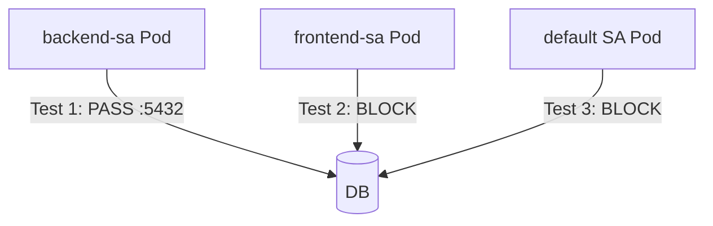

# How to Test Calico Service Account-Based Policies with Real Traffic

Author: [nawazdhandala](https://github.com/nawazdhandala)

Tags: Calico, Kubernetes, Network Policy, Service Accounts, Testing

Description: Validate Calico service account-based network policies using real traffic tests to confirm workload identity controls are enforced correctly.

---

## Introduction

Testing service account-based policies requires verifying that traffic is permitted or denied based on the service account identity of the source pod, not just its labels. This means testing with pods that have different service accounts and confirming that only the authorized service account can reach the target.

Calico's `serviceAccountSelector` in `projectcalico.org/v3` policies is evaluated against the service account name of the source pod. If a pod is running as a different service account than expected, traffic will be denied even if the pod has all the right labels.

## Prerequisites

- Kubernetes cluster with Calico v3.26+
- Service account-based policies configured
- `kubectl` with access to test namespaces

## Step 1: Deploy Pods With Specific Service Accounts

```yaml
apiVersion: v1
kind: Pod
metadata:
  name: authorized-pod
  namespace: test
spec:
  serviceAccountName: backend-sa
  containers:
    - name: busybox
      image: busybox
      command: ["sleep", "3600"]
---
apiVersion: v1
kind: Pod
metadata:
  name: unauthorized-pod
  namespace: test
spec:
  serviceAccountName: frontend-sa
  containers:
    - name: busybox
      image: busybox
      command: ["sleep", "3600"]
```

## Step 2: Apply Service Account Policy

```yaml
apiVersion: projectcalico.org/v3
kind: NetworkPolicy
metadata:
  name: test-sa-policy
  namespace: test
spec:
  order: 100
  selector: app == 'db'
  ingress:
    - action: Allow
      source:
        serviceAccountSelector: name == 'backend-sa'
      destination:
        ports: [5432]
    - action: Deny
  types:
    - Ingress
```

## Step 3: Run Traffic Tests

```bash
DB_IP=$(kubectl get pod db-pod -n test -o jsonpath='{.status.podIP}')

# Test 1: authorized service account
kubectl exec -n test authorized-pod -- nc -zv $DB_IP 5432
echo "Test 1 (authorized SA - should pass): $?"

# Test 2: unauthorized service account
kubectl exec -n test unauthorized-pod -- nc -zv $DB_IP 5432
echo "Test 2 (unauthorized SA - should fail): $?"
```

## Step 4: Test Service Account Change

```bash
# Delete and recreate pod with different SA to verify change takes effect
kubectl delete pod authorized-pod -n test
# Create with wrong SA
kubectl run authorized-pod -n test --image=busybox --restart=Never \
  --overrides='{"spec":{"serviceAccountName":"frontend-sa"}}' -- sleep 3600
kubectl exec -n test authorized-pod -- nc -zv $DB_IP 5432
echo "Test 3 (SA changed to frontend - should fail): $?"
```

## Test Matrix



## Conclusion

Service account policy testing verifies that network access is tied to workload identity, not just pod labels. Always test with pods using both authorized and unauthorized service accounts, and test what happens when a pod's service account changes. These tests give you confidence that your identity-based network controls cannot be bypassed by simply adding labels to a pod.
