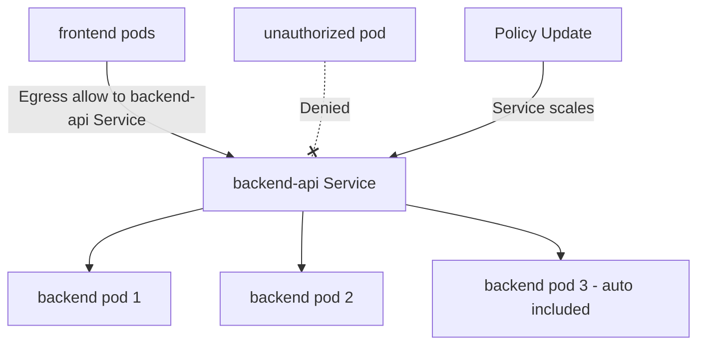

# How to Test Service-Based Policies in Calico

Author: [nawazdhandala](https://github.com/nawazdhandala)

Tags: Calico, Kubernetes, Network Policy, Services, Testing

Description: Test Calico service-based network policies test with real traffic to confirm traffic control is enforced correctly.

---

## Introduction

Testing service-based Calico policies requires verifying that traffic to and from Kubernetes Services is correctly permitted or denied based on your policy rules. Because service-based policies reference the Service object, you need to test through the service ClusterIP, not directly to pod IPs.

Calico's `projectcalico.org/v3` service-based policies use the `services` field in egress destination rules to reference Kubernetes Service objects. This creates a stable, maintainable policy that survives pod restarts, scaling events, and deployments without requiring policy updates.

This guide covers practical techniques for test service-based Calico policies effectively.

## Prerequisites

- Kubernetes cluster with Calico v3.26+
- `calicoctl` and `kubectl` installed
- Service-based policies configured or ready to configure

## Key Concepts

Service-based policies reference Kubernetes Services by name and namespace:

```yaml
apiVersion: projectcalico.org/v3
kind: NetworkPolicy
metadata:
  name: example-service-policy
  namespace: production
spec:
  order: 100
  selector: tier == 'frontend'
  egress:
    - action: Allow
      destination:
        services:
          name: backend-api
          namespace: production
  types:
    - Egress
```

## Core Technique

```bash
# Verify service exists and has endpoints
kubectl get service backend-api -n production
kubectl get endpoints backend-api -n production

# Test traffic through the service
SVC_IP=$(kubectl get service backend-api -n production -o jsonpath='{.spec.clusterIP}')
kubectl exec -n production frontend-pod -- curl -s --max-time 5 http://$SVC_IP:8080
echo "Result: $?"
```

## Troubleshooting Service Policies

```bash
# Check if service has backing pods
kubectl get endpoints backend-api -n production -o yaml | grep -A 10 subsets

# Verify policy is targeting the correct service
calicoctl get networkpolicy allow-frontend-to-backend -n production -o yaml | grep -A 5 services

# List all policies affecting the frontend pods
calicoctl get networkpolicies -n production -o wide
```

## Service Policy Architecture



## Conclusion

Service-based Calico policies provide a stable, maintainable approach to network access control that automatically adapts to service scaling and pod replacement. The key to success is ensuring services exist and have healthy endpoints before relying on service-based policies, and verifying that your policies correctly reference services by both name and namespace. This approach is particularly valuable for protecting critical shared services in production environments.
