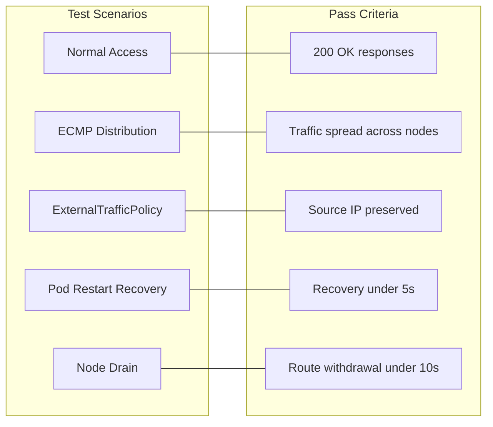

# How to Test Service IP Advertisement with Calico with Live Workloads

Author: [nawazdhandala](https://github.com/nawazdhandala)

Tags: Calico, Kubernetes, BGP, Service Advertisement, Testing

Description: Test Calico service IP advertisement with live workloads by verifying traffic distribution, failover behavior, and ExternalTrafficPolicy effects under real conditions.

---

## Introduction

Testing service IP advertisement with live workloads validates the complete service forwarding chain: from BGP route advertisement through router forwarding, node-level DNAT, and finally pod-level processing. It also reveals how the system behaves during disruptions such as pod restarts, node failures, or scaling events that change which nodes advertise a service IP.

Real-world testing should cover traffic distribution (are requests spread across nodes when ECMP is configured?), source IP handling (is externalTrafficPolicy behavior as expected?), and recovery time (how quickly does external connectivity recover after a node failure?).

## Prerequisites

- Service IP advertisement configured and validated
- External test client with BGP routes
- Test application with multiple replicas

## Deploy Multi-Replica Test Application

```bash
kubectl create deployment test-service --image=nginx --replicas=6
kubectl expose deployment test-service --port=80 --type=LoadBalancer
kubectl get svc test-service
```

## Test Traffic Distribution with ECMP

```bash
LB_IP=$(kubectl get svc test-service -o jsonpath='{.status.loadBalancer.ingress[0].ip}')
for i in $(seq 1 20); do
  curl -s http://${LB_IP}/ -o /dev/null -w "%{remote_ip}\n"
done
```

## Test ExternalTrafficPolicy: Local Behavior

```bash
kubectl patch svc test-service --type merge \
  --patch '{"spec":{"externalTrafficPolicy":"Local"}}'
kubectl get pods -l app=test-service -o wide
kubectl scale deployment test-service --replicas=1
```

## Test Pod Restart Recovery

```bash
while true; do
  code=$(curl -s -o /dev/null -w "%{http_code}" --connect-timeout 2 http://${LB_IP}/)
  echo "$(date +%H:%M:%S): $code"
  sleep 0.2
done &
kubectl rollout restart deployment/test-service
```

## Service Advertisement Test Matrix



## Conclusion

Live testing of service IP advertisement validates the end-to-end behavior of the Calico BGP service forwarding chain. Test traffic distribution, source IP handling, and recovery time after failures. These tests should be part of your service onboarding checklist for any service requiring direct external access via BGP-advertised IPs.
