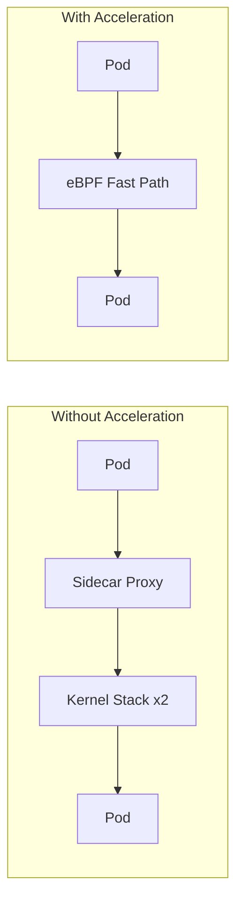

# How to Test Sidecar Acceleration in Calico with Live Workloads

Author: [nawazdhandala](https://github.com/nawazdhandala)

Tags: Calico, Kubernetes, EBPF, Sidecar, Service Mesh

Description: Benchmark sidecar acceleration performance in Calico with real service mesh workloads to quantify latency improvements.

---

## Introduction

Calico's sidecar acceleration feature uses eBPF to optimize traffic flows in service mesh environments. When pods use sidecar proxies like Envoy, network packets traverse multiple kernel networking layers. Calico eBPF can identify these patterns and apply fast-path processing that reduces the overhead introduced by sidecar interception.

This is one of the most impactful performance optimizations available for microservices architectures that have adopted service meshes - latency improvements of 30-50% are achievable for high-frequency inter-service calls.

## Prerequisites

- Calico eBPF dataplane enabled
- Service mesh with sidecar injection (Istio, Linkerd, etc.)
- kubectl and calicoctl access

## Configure and Verify

```bash
# Verify eBPF is enabled
calicoctl get felixconfiguration default -o yaml | grep bpfEnabled

# Check sidecar proxy detection
kubectl exec -n calico-system ds/calico-node -- \
  calico-node -show-bpf-map-sizes

# Verify acceleration is active for a pod
kubectl exec test-pod -- cat /proc/net/if_inet6
```

## Benchmark Acceleration

```bash
# Compare latency with and without acceleration
# Without acceleration:
kubectl exec client-pod -- grpc_bench -n 10000 server:50051

# With acceleration enabled:
kubectl exec client-pod -- grpc_bench -n 10000 server:50051
```

## Monitoring

```bash
# Check eBPF program hit counts
kubectl exec -n calico-system ds/calico-node -- \
  bpftool prog show | grep calico
```

## Acceleration Flow



## Conclusion

How to Test Sidecar Acceleration in Calico with Live Workloads requires enabling Calico eBPF mode and verifying that service mesh sidecar traffic is being processed through the optimized eBPF path. Monitor latency metrics before and after enabling acceleration to quantify the performance improvement in your specific workload profile.
