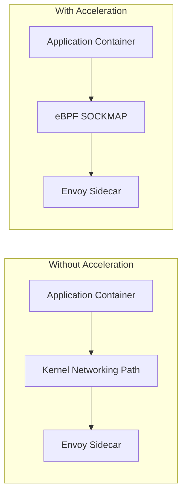

# How to Test Sidecar Acceleration in Calico with Live Workloads

Author: [nawazdhandala](https://github.com/nawazdhandala)

Tags: Calico, Kubernetes, eBPF, Sidecar, Service Mesh

Description: Benchmark sidecar acceleration performance in Calico with real service mesh workloads to quantify latency improvements.

---

## Introduction

Calico's sidecar acceleration feature uses eBPF SOCKMAP to optimize traffic between an application container and its Envoy sidecar in Istio environments. When pods use sidecar proxies like Envoy, traffic between the application and sidecar normally traverses several kernel networking layers. Calico can optimize that socket path and reduce the overhead introduced by sidecar interception.

This can be an impactful performance optimization for microservices architectures that have adopted service meshes, but it is experimental and should be tested only in non-production environments. Latency improvements depend on the workload, kernel, and service mesh configuration.

## Prerequisites

- Calico application layer policy enabled
- Linux kernel 4.19 or later on Calico nodes
- Istio with Envoy sidecar injection
- kubectl and calicoctl access

## Configure and Verify

```bash
# Verify sidecar acceleration is currently disabled

calicoctl get felixconfiguration default -o yaml | grep sidecarAccelerationEnabled

# Enable sidecar acceleration
kubectl patch felixconfiguration default --type merge --patch \
  '{"spec":{"sidecarAccelerationEnabled": true}}'

# Verify the Felix configuration
calicoctl get felixconfiguration default -o yaml | grep sidecarAccelerationEnabled
```

## Benchmark Acceleration

```bash
# Compare latency with and without acceleration
# Without acceleration:
kubectl patch felixconfiguration default --type merge --patch \
  '{"spec":{"sidecarAccelerationEnabled": false}}'
kubectl rollout restart deployment/client deployment/server
kubectl exec client-pod -- grpc_bench -n 10000 server:50051

# With acceleration enabled:
kubectl patch felixconfiguration default --type merge --patch \
  '{"spec":{"sidecarAccelerationEnabled": true}}'
kubectl rollout restart deployment/client deployment/server
kubectl exec client-pod -- grpc_bench -n 10000 server:50051
```

## Monitoring

```bash
# Confirm Calico accepted the Felix configuration
kubectl logs -n calico-system -l k8s-app=calico-node --tail=200 | \
  grep -i sidecar
```

## Acceleration Flow


```mermaid
graph LR
    subgraph Without Acceleration
        APP1[Application Container] --> KERN1[Kernel Networking Path] --> SIDECAR1[Envoy Sidecar]
    end
    subgraph With Acceleration
        APP2[Application Container] --> SOCKMAP[eBPF SOCKMAP] --> SIDECAR2[Envoy Sidecar]
    end
```

## Conclusion

How to Test Sidecar Acceleration in Calico with Live Workloads requires enabling Calico sidecar acceleration and verifying that new Istio sidecar connections are using the optimized socket path. Monitor latency metrics before and after enabling acceleration to quantify the performance improvement in your specific workload profile.
