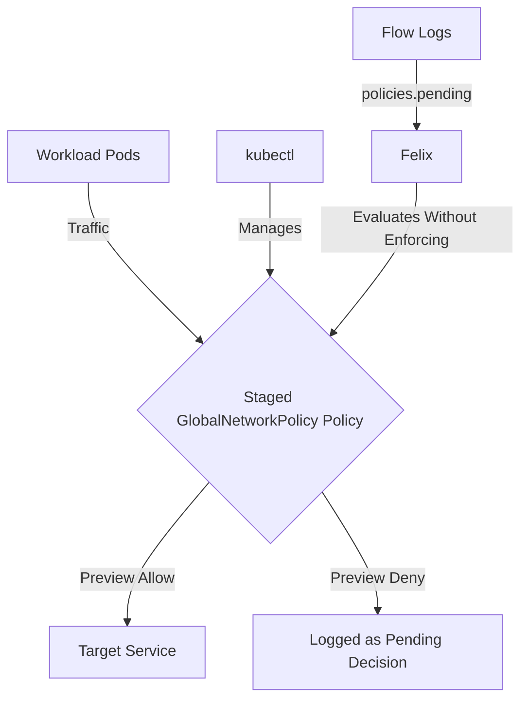

# How to Test Staged GlobalNetworkPolicy in Calico with Real Traffic

Author: [nawazdhandala](https://github.com/nawazdhandala)

Tags: Calico, Kubernetes, Network Policy, Staged Policies, Global Policy

Description: Validate Staged GlobalNetworkPolicy in Calico using real traffic scenarios to confirm policies work correctly.

---

## Introduction

Staged GlobalNetworkPolicy is an advanced Calico feature that previews fine-grained network security controls using the `projectcalico.org/v3` API without enforcing traffic. This guide covers how to test Staged GlobalNetworkPolicy effectively in your Kubernetes cluster.

Calico's `projectcalico.org/v3` API provides rich support for staged policies through its `StagedGlobalNetworkPolicy`, `StagedNetworkPolicy`, and `StagedKubernetesNetworkPolicy` resources. Proper configuration of Staged GlobalNetworkPolicy is essential for maintaining a secure, well-controlled network fabric.

This guide provides production-tested patterns for test Staged GlobalNetworkPolicy, including YAML examples, CLI commands, and troubleshooting techniques.

## Prerequisites

- Kubernetes cluster with Calico v3.30+
- `kubectl` installed and able to manage Calico `projectcalico.org/v3` resources
- Basic understanding of Calico network policy concepts
- Calico v3.30+ for Staged GlobalNetworkPolicy support in Calico Open Source

## Core Configuration

The following YAML demonstrates the key pattern for Staged GlobalNetworkPolicy:

```yaml
apiVersion: projectcalico.org/v3
kind: StagedGlobalNetworkPolicy
metadata:
  name: test-staged-globalnetworkpolicy
spec:
  tier: default
  order: 100
  selector: projectcalico.org/namespace == 'production'
  ingress:
    - action: Allow
      protocol: TCP
      source:
        selector: app == 'authorized-source'
      destination:
        ports: [8080, 443]
  egress:
    - action: Allow
      protocol: UDP
      destination:
        ports: [53]
    - action: Allow
      destination:
        selector: app == 'authorized-destination'
  types:
    - Ingress
    - Egress
```

## Implementation Steps

```bash
# 1. Apply the policy

kubectl apply -f test-staged-globalnetworkpolicy.yaml

# 2. Verify it's staged
kubectl get stagedglobalnetworkpolicies.projectcalico.org -o wide

# 3. Test connectivity
kubectl exec -n production test-pod -- curl -s --max-time 5 http://target:8080
echo "Exit code: $?"

# 4. Preview staged policy decisions in Calico flow logs
# The policies.pending field shows what would happen if the staged policy were enforced.
```

## Operational Commands

```bash
# List all relevant policies
kubectl get stagednetworkpolicies.projectcalico.org --all-namespaces
kubectl get stagedglobalnetworkpolicies.projectcalico.org

# View policy details
kubectl get stagedglobalnetworkpolicy.projectcalico.org test-staged-globalnetworkpolicy -o yaml

# Delete a policy if needed
kubectl delete stagedglobalnetworkpolicy.projectcalico.org test-staged-globalnetworkpolicy
```

## Architecture



## Common Issues

1. **Policy not applying**: Verify API version is `projectcalico.org/v3` and run `kubectl apply --dry-run=server -f test-staged-globalnetworkpolicy.yaml` first
2. **Selector not matching**: Use `kubectl get pods -n production -l app=authorized-source` to verify Kubernetes labels match the Calico selector
3. **Order conflicts**: Run `kubectl get stagedglobalnetworkpolicies.projectcalico.org -o wide` and sort by order field
4. **DNS failures**: Always ensure egress to port 53 is allowed when restricting egress

## Conclusion

Testing Staged GlobalNetworkPolicy in Calico requires careful attention to policy ordering, selector syntax, and bidirectional traffic rules. Use the patterns in this guide as a starting point, adapt them to your specific requirements, and always validate staged decisions before applying an equivalent enforcing policy to production. Consistent flow logging and monitoring will help you detect and resolve issues quickly when they occur.
