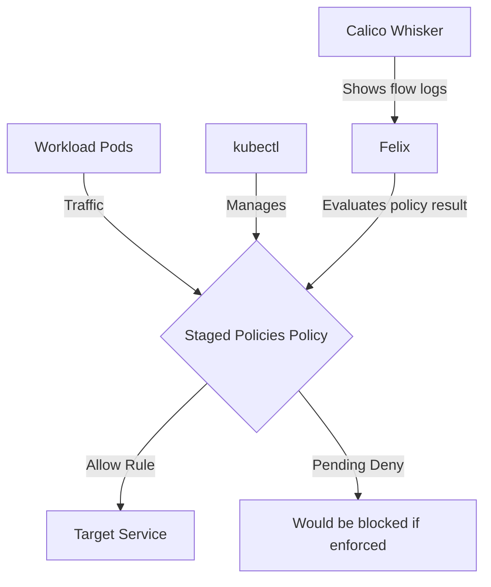

# How to Test Staged Network Policies in Calico with Real Traffic

Author: [nawazdhandala](https://github.com/nawazdhandala)

Tags: Calico, Kubernetes, Network Policy, Staged Policies, Security

Description: Validate Staged Network Policies in Calico using real traffic scenarios to confirm policies work correctly.

---

## Introduction

Staged Network Policies is an advanced Calico feature that lets you preview fine-grained network security controls using the `projectcalico.org/v3` API. This guide covers how to test Staged Policies effectively in your Kubernetes cluster.

Calico's `projectcalico.org/v3` API provides rich support for Staged Policies through its `StagedGlobalNetworkPolicy`, `StagedNetworkPolicy`, `StagedKubernetesNetworkPolicy`, and related resources. Proper configuration of Staged Policies is essential for maintaining a secure, well-controlled network fabric.

This guide provides production-tested patterns for test Staged Policies, including YAML examples, CLI commands, and troubleshooting techniques.

## Prerequisites

- Kubernetes cluster with Calico v3.30+
- `kubectl` installed  
- Basic understanding of Calico network policy concepts
- Calico Whisker and flow logs enabled for previewing staged policy impact

## Core Configuration

The following YAML demonstrates the key pattern for Staged Policies:

```yaml
apiVersion: projectcalico.org/v3
kind: StagedNetworkPolicy
metadata:
  name: test-staged-policies
  namespace: production
spec:
  order: 100
  selector: all()
  ingress:
    - action: Allow
      source:
        selector: app == 'authorized-source'
      destination:
        ports: [8080, 443]
  egress:
    - action: Allow
      protocol: UDP
      destination:
        ports: [53]
    - action: Allow
      destination:
        selector: app == 'authorized-destination'
  types:
    - Ingress
    - Egress
```

## Implementation Steps

```bash
# 1. Apply the policy

kubectl apply -f test-staged-policies.yaml

# 2. Verify the staged policy exists
kubectl get stagednetworkpolicy.p -n production -o wide

# 3. Generate real traffic. Staged policies do not block traffic;
# review the pending policy result in flow logs after this request.
kubectl exec -n production test-pod -- curl -s --max-time 5 http://target:8080
echo "Exit code: $?"

# 4. Open Calico Whisker and review the policies.pending field in flow logs
kubectl port-forward -n calico-system service/whisker 8081:8081
```

## Operational Commands

```bash
# List all relevant policies
kubectl get stagednetworkpolicy.p --all-namespaces
kubectl get stagedglobalnetworkpolicy.p

# View policy details
kubectl get stagednetworkpolicy.p test-staged-policies -n production -o yaml

# Delete a policy if needed
kubectl delete stagednetworkpolicy.p test-staged-policies -n production
```

## Architecture



## Common Issues

1. **Policy not applying**: Verify API version is `projectcalico.org/v3`, the kind is `StagedNetworkPolicy`, and run `kubectl apply --dry-run=server -f test-staged-policies.yaml` first
2. **Selector not matching**: Use `kubectl get pods -l your-selector` to verify label matches
3. **Order conflicts**: Run `kubectl get stagednetworkpolicy.p --all-namespaces -o wide` and sort by order field
4. **DNS failures**: Always ensure egress to port 53 is allowed when restricting egress

## Conclusion

Testing Staged Policies in Calico requires careful attention to policy ordering, selector syntax, flow logs, and bidirectional traffic rules. Use the patterns in this guide as a starting point, adapt them to your specific requirements, and always validate changes in a staging environment before creating an identical enforced policy for production. Consistent logging and monitoring will help you detect and resolve issues quickly when they occur.
