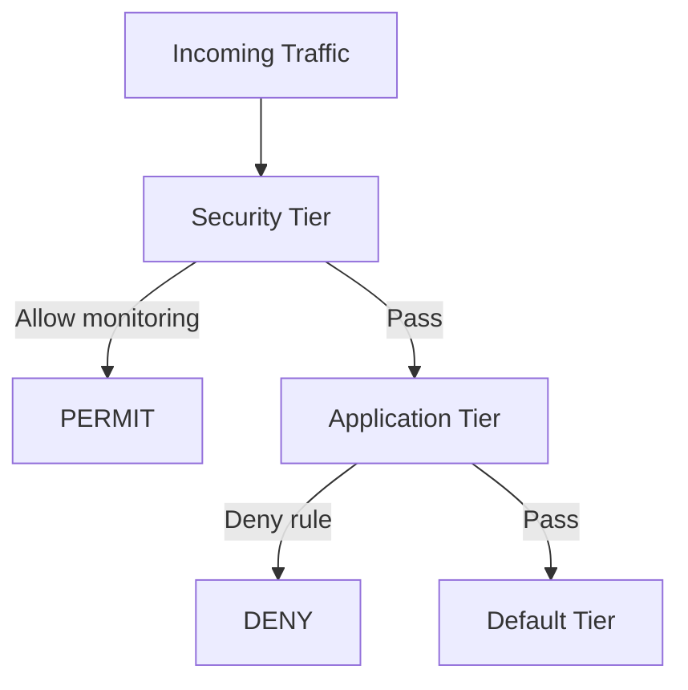

# How to Test Calico Tiered Policies with Real Traffic

Author: [nawazdhandala](https://github.com/nawazdhandala)

Tags: Calico, Kubernetes, Network Policy, Policy Tiers, Testing

Description: Validate Calico tiered network policies using real traffic tests to confirm tier-based enforcement works correctly.

---

## Introduction

Testing tiered policies in Calico requires verifying that policies in higher-priority tiers (lower order number) are evaluated before lower-priority tiers, and that the expected policy within each tier is the one making the traffic decision. Tiered policies add complexity to testing because the same traffic can be evaluated by multiple policies across multiple tiers.

Calico's `projectcalico.org/v3` policy tiers allow you to organize policies by security domain (e.g., "security" tier, "platform" tier, "application" tier). Testing must verify that each tier's policies are applying in the correct order.

## Prerequisites

- Kubernetes cluster with Calico v3.26+ (Enterprise for tiered policies)
- `calicoctl` and `kubectl` installed
- Tiers configured

## Step 1: Set Up Test Tiers

```yaml
apiVersion: projectcalico.org/v3
kind: Tier
metadata:
  name: security
spec:
  order: 100
---
apiVersion: projectcalico.org/v3
kind: Tier
metadata:
  name: application
spec:
  order: 200
```

## Step 2: Apply Test Policies Across Tiers

```yaml
# Security tier - high priority
apiVersion: projectcalico.org/v3
kind: GlobalNetworkPolicy
metadata:
  name: security.allow-monitoring
spec:
  tier: security
  order: 100
  selector: all()
  ingress:
    - action: Allow
      source:
        selector: tier == 'monitoring'
  types:
    - Ingress
---
# Application tier - lower priority
apiVersion: projectcalico.org/v3
kind: NetworkPolicy
metadata:
  name: application.deny-cross-ns
  namespace: production
spec:
  tier: application
  order: 100
  selector: all()
  ingress:
    - action: Deny
  types:
    - Ingress
```

## Step 3: Verify Tier Ordering

```bash
# Monitoring should bypass application tier deny
PROD_IP=$(kubectl get pod prod-pod -n production -o jsonpath='{.status.podIP}')

# From monitoring (security tier allows this)
kubectl exec -n monitoring monitor-pod -- wget -qO- --timeout=5 http://$PROD_IP:9090
echo "Monitoring access (security tier - should pass): $?"

# From other namespace (security tier doesn't allow, application tier denies)
kubectl exec -n staging other-pod -- wget -qO- --timeout=5 http://$PROD_IP:8080
echo "Other namespace (should fail): $?"
```

## Tier Evaluation



## Conclusion

Testing tiered policies requires verifying that each tier evaluates traffic in the correct order and that higher-priority tiers can override lower-priority ones. Build test cases for each tier transition point, verify that security tier policies correctly override application tier decisions, and test the "pass" action which forwards evaluation to the next tier. Automated tests for tier ordering prevent regressions when policies are updated.
