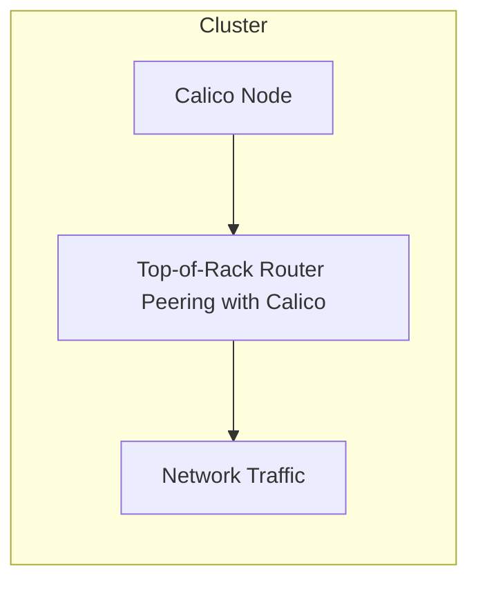

# How to Test Top-of-Rack Router Peering with Calico with Live Workloads

Author: [nawazdhandala](https://github.com/nawazdhandala)

Tags: Calico, Kubernetes, BGP, ToR, Networking

Description: Test Calico top-of-rack BGP peering under production traffic including switch failure and route convergence scenarios.

---

## Introduction

Top-of-Rack Router Peering with Calico is an important aspect of Calico networking in Kubernetes. Properly managing this component ensures your cluster networking is performant, secure, and reliable.

This guide covers test of Top-of-Rack Router Peering with Calico in Calico with practical examples and best practices for production deployments.

## Prerequisites

- Calico v3.26+ installed
- kubectl and calicoctl configured
- Cluster-admin access

## Steps

```bash
# Verify current configuration
calicoctl get bgpconfiguration default -o yaml

# Check node status
kubectl get nodes -o wide

# Verify Calico components
kubectl get pods -n calico-system
```

## Architecture



## Conclusion

test of Top-of-Rack Router Peering with Calico in Calico requires careful attention to configuration, monitoring, and testing. Follow the steps above to ensure correct behavior in your production environment.
