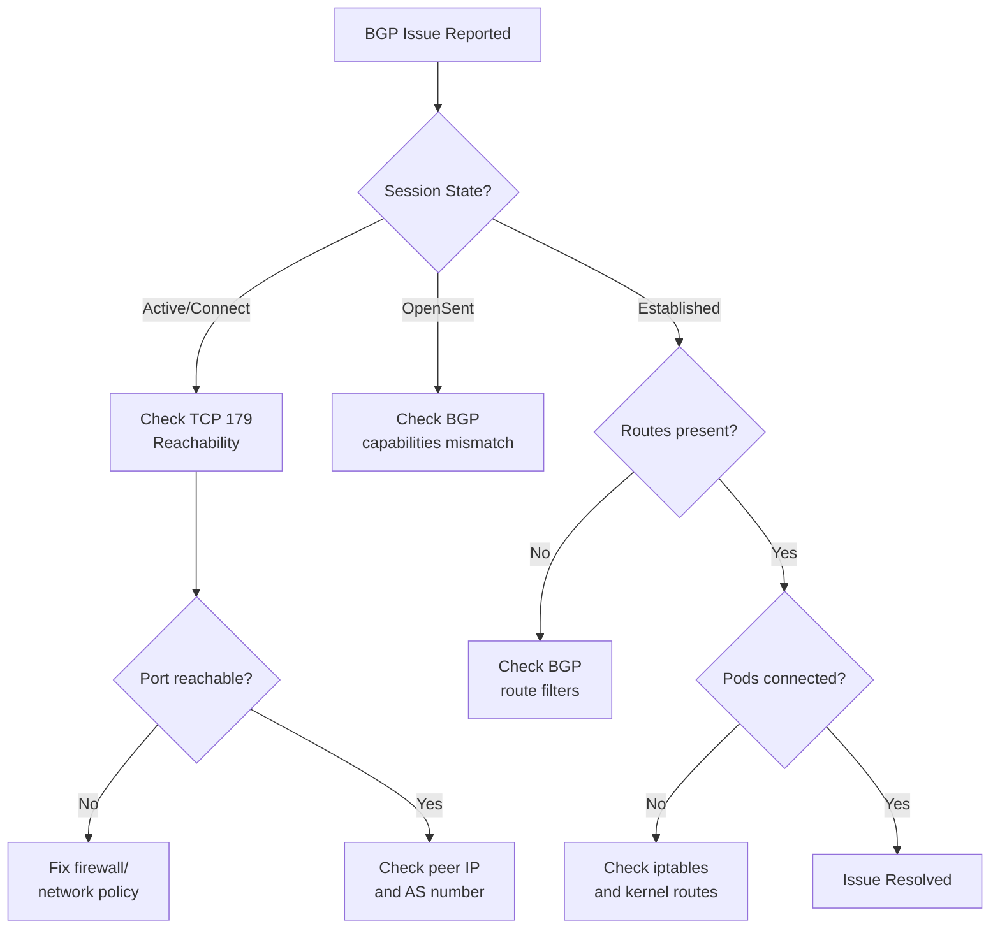

# How to Troubleshoot BGP Peering in Calico

Author: [nawazdhandala](https://github.com/nawazdhandala)

Tags: Calico, Kubernetes, BGP, Networking, Troubleshooting

Description: A practical guide to diagnosing and resolving BGP peering issues in Calico, covering session failures, route advertisement problems, and connectivity disruptions.

---

## Introduction

BGP peering issues in Calico manifest in several ways: sessions fail to establish, routes are not advertised, or pod traffic is dropped even when sessions appear healthy. Troubleshooting requires systematic inspection at multiple layers—from the BGP daemon configuration to iptables rules and kernel routing tables.

The most common BGP peering problems stem from network-level issues such as firewall rules blocking TCP port 179, misconfigured AS numbers, incorrect peer IP addresses, or IP address mismatches between what Calico expects and what the node actually uses. Understanding the BGP session state machine helps you quickly identify where in the handshake process a session is failing.

This guide walks through a structured troubleshooting approach for the most frequent BGP peering failures in Calico environments.

## Prerequisites

- Calico installed with BGP mode
- `calicoctl` and `kubectl` access
- Node-level access (SSH or `kubectl exec`)

## Check BGP Session State

Start with the BGP session state from within the calico-node pod:

```bash
NODE_POD=$(kubectl get pod -n calico-system -l app=calico-node \
  --field-selector spec.nodeName=<node-name> -o name | head -1)
kubectl exec -n calico-system ${NODE_POD} -- birdcl show protocols all
```

Key states and their meanings:
- `Active`: Attempting to connect — check network connectivity and port 179
- `Connect`: TCP connection in progress
- `OpenSent`/`OpenConfirm`: Handshake in progress — likely an AS number or capability mismatch
- `Established`: Session is healthy

## Diagnose TCP Port 179 Connectivity

BGP uses TCP port 179. Verify it is reachable between nodes:

```bash
# From one node to another
nc -zv <peer-ip> 179

# Check if iptables is blocking it
iptables -L INPUT -n | grep 179
iptables -L OUTPUT -n | grep 179
```

On nodes using firewalld:

```bash
firewall-cmd --list-ports | grep 179
```

## Verify AS Number Configuration

AS number mismatches prevent sessions from establishing:

```bash
# Check local AS number
calicoctl get bgpconfiguration default -o yaml | grep asNumber

# Check what the node is advertising
kubectl exec -n calico-system ${NODE_POD} -- birdcl show protocols all BGP_<peer_ip>
```

## Check Calico Node Logs

Felix and BGP-related logs are in the calico-node pod:

```bash
kubectl logs -n calico-system ${NODE_POD} -c calico-node | grep -i bgp
kubectl logs -n calico-system ${NODE_POD} -c calico-node | grep -i "peer\|session\|established"
```

Increase log verbosity temporarily:

```bash
calicoctl patch bgpconfiguration default --type merge \
  --patch '{"spec":{"logSeverityScreen":"Debug"}}'
```

## Diagnose Route Missing from Peer

If sessions are up but routes are missing, check BGP route filters:

```bash
kubectl exec -n calico-system ${NODE_POD} -- birdcl show route
kubectl exec -n calico-system ${NODE_POD} -- birdcl show route protocol BGP_<peer_ip>
```

Also verify the kernel routing table includes the expected pod CIDRs:

```bash
ip route show
```

## Troubleshooting Decision Tree



## Conclusion

Troubleshooting BGP peering in Calico is methodical: start with session state, then check connectivity on port 179, verify AS numbers, and finally inspect route advertisements. Enabling debug logging on the BGP configuration gives detailed insight into handshake failures. Restoring BGP session health quickly minimizes the impact on pod routing across your cluster.
