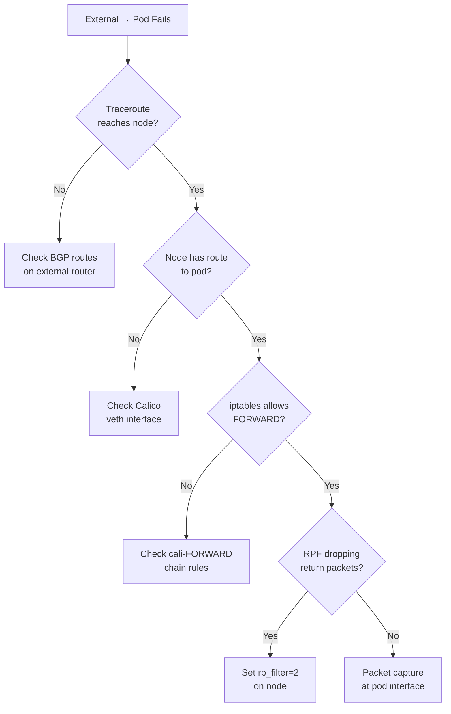

# How to Troubleshoot BGP to Workload Connectivity in Calico

Author: [nawazdhandala](https://github.com/nawazdhandala)

Tags: Calico, Kubernetes, BGP, Networking, Troubleshooting

Description: Diagnose and resolve BGP-to-workload connectivity failures in Calico by tracing packet flows from external clients to pods through the BGP routing path.

---

## Introduction

BGP-to-workload connectivity failures in Calico can be deceptive. The BGP session may be established, routes may appear in routing tables, but packets still fail to reach pods. These failures typically occur due to asymmetric routing, host firewall rules, RPF (Reverse Path Forwarding) checks blocking return traffic, or IP pool misconfiguration that causes unexpected NAT.

Unlike simple encapsulation-based networking, native BGP routing involves the host's Linux kernel routing stack, iptables chains, and external router forwarding decisions. A packet from an external client to a pod traverses multiple routing tables and iptables rules before reaching its destination, and a problem at any point causes connectivity failure.

## Prerequisites

- Calico with BGP mode and external BGP peer
- `tcpdump`, `iptables`, `ip` commands available on nodes
- `kubectl` exec access to pods

## Trace the Packet Path

Use `traceroute` from an external host to identify where packets stop:

```bash
traceroute -n <pod-ip>
```

If the trace stops at a node IP, packets are reaching the node but not being forwarded to the pod.

## Check iptables FORWARD Chain

Verify packets are allowed through the FORWARD chain:

```bash
iptables -L FORWARD -n -v
```

Look for Calico's `cali-FORWARD` chain and ensure it has a default ACCEPT rule for pod traffic:

```bash
iptables -L cali-FORWARD -n
```

## Check RPF (Reverse Path Filtering)

RPF can drop return packets from pods that arrive on unexpected interfaces:

```bash
cat /proc/sys/net/ipv4/conf/all/rp_filter
# 0 = off, 1 = strict, 2 = loose
```

For Calico BGP with asymmetric routing, set to loose:

```bash
sysctl -w net.ipv4.conf.all.rp_filter=2
# Make permanent
echo "net.ipv4.conf.all.rp_filter = 2" >> /etc/sysctl.conf
```

## Verify Pod CIDR Route on Node

Confirm the node has a route to the pod:

```bash
kubectl get pod <pod-name> -o wide
# Note the pod IP and node

# On that node:
ip route get <pod-ip>
# Should show: <pod-ip> dev cali<interface> ...
```

## Check Calico Interface

Verify the Calico veth interface for the pod exists:

```bash
# Get pod interface
POD_UID=$(kubectl get pod <pod-name> -o jsonpath='{.metadata.uid}')
ip link | grep cali
```

## Packet Capture at Multiple Points

```bash
# On node: capture on pod interface
tcpdump -i cali<iface> -n -c 50

# On node: capture on main interface for incoming traffic
tcpdump -i eth0 -n host <pod-ip> -c 50

# Inside pod: verify packets arrive
kubectl exec <pod-name> -- tcpdump -i eth0 -n -c 20
```

## Troubleshooting Flowchart



## Conclusion

Troubleshooting BGP-to-workload connectivity requires tracing packets through multiple network layers. Start with traceroute to identify where packets stop, then check iptables FORWARD rules, RPF settings, and Calico's per-pod veth interfaces. Packet captures at both the node interface and the pod interface help pinpoint exactly where in the forwarding path packets are being dropped.
