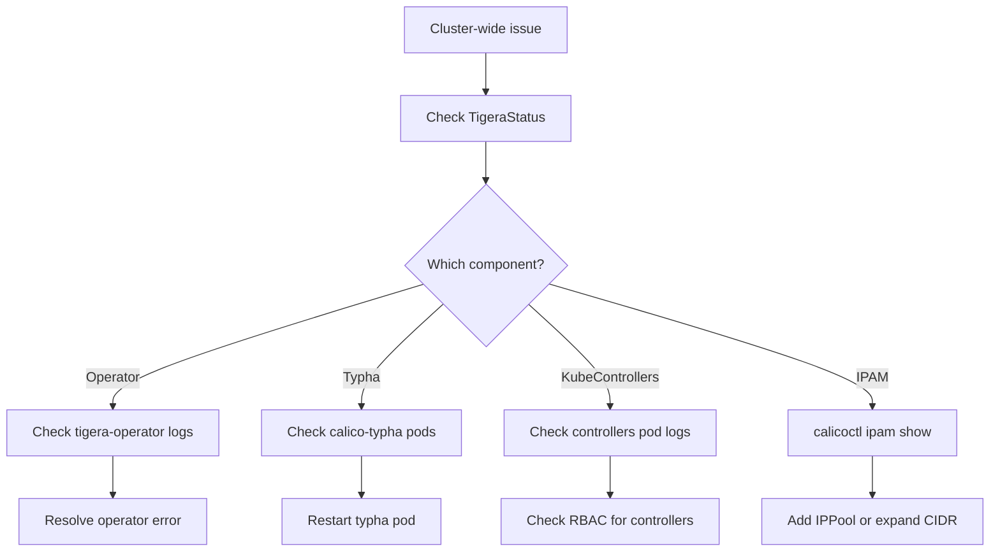

# How to Troubleshoot Calico Cluster-Wide Networking Issues

Author: [nawazdhandala](https://github.com/nawazdhandala)

Tags: Calico, Kubernetes, Networking, Diagnostics, Troubleshooting

Description: Diagnose cluster-wide Calico issues including TigeraStatus degradation, kube-controllers failures, IPAM exhaustion, and Typha connectivity problems that affect all nodes simultaneously.

---

## Introduction

Cluster-wide Calico failures affect all nodes simultaneously and typically trace to one of four sources: the Tigera Operator (not reconciling), calico-typha (not distributing policy to Felix agents), calico-kube-controllers (not syncing Kubernetes state to Calico), or IPAM exhaustion (no IPs available for new pods). Each has distinct symptoms and diagnostic commands.

## Symptom 1: TigeraStatus Shows Degraded Component

```bash
# Identify which component is degraded
kubectl get tigerastatus
# Look for Available=False

# Get detailed condition message
kubectl get tigerastatus -o yaml | \
  grep -A5 "conditions:"

# Check Tigera Operator logs for reconciliation errors
kubectl logs -n tigera-operator -l k8s-app=tigera-operator | \
  grep -i "error\|degraded\|reconcile" | tail -30

# Common messages:
# "waiting for calico-typha to be ready" - typha pod failing
# "failed to create" - RBAC or API server issue
```

## Symptom 2: New Pods Stuck in ContainerCreating (IPAM Exhaustion)

```bash
# Check IPAM utilization
calicoctl ipam show

# Check for specific error in kubelet logs
kubectl get events --all-namespaces | grep -i "ipam\|ip address\|assign"

# Check if any specific IP pools are exhausted
calicoctl get ippool -o yaml | grep -A5 "cidr:"
calicoctl ipam show --show-blocks | grep "100%"

# Resolution: Add a new IPPool or expand existing CIDR
```

## Symptom 3: calico-typha Crash Causing Policy Propagation Failure

```bash
# Check calico-typha pod status
kubectl get pods -n calico-system -l k8s-app=calico-typha

# If CrashLoopBackOff: check logs
kubectl logs -n calico-system -l k8s-app=calico-typha | tail -50

# Check Felix pods waiting for typha
kubectl logs -n calico-system -l k8s-app=calico-node -c calico-node | \
  grep -i "typha" | tail -10
```

## Symptom 4: calico-kube-controllers Not Syncing

```bash
kubectl logs -n calico-system -l k8s-app=calico-kube-controllers | \
  grep -i "error\|sync" | tail -30

# Check if controllers are reporting health
kubectl get tigerastatus kube-controllers -o yaml
```

## Cluster Troubleshooting Flow



## Conclusion

Cluster-wide Calico diagnostics require checking TigeraStatus first to identify the failing component, then targeting logs for that specific component. IPAM exhaustion is unique because it doesn't degrade TigeraStatus — pods simply fail to schedule. Always check `calicoctl ipam show` when new pods are stuck in ContainerCreating, especially in large or growing clusters. Collect `calicoctl cluster diags` before making any remediation changes.
