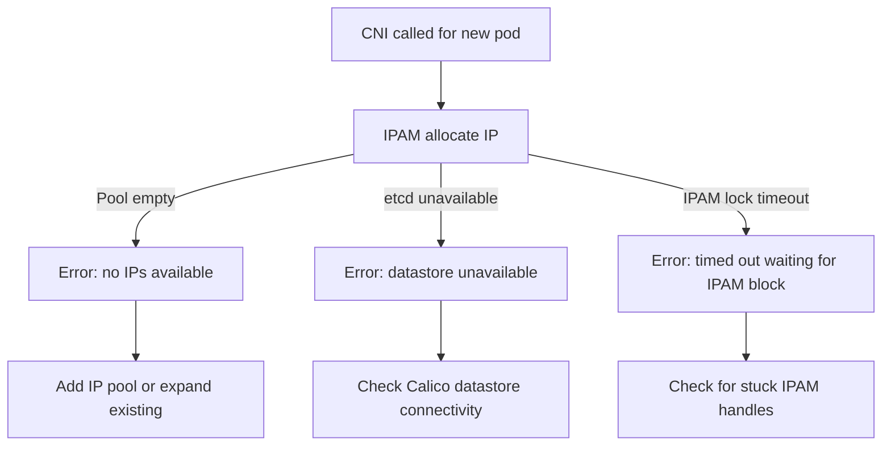

# Troubleshoot Calico CNI Plugin

Author: [nawazdhandala](https://github.com/nawazdhandala)

Tags: Calico, Kubernetes, Networking, CNI, Plugins, Troubleshooting

Description: Diagnose and resolve common Calico CNI plugin failures that prevent pods from starting, cause IP assignment failures, or result in missing network connectivity.

---

## Introduction

Calico CNI plugin failures prevent pods from starting and manifest as `ContainerCreating` status with events indicating CNI errors. These failures are often caused by misconfigured IPAM, missing CNI configuration files, exhausted IP pools, or Calico component failures that prevent the CNI plugin from allocating IPs or creating WorkloadEndpoints.

This guide covers the most common CNI plugin failures and their resolutions.

## Prerequisites

- `kubectl` with cluster admin access
- Node-level access to CNI log files
- `calicoctl` with cluster admin access

## Issue 1: Pods Stuck in ContainerCreating

**Symptoms**: Pod never transitions from ContainerCreating; describe shows CNI failure event.

**Diagnosis:**

```bash
kubectl describe pod failing-pod
# Look for events like:
# Failed to create pod sandbox: ... failed to set up CNI network

# Check CNI logs on the node where the pod is scheduled
NODE=$(kubectl get pod failing-pod -o jsonpath='{.spec.nodeName}')
kubectl debug node/$NODE -it --image=ubuntu -- cat /host/var/log/calico/cni/cni.log | tail -50
```

**Common causes:**

```bash
# 1. IPAM pool exhausted
calicoctl ipam show
# If usage near 100%: add more IPs to the pool

# 2. CNI config missing
kubectl exec -n calico-system ds/calico-node -- ls /host/etc/cni/net.d/
# If 10-calico.conflist missing: restart calico-node DaemonSet

# 3. calico-node pod not running on that node
kubectl get pods -n calico-system -o wide | grep $NODE
# If no calico-node pod: check DaemonSet tolerations
```

## Issue 2: Pod Gets Wrong IP Address

**Symptom**: Pod receives IP from unexpected CIDR range.

```bash
# Check what IP pool is configured
calicoctl get ippools -o wide

# Check which pool is being used for this namespace
calicoctl get ippool -o yaml | grep -A5 "namespaceselector"

# Check WorkloadEndpoint for the pod's IP allocation
calicoctl get wep -n default failing-pod-eth0 -o yaml | grep ipNets
```

## Issue 3: IPAM Allocation Errors



```bash
# Check for stuck IPAM handles
calicoctl ipam check --show-all-ips

# Release leaked allocations
calicoctl ipam release --ip=192.168.0.55
```

## Issue 4: CNI Binary Missing or Wrong Version

```bash
# Verify CNI binaries
kubectl exec -n calico-system ds/calico-node -- ls -la /host/opt/cni/bin/calico*
# Check version
kubectl exec -n calico-system ds/calico-node -- /host/opt/cni/bin/calico --version
```

## Issue 5: WorkloadEndpoint Not Created

**Symptom**: Pod has an IP but policy is not being enforced.

```bash
# Check if WEP exists
calicoctl get wep -n <namespace> <pod-name>-<interface>

# Check calico-node logs for WEP creation errors
kubectl logs -n calico-system ds/calico-node | grep -i "workloadendpoint\|wep"
```

## Issue 6: Slow Pod Start Times

```bash
# CNI timeout configuration
# Check if CNI is timing out when contacting the API server
kubectl exec -n calico-system ds/calico-node -- \
  cat /etc/cni/net.d/10-calico.conflist | grep timeout

# Increase timeout if API server is slow
# In calico-config ConfigMap
kubectl edit configmap calico-config -n calico-system
# Find and increase cni_network_config timeout settings
```

## Conclusion

Calico CNI plugin troubleshooting starts with checking the CNI logs on the affected node, then verifying IPAM pool capacity, CNI binary presence, and Calico datastore connectivity. The most common issues are IPAM pool exhaustion (add more CIDRs), missing CNI configuration (restart calico-node), and stuck IPAM handles (run `calicoctl ipam check`). Always check pod describe output and node-level CNI logs together to identify root cause.
