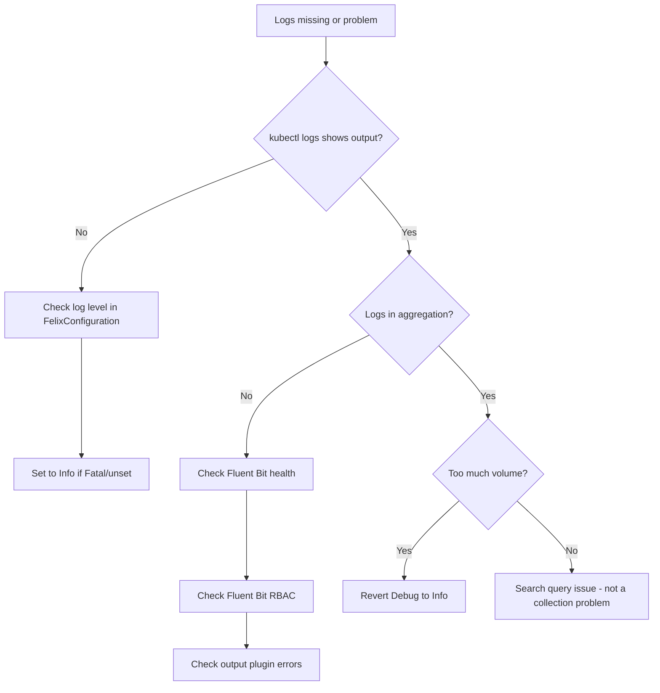

# How to Troubleshoot Calico Component Log Collection Issues

Author: [nawazdhandala](https://github.com/nawazdhandala)

Tags: Calico, Kubernetes, Networking, Logging, Troubleshooting

Description: Diagnose and resolve common Calico log collection problems including missing logs from calico-node pods, high log volume causing pipeline saturation, and log shipper failures in the calico-system...

---

## Introduction

Calico log collection failures fall into two categories: logs that are not being collected (missing data during incidents) and logs that are too voluminous (Debug level saturating log pipelines). Both problems become critical during incidents when you need reliable log access. Diagnosing the root cause requires checking Kubernetes log buffer availability, Fluent Bit pod health, and FelixConfiguration log level settings.

## Symptom 1: Missing Logs from calico-node Pods

```bash
# Check if calico-node pods are generating logs at all
kubectl logs -n calico-system -l k8s-app=calico-node -c calico-node --tail=5

# If empty: check the log level setting
kubectl get felixconfiguration default \
  -o jsonpath='{.spec.logSeverityScreen}'
# If unset or "Fatal": change to "Info"

# Check that the container name is correct
kubectl get pod -n calico-system -l k8s-app=calico-node \
  -o jsonpath='{.items[0].spec.containers[*].name}'
# Use the correct container name in logs command
```

## Symptom 2: Log Pipeline Saturation (High Volume)

```bash
# Check current Felix log level
kubectl get felixconfiguration default \
  -o jsonpath='{.spec.logSeverityScreen}'
# If "Debug": immediately revert to Info

kubectl patch felixconfiguration default \
  --type=merge -p '{"spec":{"logSeverityScreen":"Info"}}'

# Check log bytes per calico-node pod per hour
kubectl top pods -n calico-system --containers | grep calico-node
# High CPU on calico-node + log pipeline saturation = Debug level left on
```

## Symptom 3: Fluent Bit Not Collecting calico-system Logs

```bash
# Check Fluent Bit pod health in logging namespace
kubectl get pods -n logging -l app=fluent-bit

# Check Fluent Bit logs for errors related to calico-system
kubectl logs -n logging -l app=fluent-bit | grep -i "calico\|error" | tail -20

# Verify Fluent Bit has permission to read pod logs
kubectl auth can-i get pods/log -n calico-system \
  --as=system:serviceaccount:logging:fluent-bit
```

## Symptom 4: Logs Available in kubectl But Not in Elasticsearch/Loki

```bash
# Test Fluent Bit output directly
kubectl exec -n logging <fluent-bit-pod> -- \
  curl -s http://localhost:2020/api/v1/metrics | python3 -m json.tool | \
  grep -A2 "output"

# Check for output plugin errors
kubectl logs -n logging <fluent-bit-pod> | grep -i "error\|fail" | tail -20
```

## Troubleshooting Flow



## Verify Log Collection End-to-End

```bash
# Generate a known log entry
kubectl annotate felixconfiguration default \
  test-annotation="log-collection-test-$(date +%s)" --overwrite

# Wait 30 seconds, then search in Elasticsearch/Loki
# Search for: kubernetes.namespace_name:"calico-system" AND "FelixConfiguration"
```

## Conclusion

Most Calico log collection issues are caused by three things: an incorrect Felix log level (Fatal suppresses all logs), Fluent Bit RBAC not permitting access to calico-system pod logs, or Debug logging left enabled that saturates the log pipeline. Fix the log level first (it's the most common cause), then verify Fluent Bit permissions, then inspect the output plugin configuration. The end-to-end verification test with a known annotation provides a reliable way to confirm the full collection pipeline is working.
