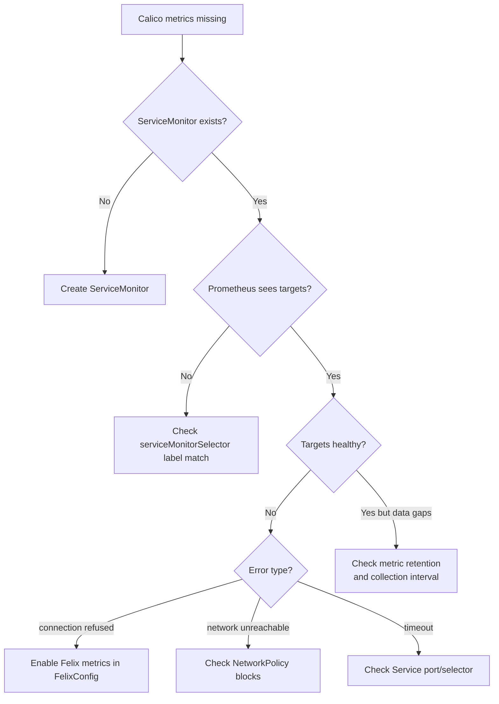

# How to Troubleshoot Calico Component Metrics Monitoring

Author: [nawazdhandala](https://github.com/nawazdhandala)

Tags: Calico, Kubernetes, Networking, Metrics, Prometheus, Troubleshooting

Description: Diagnose and resolve common issues with Calico Prometheus metrics collection, including missing targets, authentication failures, and metric gaps.

---

## Introduction

Calico metrics monitoring failures are usually one of three types: Prometheus can't discover the targets (ServiceMonitor misconfiguration), Prometheus can discover but not scrape the targets (network policy blocking, authentication issues), or metrics are being scraped but show unexpected values (Calico component configuration issue).

Understanding the Prometheus service discovery chain helps diagnose which layer has the failure.

## Prerequisites

- Prometheus Operator installed
- Calico metrics enabled (FelixConfiguration, etc.)
- Access to Prometheus UI

## Symptom 1: No Calico Targets in Prometheus

```bash
# Check if ServiceMonitors were created
kubectl get servicemonitor -n monitoring | grep calico

# Check if Prometheus is watching the monitoring namespace
kubectl get prometheus -n monitoring -o yaml | \
  grep -A10 "serviceMonitorSelector"

# Verify ServiceMonitor label matches Prometheus selector
# Prometheus typically selects ServiceMonitors with specific labels
kubectl get prometheus -n monitoring \
  -o jsonpath='{.items[0].spec.serviceMonitorSelector}' | jq .
```

## Symptom 2: Targets Exist But Show "UP" = 0

```bash
# Port-forward to Prometheus UI and check target details
kubectl port-forward -n monitoring svc/prometheus-operated 9090 &

# List all Calico-related targets
curl -s 'http://localhost:9090/api/v1/targets' | \
  jq '.data.activeTargets[] | select(.labels.job | contains("calico")) | {job: .labels.job, health: .health, lastError: .lastError}'
```

Common error causes and fixes:

```bash
# "connection refused" - Felix metrics not enabled
kubectl get felixconfiguration default -o jsonpath='{.spec.prometheusMetricsEnabled}'
# If empty or false:
kubectl patch felixconfiguration default --type=merge \
  -p '{"spec":{"prometheusMetricsEnabled":true,"prometheusMetricsPort":9091}}'

# "dial tcp: connect: network is unreachable" - NetworkPolicy blocking
kubectl get networkpolicy -n calico-system | grep metrics

# Add allow rule for Prometheus
cat <<EOF | kubectl apply -f -
apiVersion: networking.k8s.io/v1
kind: NetworkPolicy
metadata:
  name: allow-prometheus-scrape-calico
  namespace: calico-system
spec:
  podSelector:
    matchLabels:
      k8s-app: calico-node
  ingress:
    - from:
        - namespaceSelector:
            matchLabels:
              kubernetes.io/metadata.name: monitoring
      ports:
        - port: 9091
EOF
```

## Symptom 3: Felix Metrics Missing Expected Labels

```bash
# Verify felix metrics have the expected labels
curl -s 'http://localhost:9090/api/v1/query?query=felix_active_local_policies' | \
  jq '.data.result[] | .metric'

# Should see labels like:
# instance, job, node, pod

# If metrics don't have node label, check the Service spec
kubectl get svc calico-felix-metrics -n calico-system -o yaml | \
  grep -A10 "spec:"
```

## Troubleshooting Flow



## Symptom 4: Typha or kube-controllers Metrics Missing

```bash
# Verify Typha metrics are enabled
kubectl get installation default -o jsonpath='{.spec.typhaMetricsPort}'
# If empty, set it:
kubectl patch installation default --type=merge \
  -p '{"spec":{"typhaMetricsPort":9093}}'

# Verify kube-controllers metrics
kubectl get kubeconfigurationcontrollers default \
  -o jsonpath='{.spec.prometheusMetricsPort}' 2>/dev/null || \
  calicoctl get kubecontrollersconfiguration -o yaml | grep prometheus
```

## Conclusion

Troubleshooting Calico metrics monitoring issues requires working through the service discovery chain: ServiceMonitor creation, Prometheus ServiceMonitor selector matching, Service endpoint connectivity, and network policy access. The Prometheus UI's `/targets` endpoint is the most useful debugging tool — it shows the exact error reason for each failing target. Network policies are the most common blocker in security-hardened clusters; always verify that the monitoring namespace can reach the calico-system pods on the metrics ports.
