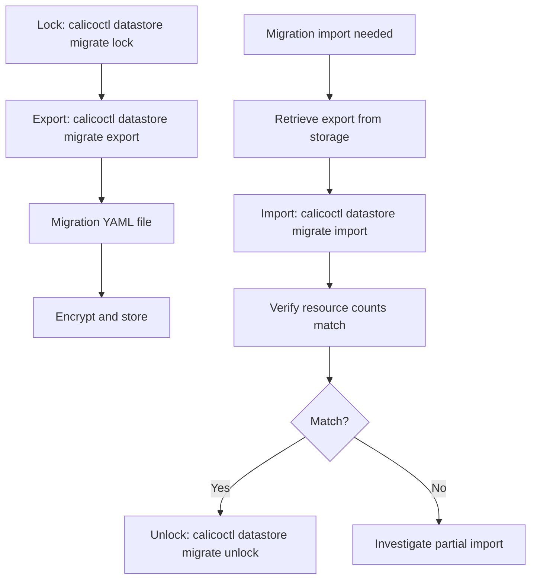

# How to Troubleshoot Calico Datastore Export and Import Failures

Author: [nawazdhandala](https://github.com/nawazdhandala)

Tags: Calico, Kubernetes, Networking, Operation

Description: Diagnose and resolve failures in calicoctl datastore migrate export and import operations including connection errors, permission failures, and import conflicts with existing resources.

---

## Introduction

Datastore export and import failures typically occur during etcdv3-to-Kubernetes datastore migration due to connection issues (etcd TLS certificates, kubeconfig misconfiguration), RBAC permissions (missing access to Calico CRDs), or import conflicts (resource already exists in the destination datastore). The error messages from calicoctl are generally descriptive enough to identify the cause.

## Key Commands

```bash
# Lock source datastore for migration
calicoctl datastore migrate lock

# Export the etcdv3 Calico datastore for migration

export_file="calico-migration-$(date +%Y%m%d).yaml"
calicoctl datastore migrate export > "$export_file"

# Verify export content
echo "Resources in export: $(grep -c '^kind:' "$export_file")"
grep "^kind:" "$export_file" | sort | uniq -c

# Import to destination datastore
calicoctl datastore migrate import -f "$export_file"

# Verify import
calicoctl get felixconfiguration
calicoctl get globalnetworkpolicy | wc -l

# Unlock after migration verification
calicoctl datastore migrate unlock
```

## Operation Flow



## Operational Checklist

```markdown
Before export:
[ ] Confirm source datastore connectivity
[ ] Confirm source kubeconfig or etcd credentials
[ ] Verify sufficient disk space for export file
[ ] Note current resource counts for post-export verification

After import:
[ ] Compare resource counts: source vs destination
[ ] Verify Calico components are operational
[ ] Test pod connectivity (cross-namespace, cross-node)
[ ] Verify network policies are being enforced
```

## Conclusion

Calico datastore export and import operations require careful verification at both ends: confirm resource counts before and after, verify connectivity and policy enforcement after import, and store migration exports encrypted in access-controlled storage. Regular test migrations ensure that disaster recovery procedures are not just theoretically possible but practically verified.
