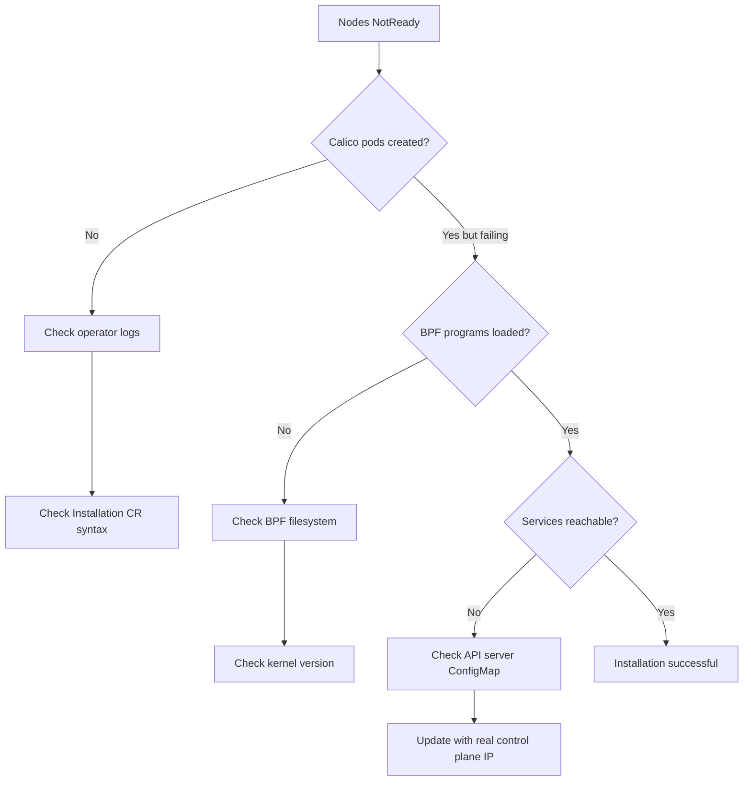

# How to Troubleshoot Calico eBPF Installation

Author: [nawazdhandala](https://github.com/nawazdhandala)

Tags: Calico, Kubernetes, Networking, eBPF, Troubleshooting, Installation

Description: Diagnose and resolve installation failures specific to Calico eBPF, including pre-installation prerequisite issues, configuration errors, and first-boot failures.

---

## Introduction

Installation failures for Calico eBPF are typically one of three types: prerequisites not met (kernel version, BPF filesystem), configuration errors (wrong API server IP, hostPorts enabled), or operator initialization failures. Unlike post-migration eBPF issues, fresh installation failures manifest early and clearly in the operator and calico-node logs.

## Prerequisites

- Calico eBPF installation attempted
- `kubectl` with cluster-admin access

## Diagnostic Checklist

```bash
#!/bin/bash
# ebpf-install-diagnostics.sh
echo "=== Calico eBPF Installation Diagnostics ==="

echo ""
echo "1. Tigera Operator Status"
kubectl get pods -n tigera-operator
kubectl logs -n tigera-operator deploy/tigera-operator 2>/dev/null | tail -20

echo ""
echo "2. TigeraStatus"
kubectl get tigerastatus 2>/dev/null || echo "No TigeraStatus resources found"

echo ""
echo "3. Installation Resource"
kubectl get installation default -o yaml 2>/dev/null || echo "No Installation resource"

echo ""
echo "4. eBPF ConfigMap"
kubectl get configmap kubernetes-services-endpoint -n tigera-operator -o yaml 2>/dev/null || \
  echo "ConfigMap not found!"

echo ""
echo "5. calico-system Pods"
kubectl get pods -n calico-system 2>/dev/null || echo "calico-system namespace not found"

echo ""
echo "6. BPF Programs on First Available Node"
POD=$(kubectl get pod -n calico-system -l k8s-app=calico-node \
  -o jsonpath='{.items[0].metadata.name}' 2>/dev/null)
if [[ -n "${POD}" ]]; then
  kubectl exec -n calico-system "${POD}" -c calico-node -- \
    bpftool prog list 2>/dev/null | head -20 || echo "bpftool not available or no programs"
fi
```

## Symptom 1: Nodes Stay NotReady After Installation

```bash
# Check calico-node logs for startup errors
kubectl logs -n calico-system ds/calico-node -c calico-node | \
  grep -E "error|Error|FATAL|WARN"

# Common causes:
# - BPF filesystem not mounted
# - Kernel version too old
# - Wrong API server IP causing Felix to not sync

# Test BPF filesystem
kubectl exec -n calico-system ds/calico-node -c calico-node -- \
  ls /sys/fs/bpf/ 2>/dev/null || echo "BPF filesystem not mounted!"
```

## Symptom 2: Operator Not Creating Calico Resources

```bash
# Operator logs show the issue
kubectl logs -n tigera-operator deploy/tigera-operator | grep -i "error\|fail"

# Check if operator found the Installation resource
kubectl logs -n tigera-operator deploy/tigera-operator | grep "Installation"

# Common cause: typo in Installation resource
kubectl get installation
# If empty, the Installation was not applied or had a parse error
kubectl describe installation default
```

## Symptom 3: calico-node Running in iptables Mode After eBPF Install

```bash
# Check Installation linuxDataplane setting
kubectl get installation default -o jsonpath='{.spec.calicoNetwork.linuxDataplane}'
# Expected: BPF

# Check if kernel is actually too old (might have been set correctly but kernel doesn't support it)
kubectl debug node/<node> --image=alpine -it -- uname -r

# Check Felix logs for BPF fallback message
kubectl logs -n calico-system ds/calico-node -c calico-node | \
  grep -i "bpf\|fallback\|iptables"
```

## Symptom 4: Services Not Reachable After Installation

```bash
# This usually means the API server ConfigMap has wrong IP
kubectl get configmap kubernetes-services-endpoint -n tigera-operator -o yaml

# Verify the KUBERNETES_SERVICE_HOST matches the real control plane IP
# NOT the virtual service IP (10.96.0.1)
kubectl get endpoints kubernetes -n default

# If wrong, update the ConfigMap
REAL_API_IP=$(kubectl get endpoints kubernetes -n default \
  -o jsonpath='{.subsets[0].addresses[0].ip}')
kubectl patch configmap kubernetes-services-endpoint -n tigera-operator \
  --type=merge -p "{\"data\":{\"KUBERNETES_SERVICE_HOST\":\"${REAL_API_IP}\"}}"

# Restart calico-node to pick up the change
kubectl rollout restart ds/calico-node -n calico-system
```

## Installation Failure Flowchart



## Conclusion

Calico eBPF installation failures follow predictable patterns: missing prerequisites (BPF filesystem, kernel version), misconfigured Installation resources, or wrong API server endpoint in the ConfigMap. The diagnostic script in this guide quickly identifies which layer has the problem. Always run it immediately after installation before investing time in less likely causes. The most common fix is updating the `kubernetes-services-endpoint` ConfigMap with the correct control plane IP when services are unreachable after installation.
