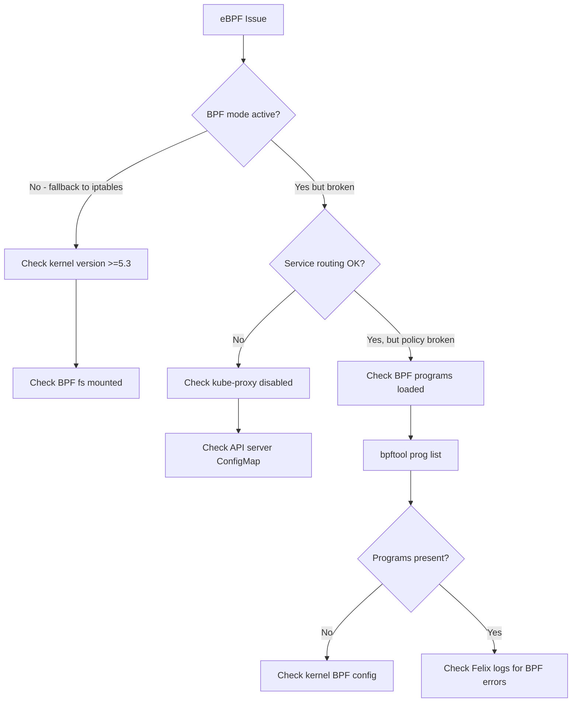

# How to Troubleshoot Calico eBPF Mode

Author: [nawazdhandala](https://github.com/nawazdhandala)

Tags: Calico, Kubernetes, Networking, EBPF, Troubleshooting

Description: Diagnose and resolve common Calico eBPF mode issues including kernel incompatibilities, kube-proxy conflicts, service routing failures, and BPF program errors.

---

## Introduction

Calico eBPF mode troubleshooting requires familiarity with BPF tools and concepts that most Kubernetes operators haven't encountered before. When something goes wrong with eBPF mode, the failure modes are different from iptables-based networking: instead of checking iptables chains, you inspect BPF maps and programs, and the error messages from Felix are specific to BPF operations.

The most common eBPF failures are: kernel version too old (silently falls back to iptables), kube-proxy conflict (double NAT causing connectivity issues), service routing failures (missing BPF maps or incorrect API server configuration), and BPF program load failures (usually kernel configuration missing).

## Prerequisites

- Calico with eBPF mode attempted
- `kubectl` with cluster-admin access
- `bpftool` available on nodes (usually via `linux-tools-$(uname -r)` package)

## Diagnostic Tool 1: Check eBPF Mode Status

```bash
# Is Felix actually running in eBPF mode?
kubectl logs -n calico-system ds/calico-node -c calico-node | \
  grep -E "BPF|eBPF|dataplane"

# Expected output when eBPF is active:
# "BPF enabled: true"
# "Started BPF endpoint manager"

# Check Felix configuration
kubectl exec -n calico-system ds/calico-node -c calico-node -- \
  calico-node -bpf-list-progs 2>/dev/null || echo "Not available"
```

## Symptom 1: eBPF Mode Not Activating (Falling Back to iptables)

```bash
# Check if Felix silently fell back to iptables
kubectl logs -n calico-system ds/calico-node -c calico-node | \
  grep -i "fallback\|bpf.*error\|kernel.*bpf"

# Check Installation for eBPF setting
kubectl get installation default -o jsonpath='{.spec.calicoNetwork.linuxDataplane}'

# Verify BPF filesystem is mounted
kubectl debug node/<node> --image=ubuntu:22.04 -it -- \
  mount | grep bpf
# If not mounted, BPF programs can't be loaded
```

Fix BPF filesystem mount:

```bash
# Mount BPF filesystem on the node
kubectl debug node/<node> -it --image=ubuntu:22.04 -- \
  bash -c 'mount -t bpf bpffs /sys/fs/bpf && echo "Mounted"'
```

## Symptom 2: Service Connectivity Broken After eBPF Enablement

This usually indicates a kube-proxy conflict:

```bash
# Check if kube-proxy is still running and conflicting
kubectl get pods -n kube-system | grep kube-proxy

# Verify kube-proxy is disabled (should not schedule)
kubectl get ds kube-proxy -n kube-system \
  -o jsonpath='{.spec.template.spec.nodeSelector}'

# Check for double NAT in BPF maps
kubectl exec -n calico-system ds/calico-node -c calico-node -- \
  calico-node -bpf-nat-dump 2>/dev/null | head -20

# Test service connectivity directly
kubectl run test-svc --image=busybox --restart=Never -- \
  wget -qO- --timeout=5 http://kubernetes.default.svc.cluster.local
```

## Symptom 3: kube-proxy Was Disabled but Services Are Unreachable

When kube-proxy is disabled, Calico eBPF handles service routing. If services are unreachable, the API server direct access configuration may be wrong:

```bash
# Check the kubernetes-services-endpoint ConfigMap
kubectl get configmap kubernetes-services-endpoint -n tigera-operator -o yaml

# Verify the IP is actually the API server, not the ClusterIP
API_CLUSTER_IP=$(kubectl get svc kubernetes -n default -o jsonpath='{.spec.clusterIP}')
API_ENDPOINT=$(kubectl get endpoints kubernetes -n default \
  -o jsonpath='{.subsets[0].addresses[0].ip}')

echo "Cluster service IP: ${API_CLUSTER_IP}"
echo "Real endpoint IP: ${API_ENDPOINT}"

# The ConfigMap should have the real endpoint IP, NOT the cluster service IP!
kubectl get configmap kubernetes-services-endpoint -n tigera-operator \
  -o jsonpath='{.data.KUBERNETES_SERVICE_HOST}'
```

## Symptom 4: BPF Program Load Failure

```bash
# Check for BPF program load errors in Felix logs
kubectl logs -n calico-system ds/calico-node -c calico-node | \
  grep -i "bpf.*fail\|bpf.*error\|load.*program"

# Check kernel BPF configuration
kubectl debug node/<node> --image=ubuntu:22.04 -it -- \
  grep -E "CONFIG_BPF|CONFIG_CGROUP_BPF" /boot/config-$(uname -r) 2>/dev/null

# Required kernel config for Calico eBPF:
# CONFIG_BPF=y
# CONFIG_BPF_SYSCALL=y
# CONFIG_NET_CLS_BPF=y or m
# CONFIG_NET_ACT_BPF=y or m
# CONFIG_BPF_JIT=y
# CONFIG_CGROUP_BPF=y
```

## eBPF Troubleshooting Decision Tree



## Conclusion

Troubleshooting Calico eBPF mode requires a different diagnostic toolkit than traditional iptables troubleshooting. The key tools are: Felix logs (for BPF enablement status), `bpftool prog list` (for BPF program loading), the `kubernetes-services-endpoint` ConfigMap (for API server routing), and kube-proxy DaemonSet status (for conflict detection). When eBPF mode silently falls back to iptables, it's almost always due to kernel version incompatibility or BPF filesystem not being mounted. Service routing failures after kube-proxy disablement almost always trace back to the API server ConfigMap having the wrong IP.
