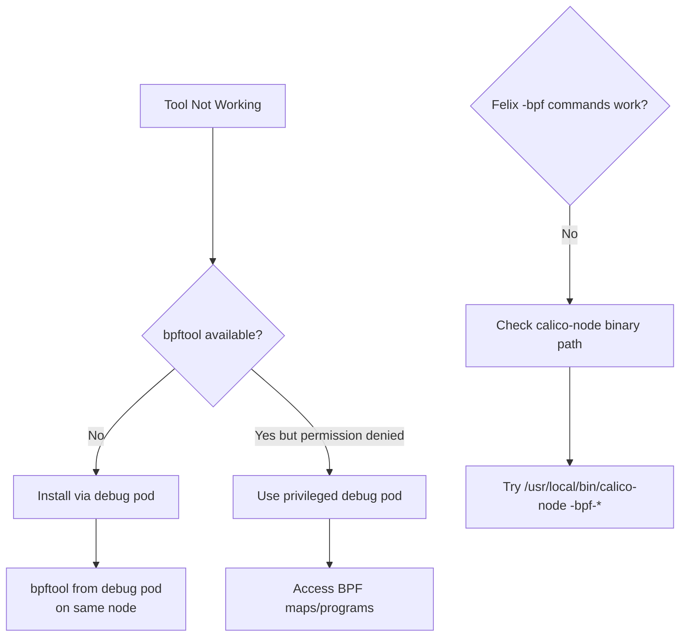

# How to Troubleshoot Calico eBPF Troubleshooting Issues

Author: [nawazdhandala](https://github.com/nawazdhandala)

Tags: Calico, Kubernetes, Networking, EBPF, Troubleshooting

Description: Resolve issues with Calico's eBPF diagnostic tools themselves, including bpftool access problems, missing debug commands, and restricted environments.

---

## Introduction

Sometimes the troubleshooting tools themselves fail to work - bpftool is not installed, Felix debug commands are not available, or the environment restricts access to BPF subsystem inspection. This guide covers how to work around tool availability issues and get diagnostic information even in restricted environments.

## Issue 1: bpftool Not Available in calico-node Pod

```bash
# calico-node pod may not have bpftool installed
kubectl exec -n calico-system ds/calico-node -c calico-node -- bpftool version
# Error: bpftool: command not found

# Solution: Use a debug pod on the same node that has bpftool
NODE=$(kubectl get pod -n calico-system ds/calico-node \
  -o jsonpath='{.spec.nodeName}' 2>/dev/null | head -1)

# Create a privileged debug pod on that node with bpftool
kubectl run bpf-debug \
  --image=quay.io/cilium/cilium-dbg:latest \
  --restart=Never \
  --overrides="{
    \"spec\": {
      \"nodeName\": \"${NODE}\",
      \"hostNetwork\": true,
      \"hostPID\": true,
      \"tolerations\": [{\"operator\": \"Exists\"}],
      \"containers\": [{
        \"name\": \"bpf-debug\",
        \"image\": \"quay.io/cilium/cilium-dbg:latest\",
        \"command\": [\"sleep\", \"3600\"],
        \"securityContext\": {\"privileged\": true},
        \"volumeMounts\": [{
          \"name\": \"bpf\",
          \"mountPath\": \"/sys/fs/bpf\"
        }]
      }],
      \"volumes\": [{
        \"name\": \"bpf\",
        \"hostPath\": {\"path\": \"/sys/fs/bpf\"}
      }]
    }
  }"

kubectl exec bpf-debug -- bpftool prog list | grep calico
```

## Issue 2: Felix -bpf-* Commands Not Working

```bash
# The -bpf-* flags require the calico-node binary directly
# If they don't work in the container, check binary path

kubectl exec -n calico-system ds/calico-node -c calico-node -- \
  which calico-node
# Usually: /usr/local/bin/calico-node or /usr/bin/calico-node

# Try with full path
kubectl exec -n calico-system ds/calico-node -c calico-node -- \
  /usr/local/bin/calico-node -bpf-nat-dump 2>&1 | head -20

# Alternative: use calicoctl for some BPF operations
calicoctl version
```

## Issue 3: BPF Map Inspection Fails Due to Permissions

```bash
# Error: permission denied when reading BPF maps
# Solution: Use a privileged container

kubectl exec -n calico-system ds/calico-node -c calico-node -- \
  id  # Check if running as root

# If not root, or BPF access denied:
kubectl debug node/<node-name> -it \
  --image=ubuntu:22.04 -- bash
# Inside debug pod:
apt-get install -y linux-tools-$(uname -r) -qq
bpftool prog list
```

## Issue 4: Debug Logging Not Appearing

```bash
# Enable Felix debug logging and verify it's working
kubectl patch felixconfiguration default --type=merge \
  -p '{"spec":{"logSeverityScreen":"Debug"}}'

# Check that the setting was applied
kubectl get felixconfiguration default -o jsonpath='{.spec.logSeverityScreen}'

# Wait for calico-node pods to pick up the config change
kubectl rollout restart ds/calico-node -n calico-system

# Now check logs
kubectl logs -n calico-system ds/calico-node -c calico-node | \
  grep -i debug | head -10
```

## Issue 5: tcpdump Not Available for BPF Interface Inspection

```bash
# Inspect BPF traffic at the interface level using tc
kubectl exec -n calico-system ds/calico-node -c calico-node -- \
  tc qdisc show 2>/dev/null | head -20

# List BPF filters attached by Calico
kubectl exec -n calico-system ds/calico-node -c calico-node -- \
  tc filter show dev eth0 ingress 2>/dev/null

# Alternative: use ip command to see BPF-attached queueing disciplines
kubectl exec -n calico-system ds/calico-node -c calico-node -- \
  ip link show 2>/dev/null | grep -A2 "eth0"
```

## Troubleshooting Flow for Tool Issues



## Conclusion

Troubleshooting tool failures in restricted or misconfigured environments require workarounds: privileged debug pods for BPF access, installing bpftool via the node's package manager in a debug pod, and understanding the full path to the `calico-node` binary for running built-in diagnostic commands. Always have a fallback approach for each tool in your toolkit so that a missing binary doesn't block your incident response entirely. The debug pod approach is particularly versatile as it can be deployed to any node in the cluster without modifying the node directly.
