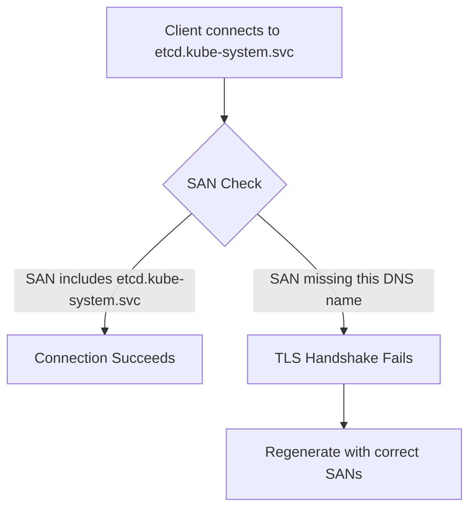

# Troubleshoot Calico etcd Certificate Generation

Author: [nawazdhandala](https://github.com/nawazdhandala)

Tags: Calico, Kubernetes, Networking, Etcd, TLS, Certificates, Troubleshooting

Description: Diagnose and fix common TLS certificate issues that prevent Calico components from authenticating to etcd, including expiry, SAN mismatches, and chain-of-trust failures.

---

## Introduction

TLS certificate issues are among the most disruptive failures in Calico etcd deployments. When a certificate expires or is misconfigured, Calico components fail to connect to etcd, which cascades into policy programming failures, IP allocation errors, and eventually cluster networking outages. The error messages - typically "x509: certificate has expired" or "tls: failed to verify certificate" - point to the problem category but require investigation to identify the specific cause.

This guide covers the most common certificate-related failures in Calico etcd deployments and provides step-by-step diagnosis and resolution procedures.

## Prerequisites

- OpenSSL installed on the management host
- `kubectl` access to the cluster
- etcdctl with CA credentials
- Access to Calico component logs

## Issue 1: Certificate Expired

**Symptom**: Calico components fail to connect to etcd; logs show "x509: certificate has expired or is not yet valid".

**Diagnosis:**

```bash
# Check expiry of all Calico etcd certificates
for cert in calico-felix calico-cni calico-admin etcd-server; do
  echo "=== ${cert}.crt ==="
  openssl x509 -in "${cert}.crt" -noout -enddate
done

# Check the secret in Kubernetes
kubectl get secret calico-etcd-certs -n kube-system -o jsonpath='{.data.etcd-cert}' | \
  base64 -d | openssl x509 -noout -enddate
```

**Resolution:**

Rotate the expired certificate:

```bash
openssl x509 -req -in calico-felix.csr \
  -CA calico-etcd-ca.crt -CAkey calico-etcd-ca.key \
  -CAcreateserial -out calico-felix.crt \
  -days 365 -sha256

kubectl create secret generic calico-etcd-certs \
  -n kube-system \
  --from-file=etcd-cert=calico-felix.crt \
  --from-file=etcd-key=calico-felix.key \
  --from-file=etcd-ca=calico-etcd-ca.crt \
  --dry-run=client -o yaml | kubectl apply -f -

kubectl rollout restart ds/calico-node -n kube-system
```

## Issue 2: Server Certificate SAN Mismatch

**Symptom**: "x509: certificate is valid for etcd-0, etcd-1, not etcd.kube-system.svc"



**Diagnosis:**

```bash
openssl x509 -in etcd-server.crt -noout -text | grep -A5 "Subject Alternative"
```

**Resolution:**

Regenerate with all required DNS names and IPs:

```bash
cat > etcd-san.conf <<EOF
[v3_req]
subjectAltName = DNS:etcd,DNS:etcd.kube-system.svc,DNS:etcd.kube-system.svc.cluster.local,IP:127.0.0.1,IP:10.0.0.10
EOF
```

## Issue 3: Wrong CA Certificate

**Symptom**: "x509: certificate signed by unknown authority"

```bash
# Verify which CA signed the client cert
openssl x509 -in calico-felix.crt -noout -issuer

# Verify the CA that etcd is configured to trust
grep "trusted-ca-file" /etc/etcd/etcd.conf
openssl x509 -in /etc/etcd/ca.crt -noout -subject
```

The issuer of the client cert must match the subject of the CA that etcd trusts.

## Issue 4: Certificate/Key Mismatch

**Symptom**: "tls: private key does not match public key in certificate"

```bash
# Quick mismatch check
openssl x509 -in calico-felix.crt -modulus -noout | openssl md5
openssl rsa -in calico-felix.key -modulus -noout | openssl md5
# These must be identical
```

## Issue 5: cert-manager Renewal Failure

```bash
# Check cert-manager certificate status
kubectl describe certificate calico-felix-etcd-cert -n kube-system

# Check cert-manager logs
kubectl logs -n cert-manager deploy/cert-manager | grep -i "calico\|error"

# Force renewal
kubectl annotate certificate calico-felix-etcd-cert -n kube-system \
  cert-manager.io/issuer-name="" --overwrite
```

## Conclusion

Certificate troubleshooting for Calico etcd connections follows a systematic progression: check expiry dates, verify SANs on the server certificate, confirm chain-of-trust alignment, and validate certificate-key pair matching. Automating certificate rotation with cert-manager prevents the most common failure mode (expiry). Always maintain a break-glass procedure for emergency manual rotation when automation fails.
